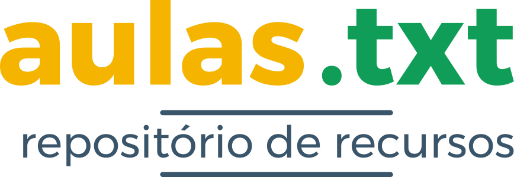



Este é um repositório de recursos (anotações, exercícios, materiais e recursos) utilizados em aulas diversas de Gestão Administrativa & Tecnologia da Informação.

Acesse todo o material em [aulas.txt](zmdy.github.io/aulas.txt)!

## Conteúdos
- Project Description
  - [Descrição](#descrição)
  - [Conteúdo](#conteudo)
  - [Passo a Passo](#passo-a-passo)

- [Licenças](#licencas)
 - [aulas.txt](#aulas-txt)
 - [Apresentaçãoes e Anotações](#apresentacoes-e-anotacoes)
 - [Conteúdos de Mídia](#conteudos-de-midia)
 - [Softwares](#softwares)

## Project Description
### Descrição

"aulas.txt" é um repositório de apresentações, anotações, livros, apostilas, imagens, vídeos e recursos utilizados em diversas aulas de Administração e TI.

Todo o conteúdo disponibilizado, incluindo (mas não se limitado a) textos, imagens, vídeos, fontes, ícones e/ou eventuais bibliotecas, módulos ou softwares utilizados para a criação de interações ou animaçãoes, é conteúdo livre (free/libre), **ao menos que explicitamente informado o contrário.**

O projeto em si é livre e está distribuídas sob Licença MIT. Verifique a sessão "LICENÇA" ao final deste documento e das apresentações para maiores detalhes.

> [O termo] Software Livre *(Free Software)* se refere à liberdade, não ao preço. Portanto, pense em *liberdade de expressão*, e não em *cerveja grátis*. As liberdades da qual me refiro são aquelas de realizar mudanças caso você queira, ou mesmo contratar alguém para realizá-las. Se você está usando um software para os seus negócios, [me refiro] à liberdade de redistribuir cópias, compartilhar com outras pessoas, realizar aprimoramentos e publicá-los para que outros também obtenham esses benefícios. **STALLMAN, Richard *em* Revolutin OS, 2001**

### Conteúdo

O conteúdo disponibilizado pode ser facilmente acessado pelo site do projeto, acessível em [aulas.txt](zmdy.github.io/aulas.txt)!

Este projeto é hospedado via [GitHub Pages](https://pages.github.com/) utilizando [uma variação](https://github.com/zmdy/dotX) do tema [dotX](https://github.com/nandomoreirame/dotX), criado pelo programador [nandomoreirame](https://github.com/nandomoreirame).

Você pode baixar e rodar este site localmente, se desejar. Para isto basta seguir o passo a passo a seguir:

#### Passo a passo

Primeiramente, você precisará instalar o [Git](https://git-scm.com/) e o  [Jekyll](https://jekyllrb.com/docs/installation/windows/) em seu computador para garantir que tudo funcione corretamente.

| #     | Software | O que é?  |
| :---: | :---:    | :---:            |
| 01    | [Git](https://git-scm.com/) | Sistema utilizado para organizar e gerenciar diferentes versões de arquivos e códigos-fonte/softwares. |
| 02    | [GitHub](https://github.com/) | Site utilizado para armazenar códigos-fonte (*y otras cositas mas*) de *softwares* utilizando o [Git](https://git-scm.com/). |
| 03    | [Ruby](https://www.ruby-lang.org/pt/) | Linguagem de programação elegante, simples e de fácil leitura. |
| 04    | [Jekyll](https://jekyllrb.com/docs/installation/windows/) | Gerador de sites estáticos escrito em [Ruby](https://www.ruby-lang.org/pt/). |

Após instalar todos os programas necessários, você deverá baixar o site [aulas.txt](zmdy.github.io/aulas.txt) para o seu computador. Caso queira, poderá também [clonar o respositório](https://git-scm.com/book/pt-pt/v2/No%C3%A7%C3%B5es-B%C3%A1sicas-do-Git-Obtendo-um-Reposit%C3%B3rio-Git).

1. [Download](https://codeload.github.com/zmdy/aulas.txt/zip/gh-pages) direto do site: `https://github.com/zmdy/aulas.txt/tree/gh-pages`

OU

2. Clone do repositório: `git clone https://github.com/zmdy/aulas.txt/tree/gh-pages`

Quando o download/clonagem finalizar, você deverá extrair os arquivos baixados OU acessar a pasta criada pelo comando `git clone`.

3. Acessa a pasta criada: `cd aulas.txt`

Agora basta instalar as dependências [Ruby](https://www.ruby-lang.org/pt/) (gems) necessárias. Isto pode levar algum tempo, é normal ;)

4. Instala as *Ruby gems*: `bundle install`

Com o download finalizado, basta iniciar o servidor [Jekyll](https://jekyllrb.com/).

5. Inicia o servidor: `jekyll serve`

Caso o comando acima não funcione, basta utilizar o comando a seguir. Isto é geralmente necessário somente da primeira vez que você iniciar o servidor Jekyll.

6. Inicia o servidor via `bundle`: `bundle exec jekyll serve`

## Licenças
### aulas.txt
Este projeto como um todo está distribuído com a [Licença MIT](https://opensource.org/licenses/MIT): *a short and simple permissive license with conditions only requiring preservation of copyright and license notices.* ([Choose a License](choosealicense.com))

- Sinta-se livre para:
  - :heavy_check_mark: Distribuir
  - :heavy_check_mark: Copiar
  - :heavy_check_mark: Modificar
  - :heavy_check_mark: Publicar
  - :heavy_check_mark: Fazer uso comercial
  - :heavy_check_mark: Fazer uso privado
  - :heavy_check_mark: Criar conteúdo derivado, utilizando outra licença
  - :heavy_check_mark: Fazer o que você quiser (literalmente)

- Mas não se esqueça de:
  - :heavy_minus_sign: Manter uma cópia do arquivo LICENSE e atribuir o devido crédito a *nóis*, porque *"dá trabalho pra fazer!"*.

Guarde no fundo do seu coração que este projeto e todos os seus constituites vêm com *absolutamente nenhuma garantia*. O autor e a licença não são responsáveis por quaisquer danos ou problemas causados pelo uso dos recursos aqui distribuídos.

### Apresentações e Anotações
Todas as apresentações (slides e anotações) também estão distribuídos com a [Licença MIT](https://opensource.org/licenses/MIT), pois são renderizadas com a biblioteca [Bonisa.js](https://github.com/zmdy/bonisa). No entanto, os conteúdos usados nas aparesentações são individualmente distribuídos sob diferentes licenças, explicitamente descritas na sessão "LICENÇA" de cada apresentação.

### Conteúdos de Mídia
Todo e qualquer conteúdo midiático, incluindo, mas não se limitando a imagens, textos, fontes, músicas, vídeos e ícones, produzidos ou incluídos em uma uma mais apresentações, são distribuídos sob a [Licença Creative Commons](https://creativecommons.org/), explicitamente descrita em cada apresentação ou anotação.

### Softwares
Todos os softwares apresentados ou referenciados nos recursos supracitados, incluindo, mas não se limitando a softwares, scripts, funções, classes, módulos, bibliotecas e/ou pacotes são de responsabilidade de seus criadores.

Demais códigos, produzidos explicitamente para uso nos materiais aqui apresentados, são também distribuídos com a [Licença MIT](https://opensource.org/licenses/MIT) ou [GNU Lesser General Public License v3.0](https://www.gnu.org/licenses/lgpl-3.0.txt), conforme apresentado em cada recurso.
