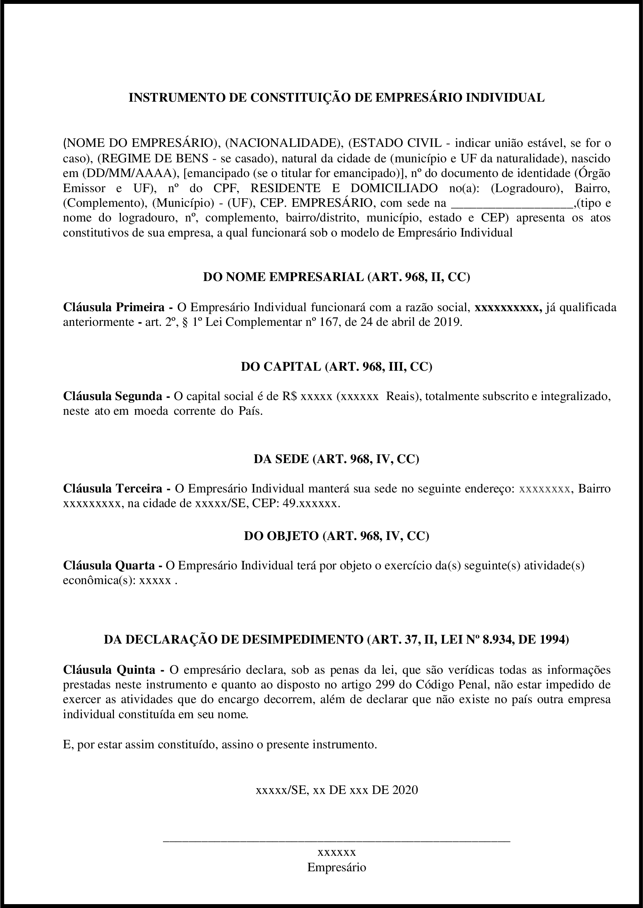

O EIRELI possui um tipo especial de Contrato Social denominado de **Ato Constitutivo**. Este documento pode ser adapatado ao Empresário Individual (EI) como um complemento ao Requerimento de Empresário.

<a href="../../../../assets/content/administracao/modelos/modelo-ato-constitutivo-ei.docx" target="_blank"><i class="icofont-download"></i>EI - Modelo de Ato Constitutivo</a>

O Ato Constitutivo mostrado acima possui 5 cláusulas que definem o funcionamento da EI.

**Cláusula 1ª:** delimita o nome empresarial (firma ou denominação) da empresa;

**Cláusula 2ª:** delimita o capital social da empresa;

**Cláusula 3ª:** define o endereço da sede da empresa;

**Cláusula 4ª:** define o objeto social da empresa;

**Cláusula 5ª:** nesta cláusula especial o empresário garante não ser sócio de nenhuma outra empresa, sendo esta uma imposição para a formalização de um EI.