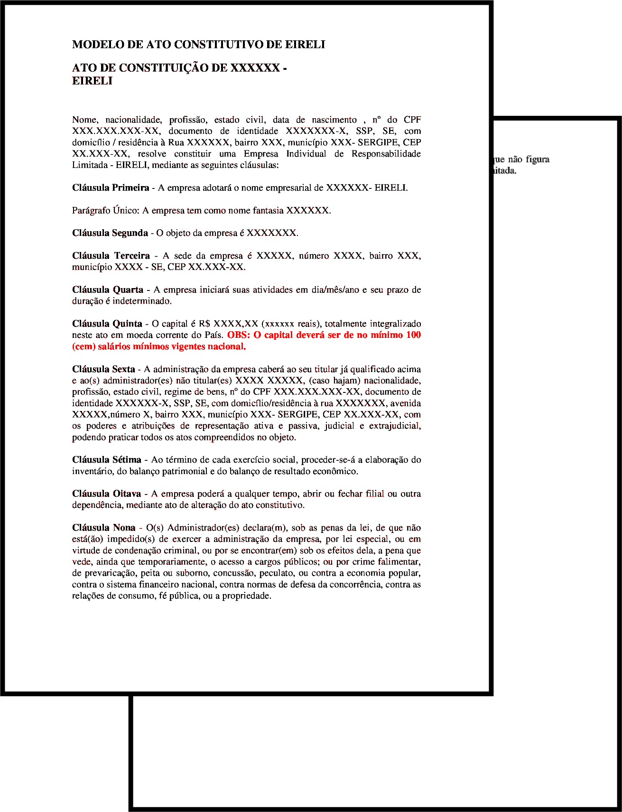

O EIRELI possui um tipo especial de Contrato Social denominado de **Ato Constitutivo**. Este documento possui bastantes semelhanças com o ato utilizado pelo Empresário Individual (EI), apesar de ter algumas cláusulas extras.

<a href="../../../../assets/content/administracao/modelos/modelo-ato-constitutivo-eireli.docx" target="_blank"><i class="icofont-download"></i>EIRELI - Modelo de Ato Constitutivo</a>

O Ato Constitutivo mostrado acima possui 10 cláusulas que regem o funcionamento da EIRELI.

**Cláusula 1ª:** delimita o nome empresarial (firma ou denominação) da empresa;

**Cláusula 2ª:** define o objeto social da empresa;

**Cláusula 3ª:** define o endereço da sede da empresa;

**Cláusula 4ª:** define a data de abertura da empresa. Esta cláusla também está presente no Contrato Social das SS, SA e LTDA;

**Cláusula 5ª:** delimita o capital social da empresa que **deve ser superior a 100 salários mínimos** para as EIRELI;

**Cláusula 6ª:** determina a quem caberá a administração da empresa, podendo ser adicionados parceiros não-titulares ou funcionários de alto escalão, como gerentes e administradores. Estes funcionários, junto ao titular da empresa, possuem poderes de representar a empresa judicial e extrajudicialmente.

**Cláusula 7ª:** determina que a empresa deverá produzir regularmente balanços patrimoniais para verificação e acompanhamento de suas atividades. Tais levantamentos são feitos, por padrão, [anualmente](https://blog.sage.com.br/dicionario-administracao-negocios/exercicio-social/), em datas escolhidas pela própria empresa.

**Cláusula 8ª:** define que a empresa tem o poder de abrir e fechar filiais conforme suas necessidades; 

**Cláusula 9ª e 10ª:** nestas cláusulas especiais o empresário garante não ser sócio de nenhuma outra empresa, além de não estar impedido judicalmente ou legalmente a abrir uma EIRELI.
