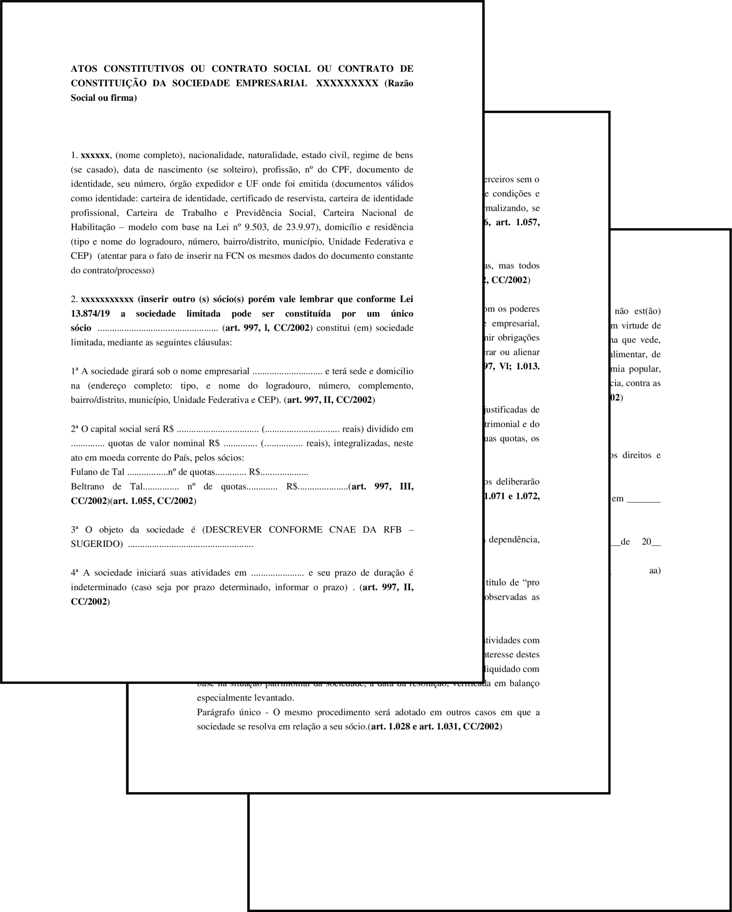

O Contrato Social das Sociedades Empresárias (SS, LTDA e SA) possuem uma maior quantidade de cláusulas, visto que no mesmo estarão listadas uma maior quantidade de pessoas. 

Após preenchidos os contratos devem ser registrados - em cartório, no caso das SS, e nas juntas comercias, no caso das LTDA e SA - e, em alguns casos, devem possuir a assinatura de um advogado (exceto se a empresa for ME ou EPP).

<a href="../../../../assets/content/administracao/modelos/modelo-contrato-social.pdf" target="_blank"><i class="icofont-download"></i>PDF - Modelo de Contrato Social para Sociedade Simples Pura e Limitada</a>

<a href="../../../../assets/content/administracao/modelos/modelo-contrato-social-ss-ltda.docx" target="_blank"><i class="icofont-download"></i>SS e LTDA - Modelo de Contrato Social para Sociedade Simples Limitada</a>

Os modelos acima apresentados podem ser adaptados e modificados para se adequarem ao enquadramento SS ou LTDA. De modo geral, o Contrato destas empresas possui as seguintes cláusulas:

O Ato Constitutivo mostrado acima possui 14 cláusulas que regem o funcionamento da empresa. Antes de serem descritas, é necessário informar os dados de todos os sócios da empresa.

**Cláusula 1ª:** delimita o nome empresarial (firma ou denominação) e endereço da sede da empresa;

**Cláusula 2ª:** define como o capital social foi integralizado e dividido entre os sócios;

**Cláusula 3ª:** define o objeto social da empresa;

**Cláusula 4ª:** define a data de abertura da empresa. Esta cláusla também está presente no Contrato Social das SS, SA e LTDA;

**Cláusula 5ª e 6ª:** cláusula especial que define as responsabilidades imitadas de cada sócio, mediante a suas quotas do Capital Social;

**Cláusula 7ª:** determina a quem caberá a administração da empresa, podendo ser adicionados parceiros não-titulares ou funcionários de alto escalão, como gerentes e administradores. Estes funcionários, junto aos sócios da empresa, possuem poderes de representar a empresa judicial e extrajudicialmente.

**Cláusula 8ª e 9ª:** determina que a empresa deverá produzir regularmente balanços patrimoniais para verificação e acompanhamento de suas atividades. Tais levantamentos são feitos, por padrão, [anualmente](https://blog.sage.com.br/dicionario-administracao-negocios/exercicio-social/), em datas escolhidas pela própria empresa.

**Cláusula 10ª:** define que a empresa tem o poder de abrir e fechar filiais conforme suas necessidades; 

**Cláusula 11ª:** cláusula especial que assegura os sócios a fazerem retiradas mensais em espécie;

**Cláusula 12ª:** define como a sociedade deverá agir em caso de falecimento ou interdição por parte de algum sócio; 

**Cláusula 13ª:** nesta cláusula todos os sócios garantem não estar impedidos judicalmente ou legalmente a abrir uma empresa.

**Cláusula 14ª:** elege-se um foro (tribunal municipal para assembleias e julgamentos jurídicos e legais) de referência para se regular demais pendências legais relativas à empresa.