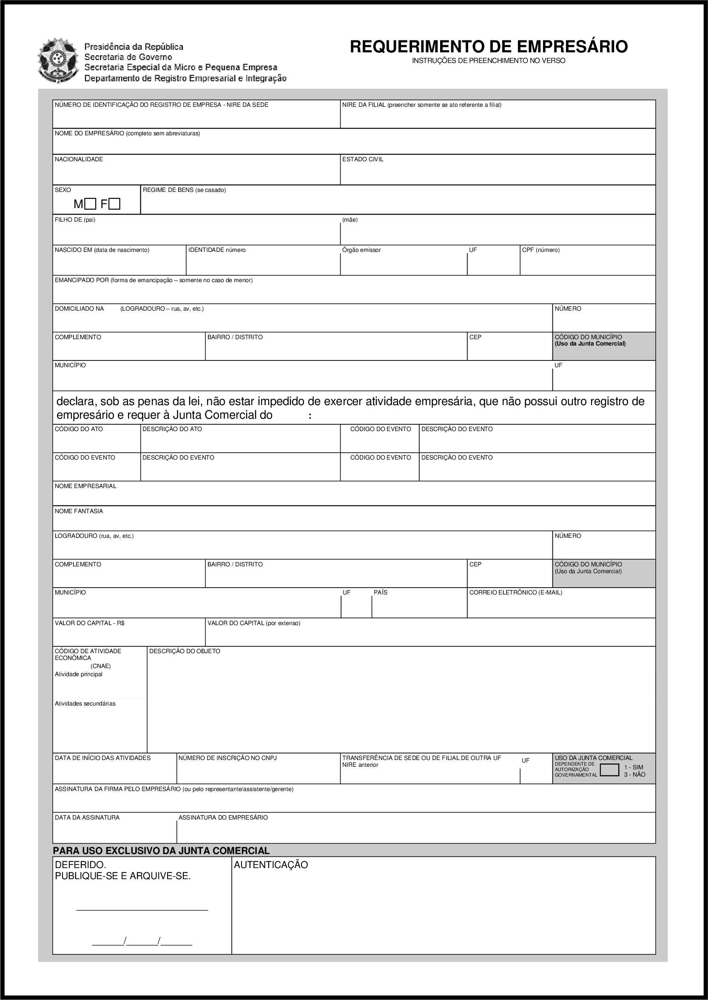

O Modelo de Requerimento de Empresário é um formulário estabelecido pelo Governo Federal que formaliza pessoas físicas como Empresários Individuais (EI).

Após preenchido e registrado nas juntas comerciais, o formulário não pode ser alterado. Por esta razão, é indicado a empresas que possuem uma atividade já estabelecida no mercado, sem previsões de mudanças a curto e médio prazo.

<a href="../../../../assets/content/administracao/modelos/modelo-requerimento-de-empresario.docx" target="_blank"><i class="icofont-download"></i>EI - Modelo de Requerimento de Empresário</a>

O Modelo de Requerimento disponibilizado acima está no formato *docx*, devendo ser aberto no Word ou processadores de texto similares.

Este formulário contém 2 importantes áreas a serem preenchidas: o **cabeçalho**, com as informações pessoais do empresário; e o **corpo do documento**, com as informações da empresa.

As informações da empresa solicitada neste documento são:

<ul>
  <li class='item-ok'><strong>NIRE - Identificação Estadual</strong>;</li>
  <li class='item-ok'><strong>CNPJ</strong>;</li>
  <li class='item-ok'><strong>Nome Empresarial e Nome Fantasia</strong>;</li>
  <li class='item-ok'><strong>CNAE e objeto social</strong>;</li>
  <li class='item-ok'><strong>Capital Social</strong>;</li>
</ul>