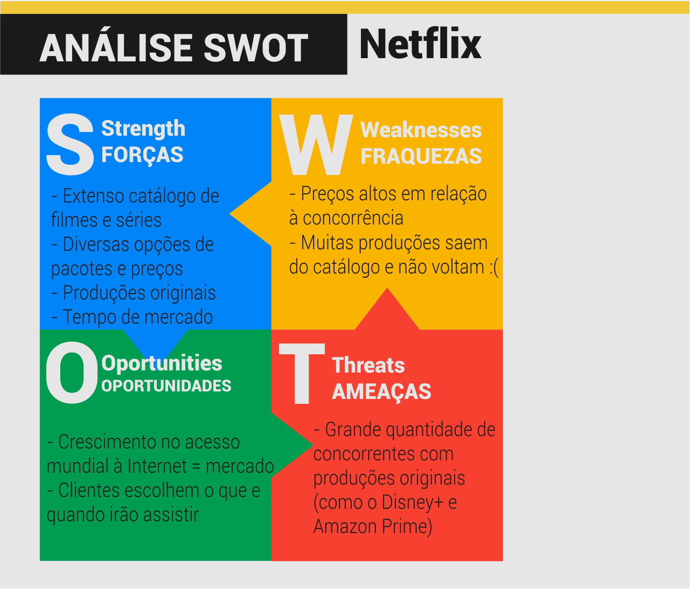
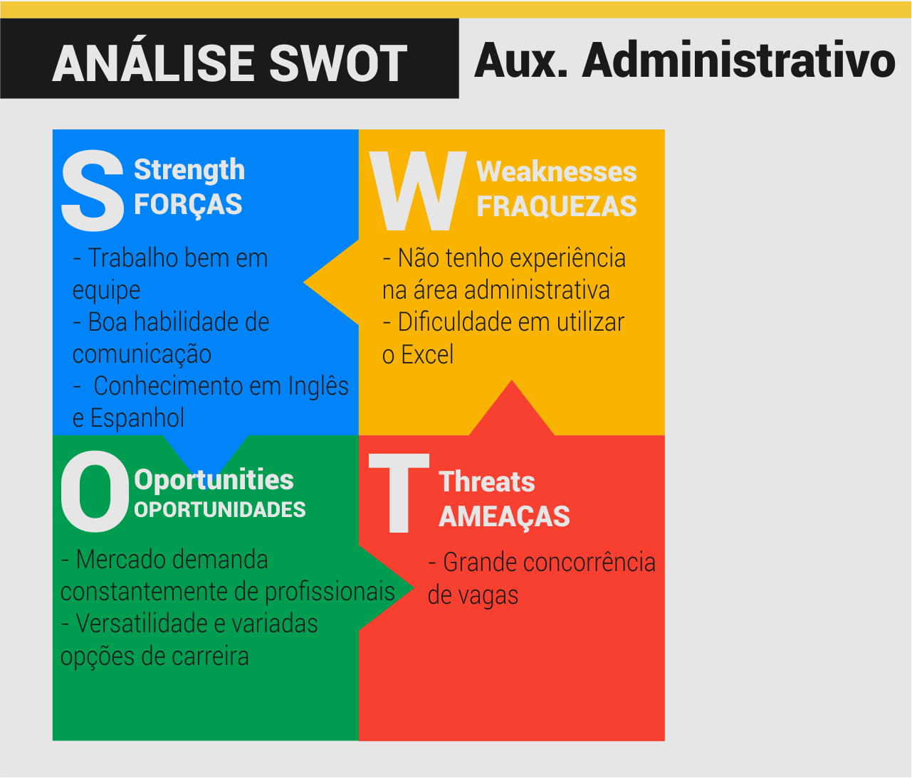
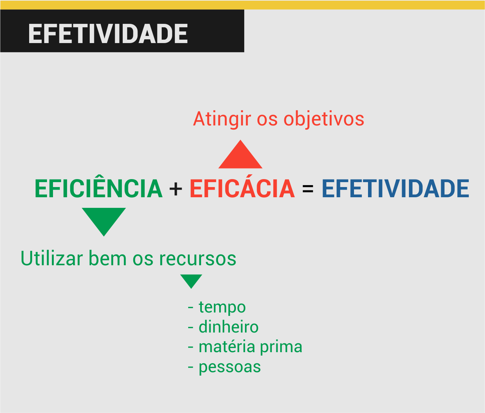

Bem vindx à primeira aula do curso de Auxiliar Administrativo!

Antes de iniciar o conteúdo propriamente dito, dê uma olhada na [ementa](../../../../pages/cursos/administracao.html) para ficar por dentro dos requisitos, regras e outros detalhes do curso.

Se desejar, você poderá realizar o *download* deste ou qualquer outro conteúdo do site pressionando o botão `Imprimir esta página em PDF` localizado no rodapé da página.

Sugiro, para estudos complementares deste curso o material descrito nas referências bibliográficas, em especial:

[BACARJI, Alencar Garcia. Formação Inicial e Continuada: Auxiliar Administrativo](https://www.ifmg.edu.br/portal/extensao/pronatec/cursos/cursos-fic/projeto-pedagogico-de-curso-auxiliar-administrativo)

Sem mais delongas, *allons-y*!

---

## Sumário da Aula

1. [O que é ser Auxiliar Administrativo](#O-que-e-ser-Auxiliar-Administrativo)
2. [O mercado de Auxiliar Administrativo](#O-mercado-de-Auxiliar-Administrativo)
3. [Exercício Prático - Conhece-te a ti mesmo](#Exercicio-Pratico-Conhece-te-a-ti-mesmo)
4. [Eficiência, Eficácia e Efetividade](#Eficiencia-Eficacia-e-Efetividade)
5. [Vendendo Ideias!](#Vendendo-Ideias)
6. [Referências Bibliográficas](#Referencias-Bibliograficas)

---

## O que é ser Auxiliar Administrativo?

Toda empresa e organização existente demanda, além de **profissionais técnicos**, uma equipe responsável por sua **administração**.

Pense em uma padaria, por exemplo: para tudo funcionar perfeitamente são necessários padeiros, confeiteiros e cozinheiros. Estas tarefas demandam experiência e *habilidades técnicas*.

Por outro lado, para produzirem os bolos e pães da padaria, a equipe técnica necessita de matéria prima (farinha, leite, ovos, açúcar, sal...); além disso são necessários vendedores para atenderem os clientes e venderem os produtos; e uma equipe especial, responsáveis por planejar promoções, entrar em contato com fornecedores, organizar o caixa da empresa, pagar os funcionários e  realizar outras tarefas "burocráticas".

É neste contexto de *organizar e planejar* uma organização que surge a Administração.

> A administração é o processo de consecução dos objetivos organizacionais de uma maneira eficiente, eficaz e efetiva, por meio do planejamento, da organização, da liderança e do controle dos recursos organizacionais.(CARAVANTES, 2005)

O auxiliar administrativo surge neste contexto como um **profissional multitarefas**, pois sua rotina abrange diferentes tarefas e dificilmente será monótona,pois ele sempre estará mudando de atividades e auxiliando diferentes setores da empresa.

O auxiliar administrativo irá, acima de tudo, dar apoio à administração de uma empresa em suas tarefas diárias, realizando **tarefas diversas e em diferentes setores**, como, por exemplo: compras, pessoal, logística, estoque, financeiro, marketing, etc.

Apesar da versatilidade do cargo, há atividades específicas que o auxiliar pode e não pode realizar.

O Auxiliar Administrativo **pode**:

<ul>
  <li class='item-ok'>Estruturar e organizar arquivos e documentos;</li>
  <li class='item-ok'>Redigir e digitar  documentos e comunicados;</li>
  <li class='item-ok'>Atender e encaminhar o público/clientes;</li>
  <li class='item-ok'>Preencher formulários, planilhas e outros documentos;</li>
  <li class='item-ok'>Receber fornecedores e materiais;</li>
  <li class='item-ok'>Elaborar agendas;</li>
  <li class='item-ok'>Entrar em contato com fornecedores e clientes;</li>
  <li class='item-ok'>Auxiliar no treinamento de funcionários do mesmo setor;</li>
</ul>

O Auxiliar Administrativo **não pode**:

<ul>
  <li class='item-not'>Contratar ou demitir funcionários da empresa;</li>
  <li class='item-not'>Realizar ou redigir contratos com fornecedores ou clientes;</li>
  <li class='item-not'>Realizar acertos ou acordos entre clientes ou fornecedores;</li>
  <li class='item-not'>Controlar as entradas e saídas da empresa;</li>
  <li class='item-not'>Definir metas e objetivos da empresa;</li>

</ul>

---

## O mercado de Auxiliar Administrativo

De acordo com dados da [CATHO](https://www.catho.com.br/institucional/), empresa de classificados online de currículos e vagas, 57% dos auxiliares administrativos possuem graduação e 12% têm Inglês Intermediário (CATHO, 2020).

Pelo fato de ser uma profissão tão ampla, a **especialização** é essencial para esta área! Saber utilizar o **Pacote Office**, se comunicar bem e demonstrar força de vontade e prontidão são competências importantes para se tornar um bom Auxiliar Administrativo.

Em março de 2020 a [média salarial](https://www.catho.com.br/profissoes/auxiliar-administrativo) do profissional no país era de **R$ 1.361,05**, sendo principalmente empregados nos ramos:

Com o tempo, o Auxiliar Administrativo pode trilhar diferentes caminhos, incluindo as áreas Financeira, Contábil e de Gerência.

---

## Exercício Prático - Conhece-te a ti mesmo

A **Análise SWOT**, também conhecida como Matriz FOFA é uma estratégia utilizada para identificar os pontos fortes e fracos de uma pessoa, situação, ideia ou empresa.

Esta análise é composta por **4 diferentes fatores** (ou quadrantes):

Cada fator deve ser detalhadamente analisado a fim de se compreender a dinâmica geral da pessoa ou empresa.

> EXERCÍCIO: Levando em conta as habilidades e competências necessárias para ser um bom auxiliar administrativo, preencha uma Matriz FOFA com as suas características pessoais relacionadas ao cargo.

### S (strengths ou forças)

Neste quadrante deve-se listar todas os **pontos positivos**, forças, vantagens internas e diferenciais da empresa, pessoa, ideia ou situação em relação a seus concorrentes.

### W (weaknesses ou fraquezas)

Aqui temos o oposto. Neste quadrante precisamos levantar quais as principais desvantagens internas (da empresa ou pessoa) em relação aos concorrentes. De forma bem sincera e honesta, é preciso saber quais são as fraquezas, defeitos, vícios e pontos negativos que prejudicam de alguma forma o negócio ou a própria pessoa.

### O (opportunities ou oportunidades)

São as forças externas que influenciam positivamente o negócio, os aspectos com potencial de fazer crescer a vantagem competitiva da empresa. Por serem fatores externos, não temos como influenciar estes aspectos, porém é extremamente importante conhecer cada um deles para que sua empresa possa se preparar para aproveitar estas oportunidades. (PAULA, 2015).

### T (threats ou ameaças)

Por fim temos os aspectos negativos e com potencial de comprometer a vantagem competitiva da empresa, ou seja, o oposto das oportunidades. As ameaças devem ser tratadas com bastante cautela, pois podem prejudicar não apenas o planejamento estratégico da empresa, mas também os resultados. (PAULA, 2015).

### Exemplos de Análise SWOT

---

## Eficiência, Eficácia e Efetividade

Peter Drucker, considerado o Pai da Administração Moderna, disse certa vez: "*Eficiência é fazer certo as coisas. Eficácia é fazer as coisas certas*".

**Eficiência** e **eficácia** são palavras semelhantes e, muitas vezes, consideradas sinônimas. No entanto, existem *diferenças sutis* na definição e utilização de ambos os termos.

`Eficiência` consiste em realizar uma tarefa da melhor maneira possível, com menos desperdício ou em menor tempo.

`Eficácia` consiste em atingir o objetivo ou metas de uma tarefa.

`Efetividade` consiste em ser, ao mesmo tempo, eficiente e eficaz.

> EXERCÍCIO: Gustavo e Gabriela são dois estudantes de um curso de Francês. Gabriela conseguiu, em um único dia, ler um livro indicado pelo professor. Gustavo, por outro lado, demorou 15 dias para terminar o mas livro, mas foi melhor que Gabriela na prova sobre o mesmo. Quem foi mais eficiente? E quem foi mais eficaz?

---

## Vendendo Ideias!

Joseph Scumpeter afirma que para sobreviverem e se desenvolverem, as empresas do mundo capitalista *precisam* inovar! Este impulso de mudança recebe o nome de *destruição criativa*.

O conceito de Schumpeter está relacionado às **novas ideias** que são diariamente apresentadas no mercado. Estas ideias precisam ser, acima de tudo, viáveis e condizentes com a situação presente da empresa.

As empresas apresentam uma série de problemas que precisam ser resolvidos. **Demonstrar interesse** pelos assuntos da empresa ou para melhorar um produto ou serviço é fundamental para garantir a competitividade!

Toda ideia apresenta, por si só, **pontos fortes e fracos**. Não apresente uma ideia pela metade esclareça porque ela é boa para sua empresa e demostre como ela pode funcionar, antecipando sempre possíveis objeções.

- **Toda ideia** possui prós e contras;
- Analisar a sua **viabilidade** consiste em relacionar estes pontos positivos e negativos, buscando sempre solucionar todas possíveis objeções;
- Há sempre um **momento certo** para apresentar suas ideias: o melhor momento é quando um projeto necessita ser planejado ou um problema foi detectado. 

Se você tem uma ideia inovadora, precisará se preparar para dialogar e negociar com os detentores do capital para transformá-la em sucesso. Por isso, não basta apenas ter uma grande ideia. Os desafios atuais vão muito além da destruição criativa! (DORNELAS, 2014)

> EXERCÍCIO: Maricleuza abriu uma empresa que produz produtos de beleza e higiene. No entanto, por ser nova no setor, sua empresa ainda não é muito conhecida no mercado.
Planeje uma ideia que ajuda a empresa de Maricleuza a se tornar reconhecida. Analise sua ideia, levando em consideração os prós e contras, e a viabilidade da mesma.

---

## Referências Bibliográficas

BACARJI, Alencar Garcia. Formação Incial e Continuada Auxiliar Administrativo. Curitiba: Instituto Federal do Paraná, 2012.

CAMARGO, R. F. de. Tudo sobre Peter Drucker: conheça quem foi o Pai da Administração Moderna e autor de O Gestor Eficaz. TREASY, Joinville, 3 de mai. de 2017. Disponível em <https://bit.ly/3aqBQHQ>. Acesso em *27 de mar. de 2020*.

CATHO. Guia de Profissões e Salários 2020 - Auxiliar Administrativo. Barueri, 2020. Disponível em <https://bit.ly/2WM4rU5>. Acesso em *27 de mar. de 2020*.

CARAVANTES, G. R.P; KLOECKNER, C. M.; PANNO, C. Administração: teoria e processos. São Paulo: Pearson Prentice Hall, 2005.

DORNELAS, J. A destruição criativa e o empreendedorismo inovador contemporâneo. UOL, São Paulo, 20 de out. de 2014. Disponível em <https://bit.ly/2QPupCq>. Acesso em *27 de mar. de 2020*.

PAULA, G. B. de. Matriz SWOT ou Matriz FOFA: utilizando a Análise SWOT para conhecer as cartas do jogo e aumentar as chances de vitória de sua empresa! TREASY, Joinville, 17 de ago. de 2015. Disponível em <https://bit.ly/3aoYOz9>.  Acesso em *27 de mar. de 2020*.