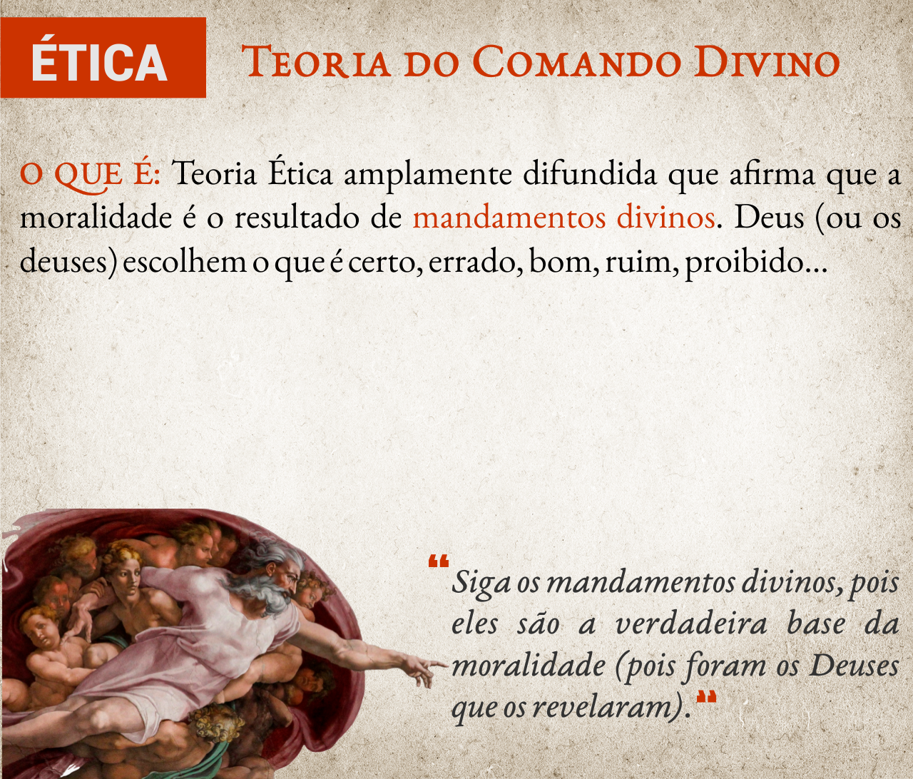
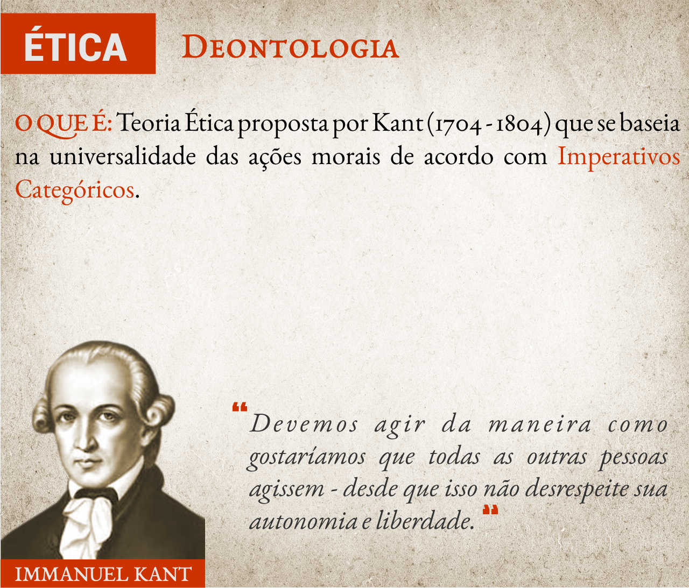
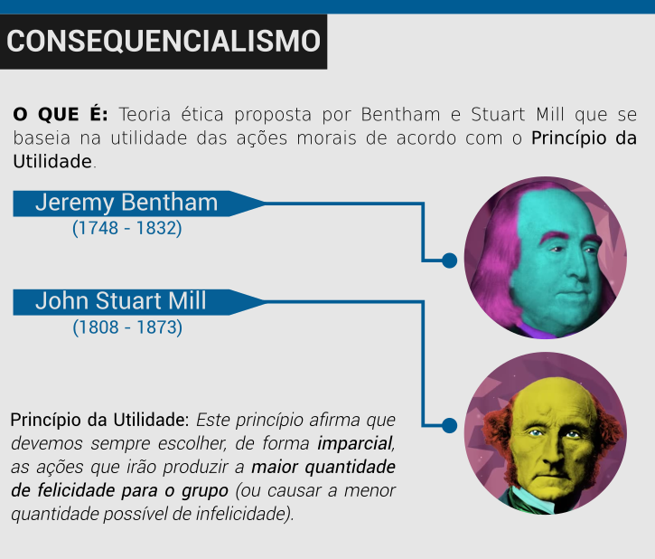
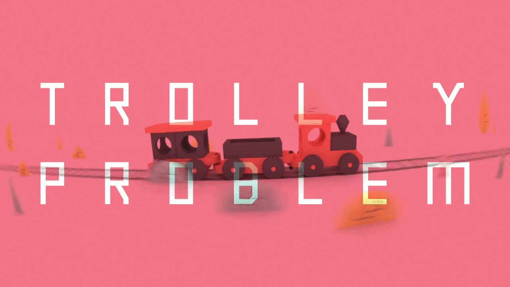
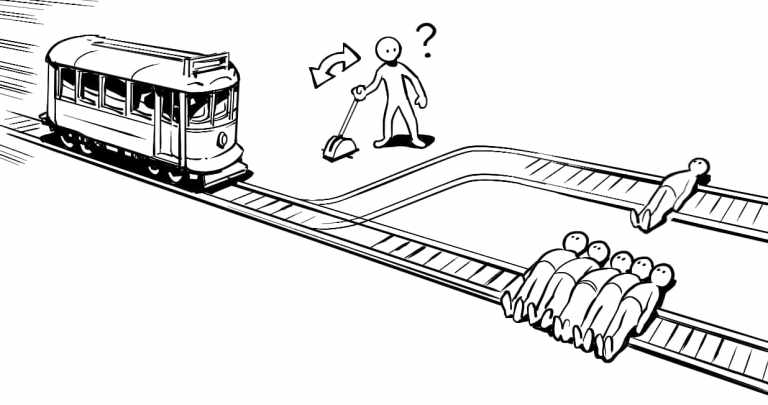

Bem vindx à segunda aula do curso de Auxiliar Administrativo!

Espero, de coração, que tu tenha feito o **resumo e os exercícios** referentes a aula anterior.

Nesta aula iremos estudar o Código de Ética do Administrador, e aprenderemos sobre os diferentes tipos de empresa.

---

## Sumário da Aula

1. [Perceção](#Percepcao)
2. [Ética, Moral e Costumes](#Etica-Moral-e-Costumes)
3. [Teorias Éticas](#Teorias-Eticas)
4. [Ética Profissional](#Etica-Profissional)
5. [Comportamentos Profissionais](#Comportamentos-Profissionais)
5. [Tipos de Empresa](#Tipos-de-Empresa)
6. [Resumo](#Resumo)
7. [Exercícios](#Exercicios)
8. [Referências Bibliográficas](#Referencias-Bibliograficas)

---

## Percepção

Precisamos ter **consciência** sobre nós mesmos e nossas realizações; saber o que queremos já é um bom começo para o nosso sucesso.

O profissional que devido a **estabilidade no emprego**, não busca mudanças, informações  profissionais, podem ter certeza, esta fora do mercado.

O **medo de errar**, muitas vezes, acaba levando a uma **inércia do agir**: por ter medo de fazermos algo errado, acabamos não fazendo nada. Não podemos permitir que os nossos medos interfiram no nosso desenvolvimento pessoal e profissional. Por isto, o auto-conhecimento e a correta percepção sobre suas realizações, sonhos e objetivos é fundamental para o nosso crescimento.

O mercado exige cada vez mais um **profissional globalizado**, preparado para habituar-se e adaptar-se. Por esta razão, nunca deixe de aprender.

---

## Ética, Moral e Costumes

Em nosso cotidiano, constantemente discutimos sobre ética, moral e os costumes.

Estamos acostumados, em tempos de corrupção política tão escancaradas, a falar sobre a (falta) de ética dos políticos. Com isso, lembramos (ou somos lembrados por outros) de outras épocas, quando "*a moral e os bons-costumes*" produzia pessoas mais cultas, respeitosas e éticas.

A ética também está presente nas relações profissionais: médicos, psicólogos, advogados e administradores possuem **códigos de ética** que devem ser seguidos e respeitados pelos profissionais.

Em meio a tantos exemplos e significados destes termos, é importante perguntar: afinal de contas, o que é a **moral** e o que é a **ética**?

### Costumes e Hábitos

Quando falamos sobre **ética ou moral**, estamos nos referindo aos costumes, comportamentos e hábitos de um povo ou sociedade. As duas palavras são traduzidas para o português como **costume**: *ethos* tem origem grega; e *mores* tem origem latina.

Toda cultura e cada sociedade institui uma série de costumes e comportamentos que são naturalizados pelos cidadãos. Estas costumes, por serem anteriores ao nosso nascimento e formam o tecido da sociedade em que vivemos, são considerados inquestionáveis e quase sagrados (CHAUÍ, 2000).

Alguns exemplos de comportamentos de nossa sociedade contemporânea são:

- Usar roupa;
- Usar dinheiro;
- Ir a templos religiosos;
- Não trabalhar em determinados feriados;
- Tabus, como morte, sexo e política.

### Moral

A **moral** está relacionada ao **agir de acordo com os costumes** e regras socialmente difundidas. Este comportamento leva-nos a acreditar que estes hábitos são regras morais evidentes - dizemos, por exemplo: “*É certo fazer tal ação, porque meus antepassados a fizeram e meus parentes a fazem*”.

Em 1771 o Capitão inglês James Cook visitou a ilha de Tonga, no Pacífico Sul. Lá ele observou que durante as refeições homens e mulheres se alimentavam em diferentes locais. Ao questionar o chefe local a razão deste comportamento, o chefe respondeu, somente: "*Taboo*" (GRCIC, 2015).

Há diversos valores sociais que muitas vezes se travestem como *tabus*: há fatos, assuntos e temas que não podem ser (e não são) discutidos.

Alguns exemplos de **regras morais** da nossa sociedade contemporânea são:

<ul>
  <li class='item-ok'>Usar roupa quando estiver em público;</li>
  <li class='item-ok'>Ir a templos religiosos;</li>
  <li class='item-not'>Não trabalhar em determinados feriados;</li>
  <li class='item-not'>Não conversar sobre tabus, como morte, sexo, política...</li>
  <li class='item-ok'>Votar a cada 2 anos</li>
  <li class='item-not'>Não roubar</li>
  <li class='item-ok'>Consumir determinados produtos culturais, como séries, filmes e músicas (cultura de massa)</li>
</ul>

Como a **moralidade** varia de cultura para cultura, há regras de conduta que não se aplicam em todas as sociedades. Para os indígenas, hindus e muitas tribos africanas, as pinturas corporais (e a maquiagem) são, em diversos rituais, obrigatórios, pelo fato de possuirem um significado cultural muito forte e enraizado. Já os muçulmanos acreditam que as tatuagens e pinturas corporais (e cirurgias plásticas) são erradas, pois representam uma tantativa de se alterar aquilo que foi criado por *Allah*.

Imagine que um muçulmano analise as crenças indígenas sobre pinturas corporais: para eles (muçulmanos) as pinturas corporais são erradas e, logo, os indígenas apresentam comportamentos **imorais** (contrários à moral).

Da mesma forma, para um indígena ou hindu, a falta de pinturas corporais em rituais sagrados é errada, e, logo, também imoral.

Por outro lado, se considerarmos alguém neturo, que não possua nenhum pré-conceito sobre tatuagens e pinturas corporais, a presença ou falta de pinturas, por si só, não faz de alguém bom ou ruim. Esta pessoa neutra possui uma visão **amoral** sobre as tatuagens.

### Ética

A **ética** nasce quando se passa a indagar o que são, de onde vêm e o que valem os costumes, pois a ética não pode ser dissociada da filosofia moral. Ela está relacionada ao pensar racionalmente sobre os costumes e hábitos.

É com a ética (também chamada de **filosofia moral**) que ocorrem os questionamentos e as análises racionais dos comportamentos e hábitos das diferentes sociedades.

Alguns exemplos de **questionamentos éticos** são:

<ul>
  <li class='item-question'>Por que usamos roupa?</li>
  <li class='item-question'>Por que devemos trabalhar? É errado não trabalhar?</li>
  <li class='item-question'>Por que não conversamos sobre a morte?</li>
  <li class='item-question'>Votar a cada 2 anos realmente significa participar da vida política do país?</li>
  <li class='item-question'>Roubar ou matar é errado em todas as situações? Por que as pessoas roubam?</li>
  <li class='item-question'>Porque vamos ao cinema assistir Thor, mas geralmente zombamos das religiões de matriz  africana?</li>
</ul>

---

## Teorias Éticas

Assim como existem diferentes visões morais sobre o mundo (lembre-se do exemplo da Ilha de Tonga), existem diferentes Teorias Éticas sobre as nossas ações. Iremos analisar brevemente 4 diferentes teorias: A *Teoria do Comando Divino*; A *Teoria Deontológica*; A *Teoria Consequencialista*; e por fim a *Teoria Contratualista*.

### Teoria do Comando Divino

Esta a Teoria Ética mais antiga e ainda a mais aceita. Ela afirma que Deus (ou os deuses) são os responsáveis por *comandar* aquilo que é certo e errado.

Nas mais diferentes religiões existentes há diferentes exemplos desta Teoria.

A fé judaico-cristã afirma que Deus entregou a Moisés duas tábuas contendo *Os Dez Mandamentos*. Estes mandamentos são *leis divinas* que devem ser seguidas por todos - e se não forem seguidas há consequências divinas a este desrespeito.

Para os muçulmanos há *5 Pilares*, revelados por Allah e salientados pelo Arcanjo Gabriel, que devem guiar a fé islâmica, incluindo a oração, a caridade, o jejum e a peregrinação à cidade de Meca.

Os hindus, por sua vez, não apenas consideram as vacas como animais sagrados, mas também os ratos, as cobras, os crocodilos e os búfalos. Para eles, estes animais representam a pureza e resiliência - além de carregarem (espiritualmente ou literalmente) diferentes deuses. Assim sendo, matar ou ferir algum destes animais seria equivalente a ferir um deus, ou seja, uma blasfêmia (HELLERN, NOTAKER & GAARDER, 2000).

Apesar de sua grande difusão, esta Teoria apresenta alguns problemas filosóficos.

O primeiro e principal deles está relacionado à sua abrangência: qual religião deveria ser utilizada como base para se definir as regras éticas de uma profissão, por exemplo?

O segundo problema com esta teoria está relacionado com um problema conhecido como *O Dilema de Eutífron* que questiona a racionalidade dos comandos divinos.

Por outro lado a Teoria do Comando Divino, junto a suas recompensas e punições, fornece uma *motivação* para agirmos de forma moral. Além disso, muitos defensores desta ética afirmam que as falhas e faltas que a Justiça apresenta, em casos como de Hitler e Stalin (que evitaram a punição humana pelos seus atos) são compensadas pela justiça divina.

Muitos se sentem como o escritor russo Dostoevsky, cujo um dos personagens de sua obra *Os Irmãos Karamazov* diz: "Se destruísse no homem a fé na imortalidade [de Deus], não somente o amor secará nele, mas também a força de continuar a vida no mundo. Mais ainda, não haverá então nada de imoral, tudo será autorizando, até mesmo o canibalismo".

### Deontologia

Para resolver alguns dos dilemas criados pela Teoria do Comando Divino, Immanuel Kant desenvolveu uma filosofia moral baseada na *universalidade das ações*. 

A Teoria Kantiana, também chamada de **Deontologia**, apoia-se no conceito de **imperativo categórico**.

Imperativos Categóricos representam "a regra fundamental que toda pessoa deveria respeitar para agir moralmente. Então, para o filósofo, se quisermos ser pessoas boas, devemos fazer aquilo que esse imperativo exige" (TATIM, 2019a).

Para entender bem este conceito é importante ressaltar que Kant divide seu imperativo em duas partes (fórmulas).

A **primeira fórmula do Imperativo Categórico**, também chamada de Fórmula da Lei Universal, diz: "*Age apenas segundo uma máxima tal que possas ao mesmo tempo querer que ela se torne lei universal.*"

Esta ideia afirma que devemos agir somente de acordo com as ações (ao que Kant chama de *máximas*) que podem ser universalizáveis. Em termos simples: devemos agir da maneira como queremos que *todas as outras pessoas* ajam.

Exemplo: imagine que você está com problemas financeiros e decide pedir dinheiro emprestado. Você sabe que não tem condições para pagar o empréstimo, mas, na hora de fazê-lo mente para o agente bancário e ele lhe concede o dinheiro.

Para Kant, o exemplo acima evoca a máxima "Mentir para conseguir aquilo que se deseja". Dizer que esta máxima é universalizável significa afirmar que não há problemas se todas as pessoas mentissem para conseguirem o que querem.

Isto seria uma coisa boa? Claro que não, pois assim não seria possível confiar nas pessoas e em pouco tempo ninguém mais emprestaria dinheiro para ninguém. Logo, o **Imperativo Categórico** afirma que não podemos querer que todas ajam segundo esta máxima, ou seja, ela deve ser rejeitada.

A **segunda fórmula do Imperativo Categórico**, também conhecida como Fórmula do Fim em Si, é a seguinte: "*Age de tal maneira que uses a tua humanidade, tanto na tua pessoa como na pessoa de qualquer outro, sempre e simultaneamente como fim e nunca simplesmente como meio.*".

Esta fórmula afirma que é errado usar as pessoas como meios para atingir os nossos fins. "Pessoas são agentes racionais, são seres dotados de autonomia, capazes de escolher livremente os seus objetivos" (TATIM, 2019a) e por isto devemos sempre repeitá-los.

No exemplo acima estamos utilizando o agente bancário como um instrumento para conseguirmos dinheiro. O mesmo vale quando aponta-se uma arma para roubar alguém: estas ações violam a sua autonomia como pessoa e as obrigam (ou forçam) a fazer coisas que elas não querem.

Resumindo sobre a Deontologia Kantiana: *devemos agir da maneira como gostaríamos que todas as outras pessoas agissem - desde que isso não desrespeite sua autonomia*.

### Consequencialismo

Enquanto a Teoria Kantiana focava na *intenção* por trás das nossas ações, os filósofos Jeremy Bentham e John Stuart Mill começaram a focar nas *consequências das ações*.

Assim surgiu o *Utilitarianismo*, que mais tarde foi renomeado como *Consequencialismo*. Para esta Teoria, as ações devem ser analisadas em termos de quanta felicidade ou prazer elas produzem.

Ao contrário de Kant, a base desta Teoria está no **Princípio da Utilidade**. Este princípio afirma que devemos sempre escolher, de forma imparcial, as ações que irão produzir a maior quantidade de felicidade para o grupo (ou causar a menor quantidade possível de infelicidade). 

Para entender melhor o Consequencialismo vamos pensar no clássico Dilema do Bonde.

### O Dilema do Bonde

(Imagem retirada da [TED ED de Eleanor Nelsen](https://www.youtube.com/watch?v=yg16u_bzjPE) - Todos os direitos reservados aos seus autores)

O Dilema do Bonde foi apresentado pela primeira vez em 1967 pela filósofa moral britânica Phillipa Foot. Este dilema propõe a seguinte situação: imagine que você está próximo a uma linha de um bonde que está desgovernado. Caso nada seja feito ele irá seguir em frente e mater 5 operários que estão na linha. Não há tempo para você avisar aos funcionários para saírem do trilho, mas, você pode utilizar uma alavanca para desviar o bonde para outro trilho.

Neste outro trilho, porém, há um outro trabalhador que também não pode ser avisado a tempo.

O que você faz: deixa o bonde seguir em frente e matar 5 funcionários, ou utiliza a alavanca para matar apenas 1?

(Imagem retirada do site [Filosofia na Escola](https://filosofianaescola.com/moral/utilitarismo/) - Todos os direitos reservados aos seus autores)

Do ponto de vista **kantiano** você não pode matar nenhuma pessoa. Kant pensaria, em primeiro lugar, que ao não agir para desviar o bonde, você não está fazendo nada errado, pois não tem a intenção de matar cinco pessoas. Na verdade, se trata de uma fatalidade pela qual não deve ser responsabilizado.

Em segundo lugar, consideraria que, caso desvie o bonde, está usando uma pessoa simplesmente como um meio para um bem maior. Para Kant isso seria incorreto, pois você está tratando a pessoa como uma coisa, não como um ser humano, já que está ignorando completamente sua capacidade de escolha.

Do ponto de vista **utilitarista** você deve puxar a alavanca. Matar uma pessoa para salvar cinco claramente resultará num saldo maior de felicidade do que não fazer nada. Portanto, se você fosse um utilitarista coerente, deveria puxar a alavanca.

"É importante diferenciar o utilitarismo do egoísmo. De acordo com essa visão, o certo é aquilo que nos é benéfico. Uma pessoa egoísta, no dilema do trem, optaria pela ação que vai lhe deixar mais confortável. Um utilitarista, ao contrário, considera a felicidade de todas as pessoas que serão afetadas pela ação" (TOTIM, 2019b).

(Imagem retirada da [TED ED de Eleanor Nelsen](https://www.youtube.com/watch?v=yg16u_bzjPE) - Todos os direitos reservados aos seus autores)

Outra variação deste experimento mental propõe agora que você considere que está em uma ponte junto com um desconhecido obeso. A única maneira de impedir o bonde de atropelar os 5 trabalhadores é jogando esta pessoa desconhecida da ponte. O que você faria?

(Imagem retirada da [TED ED de Eleanor Nelsen](https://www.youtube.com/watch?v=yg16u_bzjPE) - Todos os direitos reservados aos seus autores)

Para um utilitarista a resposta é a mesma. No entanto, do ponto de vista psicológico, a primeira situação tende a provocar menor desconforto nas pessoas: 89% das pessoas puxariam a alavanca, mas apenas 11% delas lançaria o desconhecido-obeso para parar o trem (KHAZAN, 2014).

As emoções de uma pessoa alteram a maneira como ela tende a responder este dilema ético (NELSEN, 2016), tornando a segunda situação mais desconfortável e pessoal. No entanto, outros pesquisadores afirmam que este experimento é tolo e irreal, de modo que as pessoas não reagem a ele da mesma forma que reagiriam no mundo real (KHAZAN, 2014).

Independentemente das respostas a este e outros dilemas éticos, é importante ressaltar que estas decisões ainda se embasam na relação emocional das pessoas com o caso (RIBEIRO, 2020)- como revela o recente exemplo envolvendo o médico Drauzio Varella.

### Teoria Contratualista

Imagine um mundo sem regras, onde nada é ilegal ou imoral: todos são absolutamente **livres**.

Se, por um lado, este mundo parece ser utópico e libertador (já que não existiriam pressões sociais para estudar, trabalhar ou se preocupar com as outras pessoas e o futuro), por outro, pelo menos de acordo com o filósofo britânico **Thomas Hobbes**, este mundo seria seu pior pesadelo.

Hobbes acreditava que as pessoas são, por natureza, egoístas, competitivas, orgulhosas, vingativas e ambiciosas: "*o homem é o lobo do homem*".

Este mundo sem regras, como o descrito acima, foi chamado por Hobbes de **estado de natureza**. Neste mundo a vida seria uma constante guerra, de todos contra todos.

Deste ponto de vista, a **moralidade** surge como uma **necessidade e um pacto**. A violência extrema provocada pela total liberdade individual faz com que as pessoas, com o tempo, abram mão de parte de sua liberdade em nome de sua própria segurança. Este **contrato social**, ou seja, o pacto feito entre as pessoas em nome de sua segurança individual, dá origem (para Hobbes) ao Estado.

**Jean Jacques Rousseau**, séculos mais tarde, chegou em conclusões semelhantes às de Hobbes: para uma boa convivência entre as pessoas é necessário instituir um **contrato social** que garanta a liberdade e a segurança de todos. É bom ressaltar que Rousseau, ao contrário de Hobbes, acreditava que o **estado de natureza** do homem é livre, virtuoso, piedoso, amoral e bondoso.

Ambos os filósofos ressaltam que as pessoas são, naturalmente *amorais e aéticas*. A moralidade e a ética surgem a partir do momento em que se institui um conjunto de regras para a conviência em sociedade, ou seja, por meio do **contrato social**.

---

## Ética Profissional

Para se evitar o julgamento emocional e subjetivo dos profissionais perante aos dilemas vivenciados no ambiente de trabalho, todas as profissões possuem um **Código de Ética**, isto é, um conjunto de regras éticas próprias que orienta e direciona o comportamento dos profissionais da área (BRASIL, CFA, 2018). 

O objetivo do **Código de Ética ** é, acima de tudo, padronizar o comportamento e as ações dos profissionais, oferecendo algumas respostas aos dilemas mais comuns daquela profissão. Apesar de muitas vezes serem publicados como Leis Complementares ou Resoluções Normativas, os códigos de ética **não são Leis Jurídicas**. Cada código prevê, com base nas Leis do País, as punições que os profissionais antiéticos devem enfrentar, mas isso não os qualifica como leis jurídicas.

Um exemplo bastante comum de Ética Profissional está relacionado aos médicos. Seu código de ética garante a obrigação dos profissionais em manterem sigilo sobre as informações de todos os pacientes. Já o código de ética dos jornalistas baseia-se no direito dos cidadãos de terem acesso à informação, mas pode resguardar o sigilo das fontes utilizadas para transmitirem esta informação.

Os administradores também possuem um [Código de Ética](https://cfa.org.br/wp-content/uploads/2018/11/resolucao_537_2018_665.pdf), aprovado em 2018.

Este código apresenta 23 artigos, dos quais os mais importantes serão listados abaixo.

(Art. 2º) São deveres do profissional de Administração:

<ul>
  <li class='item-ok'>II – defender os direitos e interesses do cliente;</li>
  <li class='item-ok'>III - guardar sigilo sobre o que saiba em razão do exercício profissional lícito de seu ofício,</li>
  <li class='item-ok'>IV - manter independência técnica na orientação de serviços, sem abdicar de sua dignidade e prerrogativas, seja como profissional liberal ou empregado;</li>
  <li class='item-ok'>VII – esclarecer o cliente sobre a função social da organização e a necessidade de preservação do meio ambiente.</li>
</ul>

(Art. 3º) Constitui infração disciplinar::

<ul>
  <li class='item-not'>I. tratar outros profissionais ou profissões sem urbanidade, de modo a ofender sua dignidade, ou discriminá-los de qualquer forma; </li>
  <li class='item-not'>III. assinar documentos elaborados por terceiros sem a sua orientação ou supervisão; </li>
  <li class='item-not'>IV. afastar-se, sem justificativa, de suas atividades profissionais sem comunicar previamente ao seu cliente ou empregador;</li>
  <li class='item-not'>V. violar, sem justa causa, sigilo profissional;</li>
  <li class='item-not'>XV. praticar, no exercício da atividade profissional, ato contrário à lei ou destinado a fraudá-la, ou contribuir para a realização de ato definido como ilícito penal;</li>
  <li class='item-not'>XVI. usar de artifícios enganosos ou fraudulentos para obter vantagem indevida;</li>
</ul>

(Art. 4º) São direitos do Profissional de Administração:

<ul>
  <li class='item-ok'>I - exercer a profissão independentemente  de questões religiosas, raça, sexo, nacionalidade, cor, idade, condição social, orientação sexual ou de qualquer natureza discriminatória; </li>
  <li class='item-ok'>II - apontar falhas nos regulamentos e normas das instituições, quando as julgar indignas do exercício profissional ou prejudiciais ao cliente, devendo, nesse caso, dirigir-se aos órgãos competentes, em especial ao Conselho Regional de Administração;</li>
  <li class='item-ok'>III - exigir justa remuneração por seu trabalho, a qual corresponderá às responsabilidades assumidas a seu tempo de serviço dedicado, sendo-lhe livre firmar acordos sobre salários, velando, no entanto, pelo seu justo valor;</li>
</ul>

---

## Comportamentos Profissionais

Baseado nas regras do Código de Ética, é importante que os profissionais sigam algumas dicas de bom comportamento profissional.

<ul>
  <li class='item-ok'>Conhecer bem a empresa e tudo que ela oferece, saber quais são seus diferencias em relação aos seus concorrentes;</li>
  <li class='item-ok'>Saber usar equipamentos como fax, computador (internet, dentre outros programas);</li>
  <li class='item-ok'>Estar em dia com a tecnologia, ou seja, ter conhecimento de informática;</li>
  <li class='item-ok'>Estar bem informado, fazer cursos de especializações;</li>
  <li class='item-not'>Não usar sua posição em beneficio próprio ou de terceiros;</li>
  <li class='item-ok'>Ser responsável da administração de documentos, ou papéis de importância;</li>
  <li class='item-warning'>Só interromper o chefe quando não puder resolver um problema sozinho;</li>
  <li class='item-warning'>Anotar assuntos pendentes ao longo da jornada para evitar interrupções frequentes;</li>
  <li class='item-ok'>Incentivar sua participação em reuniões de trabalho e cursos extras.</li>
</ul>

---

## Tipos de Empresa

No módulo de Contabilidade estudaremos a fundo os diferentes tipos de empresas e organizações existentes. Por enquanto é importante lembrarmos que existem alguns tipos diferentes de empresas, que podem ser classificadas de acordo com **seu tipo de atividade** ou com o **objetivo financeiro**.

Em relação às empresas por tipo de atividade, temos:

- **Indústria**
  - Tem como objetivo a transformação da matéria-prima em um bem material;
  - Exemplos: Fábricas e montadoras
- **Comércio**
  - Compra o que as indústrias produzem e distribui esses produtos em pontos de vendas; Vendem produtos diretamente ao consumidor;
  - Exemplo: Restaurantes, supermercados, papelarias, etc.
- **Prestadoras de Serviço**
  - São aquelas cujas atividades não resultam na entrega de mercadorias, mas da oferta do próprio trabalho ao consumidor.
  - Exemplos: Escolas, hospitais, cinema

Em relação às empresas quanto ao objetivo financeiro, tem-se:

- **Empresas sem fins lucrativos**
  - Também chamadas de filantrópicas ou beneficentes
  - São mantidas com doações ou verbas governamentais
  - Exemplos: ONGS
- **Empresas com fins lucrativos**
  - As empresas com fins lucrativos são mantidas com o dinheiro que recebem em troca dos bens ou serviços que oferecem.
  - O lucro é necessário porque dele dependem a segurança e sobrevivência da empresa, seu crescimento e a melhoria das condições de trabalho.

---

# Resumo

- Precisamos ter **consciência** sobre nós mesmos e nossas realizações; saber o que queremos já é um bom começo para o nosso sucesso.

- Quando falamos sobre **ética ou moral**, estamos nos referindo aos costumes, comportamentos e hábitos de um povo ou sociedade. As duas palavras são traduzidas para o português como **costume**: *ethos* tem origem grega; e *mores* tem origem latina.
  - A **moral** está relacionada ao **agir de acordo com os costumes** e regras socialmente difundidas.
  - A **ética** nasce quando se passa a indagar o que são, de onde vêm e o que valem os costumes.

- Assim como existem diferentes visões morais sobre o mundo, existem **diferentes Teorias Éticas** sobre as ações humanas.
  - **Teoria do Comando Divino**: afirma que Deus (ou os deuses) são os responsáveis por *comandar e escolher* aquilo que é certo e errado;
  - **Teoria Deontológica**: afirma que devemos seguir o Imperativo Categórico para decidir o que é certo e errado: *devemos agir da maneira como gostaríamos que todas as outras pessoas agissem - desde que isso não desrespeite sua autonomia*;
  - **Teoria Consequencialista**: as ações devem ser analisadas em termos de quanta **felicidade ou prazer** elas produzem;
  - **Teoria Contratualista**: afirma que a moralidade surge para garantir a liberdade por meio de regras sociais (Contrato Social).

- Os Códigos de Ética Profissional são um conjunto de regras éticas próprias que orienta e direciona o comportamento dos profissionais da área.
  - O Código de Ética do Administrador possui 23 artigos que dispõe sobre direitos, deveres e proibições inerentes aos profissionais administrativos.

-  As empresas podem ser classificadas de acordo com **seu tipo de atividade** (INDÚSTRIA, COMÉRCIO E PRESTAÇÃO DE SERVIÇOS) ou com o **objetivo financeiro** (COM OU SEM FINS LUCRATIVOS).

---

## Exercícios

01. Explique, com suas palavras, a diferença entre moral e ética. Exemplifique.

02. Explique, com suas palavras, a diferença entre imoral, amoral, antiético e aético.

03. De acordo com a Teoria Ética Kantiana responda: Quando somos convidados por um amigo para ir na sua festa de aniversário - e vamos na festa com o único objetivo de comer um pedaço de bolo - estamos tratando nosso amigo como um instrumento para conseguir aquilo que queremos?

04. O que você faria nas duas situações envolvidas no Dilema do Bonde? Dê uma olhada [nesta criativa solução](https://www.youtube.com/watch?v=-N_RZJUAQY4).

05. Um auxiliar administrativo, acatando ordens de um superior, omitiu dados importantes da empresa em um documento que redigia para um cliente, induzindo-o assim a adquirir um produto da empresa. Analise o comportamento do auxiliar do ponto de vista ético;

06. Após a venda de um produto defeituoso, um cliente encaminhou-se até a empresa para pedir a troca do produto. Irritado com a situação, o cliente solicitou ao auxiliar administrativo que o atendia dados pessoais do vendedor que o atendeu no momento da compra. Do ponto de vista ético, o auxiliar deve ou não passar as informações ao cliente?

07. Dê 5 exemplos de cada tipo de empresa: Indústria; Comércio; Prestador de Serviços; Com Fins Lucrativos e Sem Fins Lucrativos.

---

## Referências Bibliográficas

ARRUDA, J. L. A ética nossa de cada dia. Estado de São Paulo, São Paulo, 4 de set. de 2018. Disponível em <https://bit.ly/2wFxJsQ>. Acesso em *27 de mar. de 2020*.

BRASIL. CFA. Resolução Normativa CFA nº 537, de 22 de março de 2018. Aprova o Código de Ética dos Profissionais de Administração previsto na Lei nº 4.769, de 09 de setembro de 1965. Disponível em <https://bit.ly/2QCq6dz>. Acesso en *20 de mar. de 2020*.

CHAUÍ, Marilena. Convite à filosofia. São Paulo: Editora Ática, 2000.

DOSTOEVSKY, F. M. Os Irmãos Karamazov. São Paulo: 34, 2008

GRCIC, Joseph. Ethics: Theory and Practice (English Edition) - 7 ed. Terre Haute: Philosophy Department / Indiana State University, 2015. 675 p.

HELLERN, V., NOTAKER, H., & GAARDER, J. (2000). O livro das religiões. São Paulo: Companhia das Letras.

KHAZAN, O. Is One of the Most Popular Psychology Experiments Worthless? The Atlantic, 24 de jul. de 2014. Disponível em <https://bit.ly/3dFSipJ>. Acesso em *29 de mar. de 2020*.

NELSEN, E. Would you sacrifice one person to save five? TED Ed, 2016. Disponível em <https://bit.ly/2JmvSw3>. Acesso em *29 de mar. de 2020*.

RIBEIRO, F. T. Críticas a Drauzio revelam "lado B" da empatia, diz neurocientista. UOL, 10 de mar. de 2020. Disponível em <https://bit.ly/3dwfOp8>. Acesso em *29 de mar. de 2020*.

TATIM, W. G. Imperativo Categórico. Filosofia na Escola, 1 de set. de 2019a. Disponível em <https://bit.ly/2Up3mjB>. Acesso em *29 de mar. de 2020*.

TATIM, W. G. Utilitarismo. Filosofia na Escola, 1 de set. de 2019b. Disponível em <https://bit.ly/3bCLis7>. Acesso em *29 de mar. de 2020*.

TATIM, W. G. Utilitarismo. Filosofia na Escola, 1 de set. de 2019b. Disponível em <https://bit.ly/3bCLis7>. Acesso em *29 de mar. de 2020*.

TATIM, W. G. Diferenças entre utilitarismo e ética kantiana. Filosofia na Escola, 17 de dez. de 2019b. Disponível em <https://bit.ly/2xvi3sk>. Acesso em *29 de mar. de 2020*.
