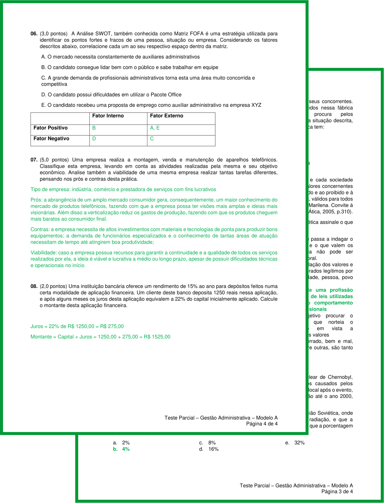
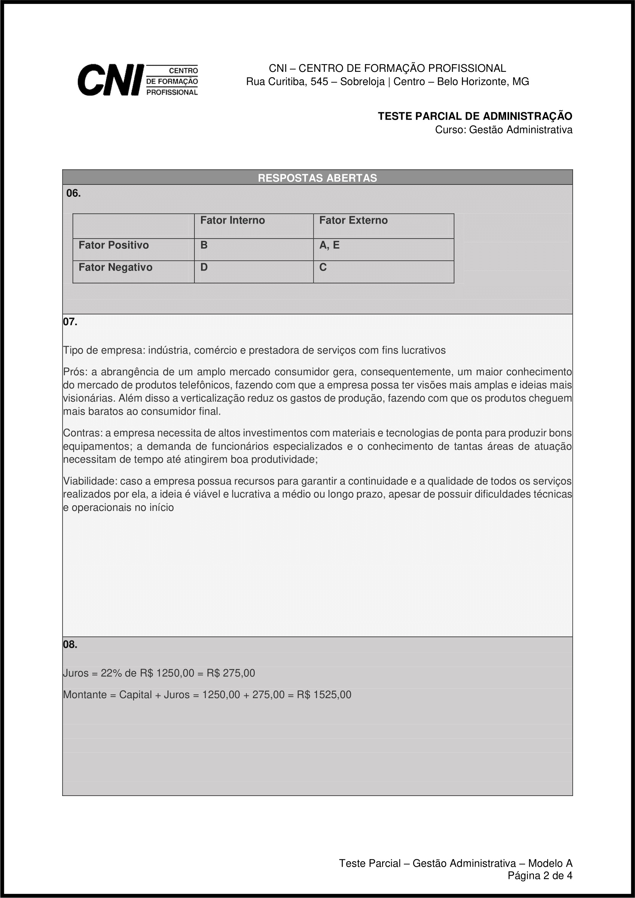

Bem vindx à mais uma aula do curso de Auxiliar Administrativo!

Conforme presente no nosso cronograma, nesta aula será aplicada a **Prova Parcial**, no valor de 10 pontos.

### Aplicação das Provas

Todas as provas são compostas por duas partes: o caderno de respostas e o caderno de perguntas.

O **caderno de respostas** é composto pelas 2 primeiras páginas da prova (1ª folha). Somente este caderno deverá ser entregue.

O **caderno de perguntas** é composto pelas demais páginas da prova. Este caderno pode ser levado para casa.

A primeira página do caderno de respostas é composta pelo gabarito, no qual deverão estar as respostas fechadas da prova. Ele deve ser preenchido obrigatoriamente a caneta (azul ou preta).

A segunda página do caderno de respostas é composta pela matriz, na qual deverão estar  as respostas abertas da prova. Ele deve ser preenchido obrigatoriamente a caneta (azul ou preta).

Somente o **caderno de respostas** será considerado para a correção das provas, mesmo que as as mesmas sejam entregues inteiras.

### Reposição das Provas

- As provas serão **repostas**, garantindo seu valor integral (100%), mediante a apresentação de **justificativas ou atestados**, que expliquem uma possível falta.

- Em caso da **não apresentação** de justificativas por escrito das faltas ocorridas em data de prova(s), haverá:
  - Reposição da PROVA PARCIAL, em data acertada, por trabalho de valor equivalente a 60% do valor da prova;
  - Nulidade da nota da PROVA FINAL.

- Demais casos não previstos serão analisados pelo professor ou coordenador do curso.

- Todas as provas anteriormente aplicadas podem ser acessadas pelos alunos como forma de estudo e consulta [nesta página](../provas-anteriores).
