Bem vindx à mais uma aula do curso de Auxiliar Administrativo!

Nesta reta final do nosso primeiro módulo, iremos estudar os principais tipos de documentos empresariais e as técnicas utilizadas para escrevê-los.

Sugiro, para estudos complementares deste curso o material descrito nas referências bibliográficas, em especial:

[Manual de redação da Presidência da República](https://bit.ly/3fGZWRM)
[LOPES & PORRUA. Comunicação Empresarial](https://bit.ly/2zEFHDG)

*Allons-y!**

---

## Sumário da Aula

1. [Documentos Empresariais](#Documentos-Empresariais)
2. [Dicas de Redação Empresarial](#Dicas-de-Redação-Empresarial)
3. [Comunicação e Improvisação Teatral](#Comunicacao-e-Improvisação-Teatral)
7. [Resumo](#Resumo)
8. [Exercícios](#Exercicios)
9. [Referências Bibliográficas](#Referencias-Bibliograficas)

---

## Documentos Empresariais

Redação empresarial é uma modalidade de comunicação entre pessoas por meio documentos e atos normativos escritos.

No dia a dia de uma empresa, diversas decisões e ações são tomadas. Estas decisões podem impactar todo o funcionamento de uma empresa ou setor, e por isso devem ser devidamente **comunicados** a todos os interessados.

Outro exemplo clássico de comunicação empresarial se dá diretamente com seus clientes ou fornecedores. Uma boa relação entre a empresa e seu ambiente externo é possibilitada em grande parte pela comunicação, feita por meio das propagandas, divulgações e atendimentos ao público.

Assim sendo, quando se redige um documento empresarial, o mesmo pode ter 2 destinos diferentes: interno (quando o documento será utilizado internamente pela empresa, sem deixar suas instalações) ou externo (quando o documento é enviado para clientes, fornecedores ou a ambientes fora das instalações da empresa).

Existem diversos modelos diferentes de documentos empresariais, cada qual com suas particularidades e regras de escrita. Suas particularidades serão analisadas individualmente.

|    DOCUMENTO    |    ORIGEM    |    DESTINO    |    OBJETIVOS    |
|-----------------------|--------------------------------|-------------------------------------------|--------------------------------------------------------------------------|
|    Ata    |    Empresa    |    Interno    |    Registrar o que aconteceu em uma reunião    |
|    Carta Comercial    |    Empresa    |    Cliente, fornecedor ou patrocinador    |    Divulgar a empresa   para atrair e manter clientes ou parceiros    |
|    Declaração    |    Empresa    |    Empresa    |    Atestar a   veracidade de   uma informação sobre uma pessoa física    |
|    E-mail    |    Pessoa Física ou Empresa    | Interno ou Externo |    Enviar documentos ou encaminhar informações    |
|    Memorando    |    Empresa    |    Interno    |    Comunicação interna da empresa    |
|    Ofício    |    Empresa    |    Externo    |    Comunicação externa da empresa    |
|    Procuração    |    Pessoas Físicas    | Interno ou Externo |    Transferir poderes a terceiros    |
|    Recibo    |    Empresa    |    Pessoa Física ou empresa    |    Registrar o recebimento de produtos/serviços e o seu pagamento    |
|    Requerimento    |    Pessoa Física ou Empresa    |    Autoridades Públicas    |    Realizar   solicitações ou pedidos aos órgãos públicos    |

Destes documentos, daremos ênfase a 6.

### Ata

**Atas** são documentos redigidos em **reuniões** para se registrar aquilo que foi pautado e falado durante os encontros.

Em toda reunião empresarial deve-se escolher um **secretário** que se encarregará por escrever as atas. Este secretário pode ser escolhido ao acaso, nas reuniões, ou ser um funcionário da empresa especializado neste tipo de tarefa, como recepcionistas, secretários e auxiliares.

A principal caracterísitica de uma ata é que **as mesmas possuem somente 1 parágrafo** no qual são apresentados todos os detalhes da reunião.

Ao final da reunião, a ata é lida e então assinada por todos os presentes na mesma.

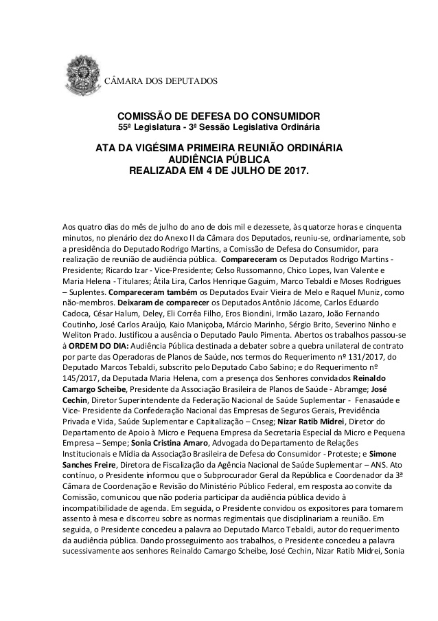

### Carta Comercial

**Cartas Comerciais** são documentos utilizados para as empresas iniciarem, manterem ou encerrarem **transações comerciais**.

Isto significa que elas são utilizadas para **entrar em contato** com clientes, fornecedores ou parceiros comerciais buscando **promover os produtos ou serviços da empresa**.

Geralmente Cartas Comerciais são enviadas em grande quantidade, utilizando **malas diretas**, como aquelas enviadas para os eleitores em períodos de eleição.

Exemplos de uso: catálogo para clientes; propostas de parceria comercial

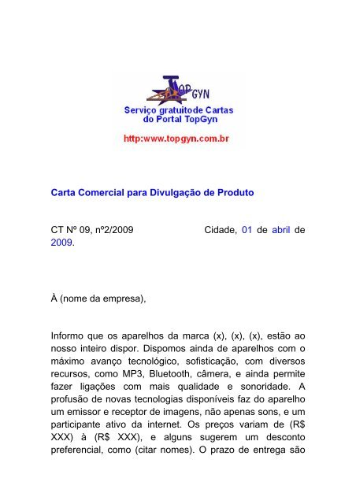

### Declaração

**Declarações** são emitidas sempre que for necessário assegurar a veracidade de um fato.

Exemplos de uso: um funcionário precisa provar a sua empresa que está realizando um curso, para isto solicita  a sua escola uma declaração.

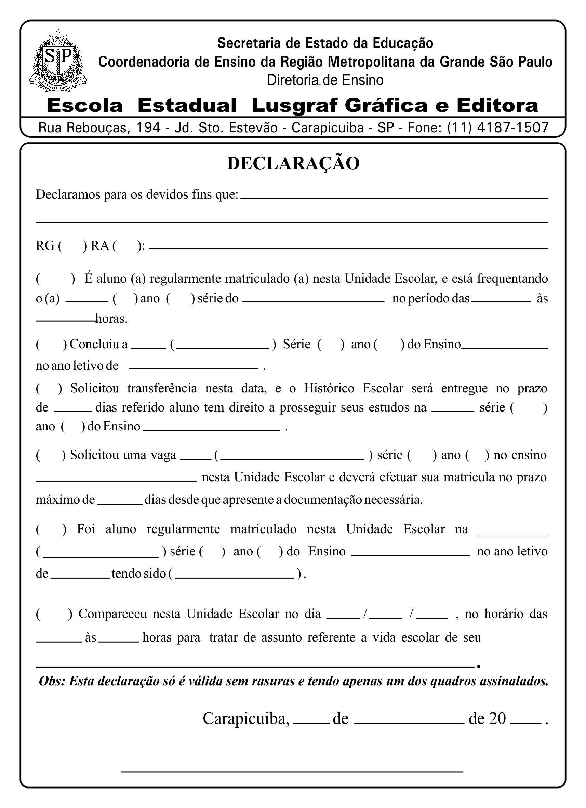

### E-mails

**E-mails** são **mensagens eletrônicas** utilizadas para as mais diversas situações. Seu principal uso comercial é de enviar documentos ou encaminhar informações.

Muitas empresas utilizam-o para envio em massa de mensagens comercias, como *newsletter*, *flyers* e ofertas. No entanto, devido a facilidade de se programar o envio de mensagens automatizadas, muitos dos golpes digitais sofridos por empresas tem origem nos emails e *spam*!

### Memorandos

**Memorandos** são utilizados para a **comunicação interna** das empresas para informar, solicitar ou encaminhar informações, produtos, verbas, etc.

Exemplos de uso: o Dpto. de Vendas de uma empresa precisa de verba para a compra de novos equipamentos, por isso manda um memorando para o Depto. Financeiro; um grupo de funcionários precisa agendar o uso de uma sala de reuniões, para isso deve informar a todos que a a sala estará sendo usada naquele período

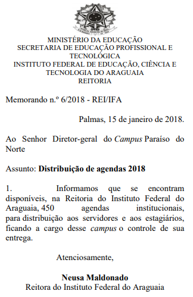

### Ofícios

**Ofícios** são utilizados para a **comunicação externa** entre empresas. Funcionam como memorandos externos.

Exemplos de uso: uma empresa irá realizar o lançamento de um novo produto, e para isto manda um ofício aos seus patrocinadores para avisar sobre o evento; uma empresa solicita o uso do auditório de uma de suas parceiras para a  realização de um evento;

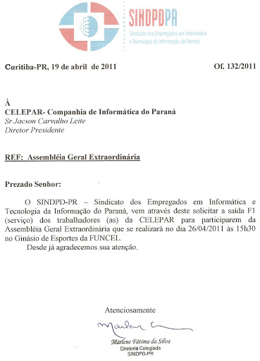

### Procuração

**Procurações** são utilizados quando se precisa **transferir a terceiros poderes ou responsabilidades** para praticar atos em seu nome. Este documento necessita obrigatoriamente de assinaturas reconhecidas em cartório.

RECONHECIMENTO DE FIRMA é o nome dado ao processo no qual um cartório ou  escrevente reconhece a assinatura de uma pessoa. Isto serve para certificar que uma assinatura realmente pertence a uma determinada pessoa

Exemplos de uso: por motivos de doença um sócio de uma empresa irá transferir aos seus filhos suas responsabilidades; 

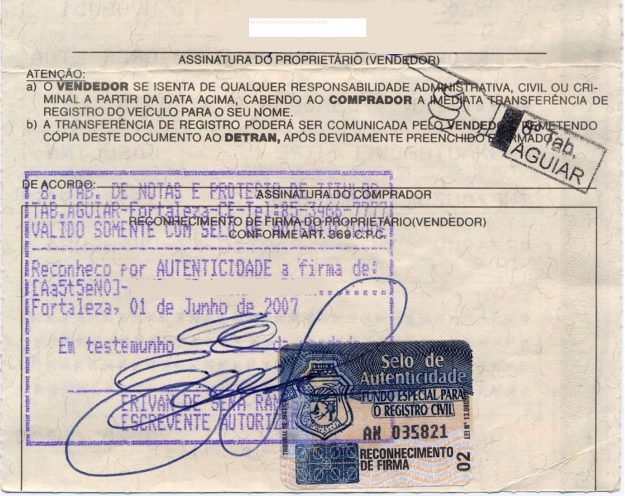

### Requerimentos

**Requerimentos** são documentos endereçados exclusivamente para **autoridades públicas**. Seu principal objetivo é realizar uma solicitação ou pedido à mesma.

Tanto pessoas físicas quanto jurídicas podem escrever requerimentos.

Exemplos de uso: utilização de espaços públicos para eventos de empresas; solicitação de obras públicas;  solicitação para registro em Conselhos Públicos;

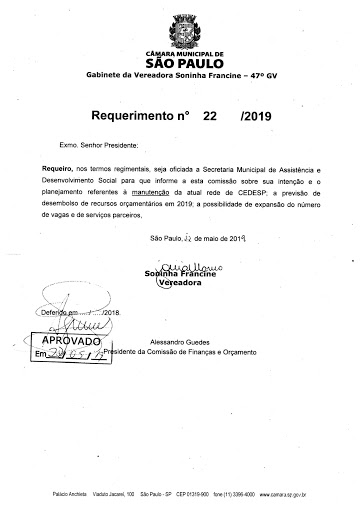

---

## Dicas de Redação Empresarial

Conforme o [Manual de redação da Presidência da República](https://bit.ly/3fGZWRM), as redações empresariais devem caracterizar-se por:

- clareza e precisão;
- objetividade;
- concisão;
- coesão e coerência;
- impessoalidade;
- formalidade e padronização; e
- uso da norma padrão da língua portuguesa. 

Um importante elemento utilizado nas redações empresariais são os **Pronomes de Tratamento**.

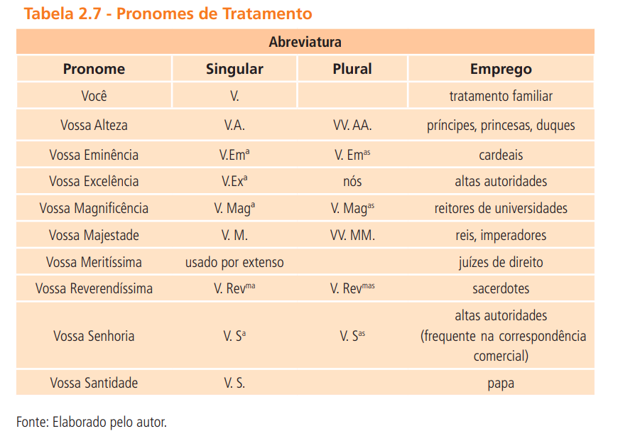

(Tabela retirada do livro de [LOPES & PORRUA. Comunicação Empresarial](https://bit.ly/2zEFHDG)).

Na redação oficial, é necessário atenção para o uso dos pronomes de tratamento em três momentos distintos:

1) **Endereçamento:** é o texto utilizado no envelope que contém a correspondência oficial;

2) **Vocativo: ** No vocativo, o autor dirige-se ao destinatário no início do documento, de forma completa (por extenso);

3) **No corpo do texto:** pode-se empregar os pronomes de tratamento em sua forma abreviada ou por extenso.

---

## Comunicação e Improvisação Teatral

A comunicação desempenha um papel fundamental em qualquer atividade humana. Por trás de toda forma comunicação há uma série de **5 elementos importantes**, a citar:

1) **Emissor**: se refere à pessoa ou grupo que está transmitindo um informação;
2) **Receptor**: se refere à pessoa ou grupo que recebe as informações;
3) **Mensagem**: se refere ao conteúdo transmitido do emissor ao receptor;
4) **Canal**: corresponde ao local onde a mensagem é transimitida, como livros, jornais, TV, o ar (no caso de uma conversa = voz), rádio...
5) **Código**: representa o conjunto de signos utilizados na mensagem ("idioma").

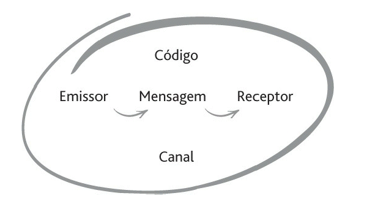

No contexto da comunicação, existem duas palavras bastante utilizadas e confundidas: ouvir e escutar.

Várias línguas fazem distinção entre a **capacidade de ouvir** (*hearing*, *entendre*), ou seja, a habilidade sensorial de identificar variações nos sons, e a **arte de escutar** (*listening*, *écouter*), ou seja, tramitar e conectar sentidos e conceitos. 

"Portanto, a diferença entre ouvir e escutar é o que acontece após o indivíduo receber o som. Ele está ouvindo quando há pouca interação, e escutando quando está prestando atenção ao que é emitido."

Para entender, na prática, a diferença entre **escutar** e **ouvir**, faremos alguns exercícios de **improvisação teatral**, baseado nas obras de Viola Spolin, e nos exercícios do **Teatro do Oprimido** de Augusto Boal.

Nos exercícios de improvisação há uma série bem definida de etapas que acompanham o desenvolvimento dos jogos e das cenas, e para o andamento deste processo é necessário, acima de tudo, exercitar a escuta.

ETAPAS DA IMPROVISAÇÃO
MOTOR --> ESCUTA --> REBOTE --> AÇÃO --> MOTOR --> ...

O **motor é a mola propulsora da improvisação**, consistindo no primeiro impulso (espaço, estado de ânimo, ação, texto...) que norteará a cena. 

A **escuta é o processo percepção e atenção** ao que acontece no espaço; consiste na compreensão daquilo que está acontecendo ou sendo proposto. 

O **rebote é o processo de resposta** ao estímulo ou impulso presente no motor. Nele ocorre a aceitação da proposta e a construção de livres associações despertadas pela mesma no improvisador, levando a uma ação conseguinte. 

O **processo de aceitação** presente no rebote pode se construir como uma negação/bloqueio ao estímulo inicial. Estas situações podem ocorrer de diversas formas, como:

a)	Falta de Escuta: ignorar informações relevantes transmitidas durante a cena;
b)	Rudeza: não aceitação da proposta, impedindo o prosseguimento da cena;
c)	Obstrução maior: interromper um jogador/ator durante a exposição de uma ideia ou ação que daria continuidade à cena;
d)	Acessório Ilegal: utilização de objetos concretos durante a cena, quando somente permitidos apenas imaginários;
e)	Clichê: uso de expressões ou personagens cômicos ou estereotipados, presentes no senso comum ou no contexto de desenvolvimento da cena.

### Exercício 01 – Caminhada no Espaço

**Objetivos**: auxiliar no processo de autoconhecimento, fazendo-se perceber as próprias habilidades e dificuldades; desenvolver a sensibilidade e a abertura a novas sensações, ideias e visões;

1ª Etapa: caminhar livremente pelo espaço disponível, deixando-o uniformemente preenchido.
2ª Etapa: manter contato visual com a pessoa mais próxima.
3ª Etapa: espelhar as ações do colega.
4ª Etapa: contar uma história com o máximo número de palavras.
5ª Etapa: caminhar pelo espaço, mantendo contato visual com seu colega. 

### Exercício 02 – Estender a visão e a escuta

**Objetivos**: auxiliar no processo de autoconhecimento, fazendo-se perceber as próprias habilidades e dificuldades; desenvolver a sensibilidade e a abertura a novas sensações, ideias e visões; auxiliar no processo de sensibilização da escuta e abertura ao outro; desenvolver habilidades interpessoais e de trabalho em equipe;

1ª Etapa: caminhar pelo espaço até que alguém pare. Quando 1 pessoa parar, todas devem parar (processo de ESCUTA).
2ª Etapa: incluir outros comandos de ação ao exercício 01 – parar, mover, pular, etc.

### Exercício 03 – Estender a visão e a escuta – com líder
**Objetivos**: auxiliar no processo de sensibilização da escuta e abertura ao outro; desenvolver a sensibilidade e a abertura a novas sensações, ideias e visões;

1ª Etapa: com todos parados, em pé, um líder indicará uma ação para ser realizada por todo o grupo (REBOTE COM ACEITAÇÃO). 
2ª Etapa: um líder irá realizar uma ação. Os demais deverão espelhar as ações do líder, mantendo sua essência, mas podendo modifica-las à sua vontade (REBOTE)
3ª Etapa: com todos parados, em pé, um líder indicará uma ação para ser realizada por todo o grupo. Cada um poderá realizar qualquer ação que não seja aquela indicada pelo líder (processo de REBOTE COM NEGAÇÃO - BLOQUEIO).

### Exercício 04 – Contato Visual e Aceitação
**Objetivos**: auxiliar no processo de sensibilização da escuta e abertura ao outro; desenvolver a sensibilidade e a abertura a novas sensações, ideias e visões;

1ª Etapa: com todos em pé, em uma roda posiciona-se um objeto qualquer no centro da mesma. Uma pessoa por vez deverá ir até o centro da roda e desempenhar alguma ação com o objeto, fingindo que o mesmo é alguma outra coisa. (Homenagem a Magritte).
2ª Etapa: Uma pessoa por vez deverá ir até o centro da roda e desempenhar alguma ação com o objeto central, fingindo que o mesmo é alguma outra coisa, indicado por outro colega/grupo.
3ª Etapa: com todos em roda, uma pessoa iniciará o contato visual com outra, que poderá confirmar ou negar a conexão. Sendo esta confirmada, o ator inicial se moverá até a posição do “match”, que deverá realizar outro contato visual e se mover (REBOTE).
3ª Etapa: caminhada no espaço. Ao comando de AÇÃO os alunos devem cumprimentar a pessoa mais próxima com uma saudação inusitada. Progressivamente o número de pessoas participando da saudação deve aumentar, tornando-se um abraço coletivo.

Nos exercícios de improvisação há uma série bem definida de etapas que acompanham o desenvolvimento dos jogos e das cenas, e para o andamento deste processo é necessário, acima de tudo, exercitar a escuta.

---

## Resumo

- Existem diversos modelos diferentes de documentos empresariais, cada qual com suas particularidades e regras de escrita.

|    DOCUMENTO    |    ORIGEM    |    DESTINO    |    OBJETIVOS    |
|-----------------------|--------------------------------|-------------------------------------------|--------------------------------------------------------------------------|
|    Ata    |    Empresa    |    Interno    |    Registrar o que aconteceu em uma reunião    |
|    Carta Comercial    |    Empresa    |    Cliente, fornecedor ou patrocinador    |    Divulgar a empresa   para atrair e manter clientes ou parceiros    |
|    Declaração    |    Empresa    |    Empresa    |    Atestar a   veracidade de   uma informação sobre uma pessoa física    |
|    E-mail    |    Pessoa Física ou Empresa    | Interno ou Externo |    Enviar documentos ou encaminhar informações    |
|    Memorando    |    Empresa    |    Interno    |    Comunicação interna da empresa    |
|    Ofício    |    Empresa    |    Externo    |    Comunicação externa da empresa    |
|    Procuração    |    Pessoas Físicas    | Interno ou Externo |    Transferir poderes a terceiros    |
|    Recibo    |    Empresa    |    Pessoa Física ou empresa    |    Registrar o recebimento de produtos/serviços e o seu pagamento    |
|    Requerimento    |    Pessoa Física ou Empresa    |    Autoridades Públicas    |    Realizar   solicitações ou pedidos aos órgãos públicos    |

- A comunicação ocorre por meio da interação de um **emissor** que transmite uma **mensagem** cifrada em determinada **código**, utilizando-se determinado **canal**, para um **receptor**.

- Várias línguas fazem distinção entre a **capacidade de ouvir** (*hearing*, *entendre*), ou seja, a habilidade sensorial de identificar variações nos sons, e a **arte de escutar** (*listening*, *écouter*), ou seja, tramitar e conectar sentidos e conceitos. 

- No contexto da improvisação, a escuta ocorre por meio da percepção e do rebote do que acontece no espaço.

---

## Exercícios

01) Identifique os tipos de documento mostrado a seguir:
  - 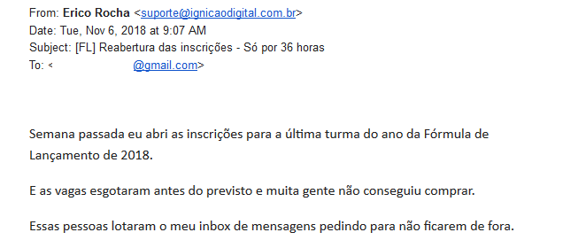
  - 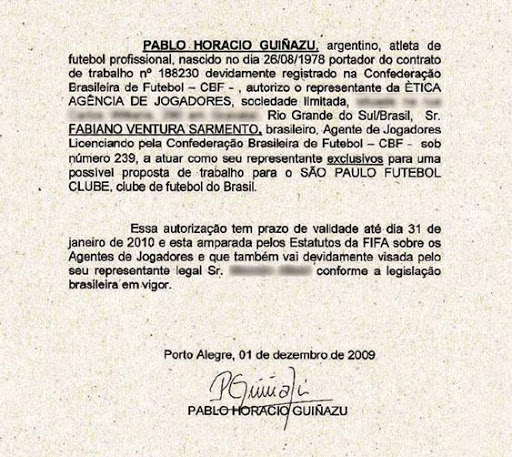
  - 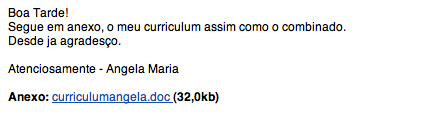
  - 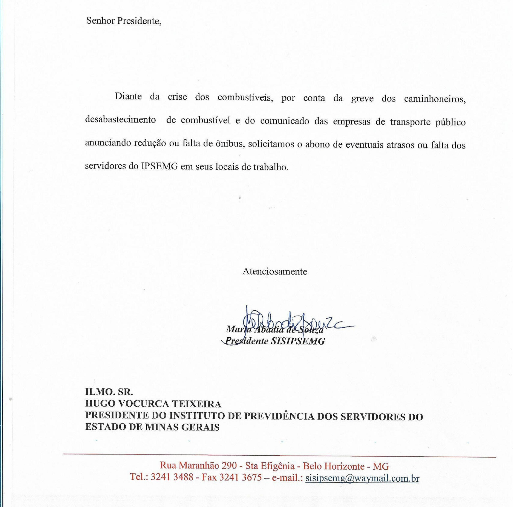
  - 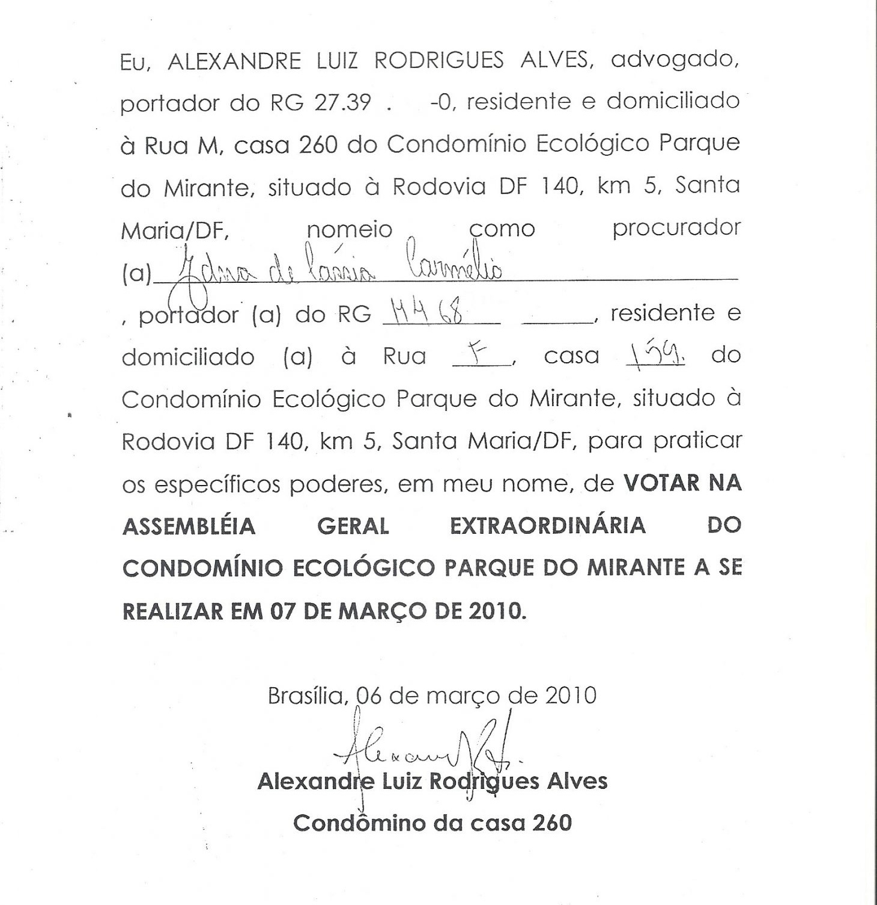
  - 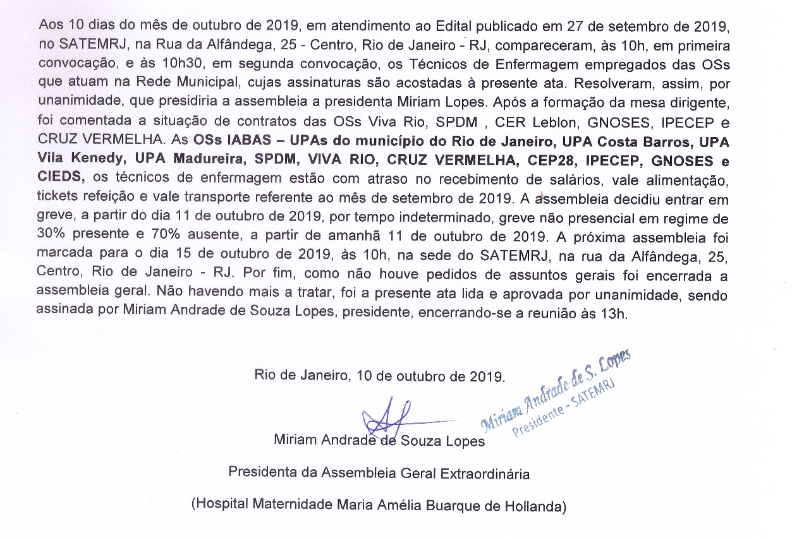

02) Que erro foi cometido na redação do documento abaixo?
  - 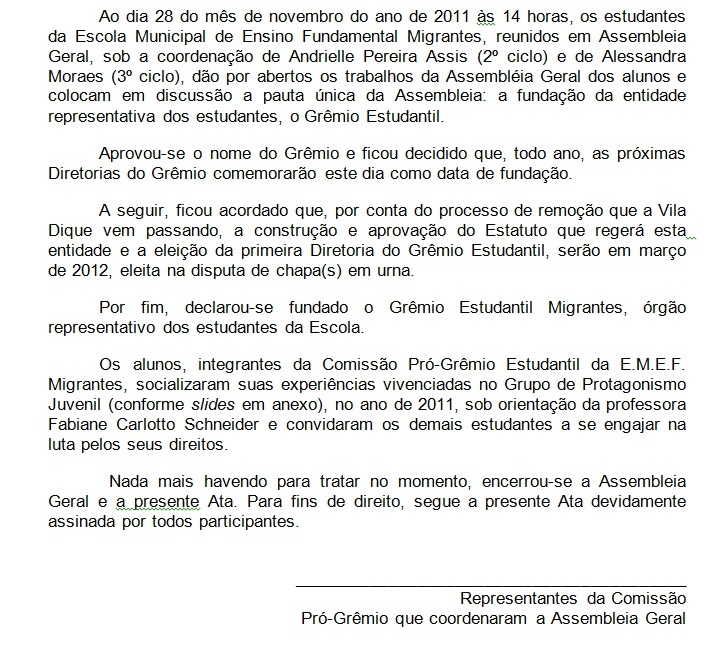

03) Indique os cuidados que devem ser tomados na recepção e envio do tipo de documento mostrado abaixo:
  - 

04) Assista ao vídeo abaixo e responda: quais as diferenças entre escutar e ouvir?

<iframe width="569" height="240" src="https://www.youtube.com/embed/7lrmapp8gRg" frameborder="0" allow="accelerometer; autoplay; encrypted-media; gyroscope; picture-in-picture" allowfullscreen></iframe>

---

## Referências Bibliográficas

BOAL, Augusto. Jogos para atores e não-atores. Rio de Janeiro: Civilização Brasileira, 1998.

BOAL, Augusto. 200 exercícios e jogos para o ator e o não-ator com vontade de dizer algo através do teatro. Rio de Janeiro: Civilização Brasileira, 5ed., 1983.

BRASIL. Presidência da República. Casa Civil. Manual de redação da Presidência da República. BRASÍLIA, DF: Casa Civil, Subchefia de Assuntos Jurídicos ; coordenação de Gilmar Ferreira Mendes, Nestor José Forster Júnior [et al.]. – 3. ed., rev., atual. e ampl. – Brasília: Presidência da República, 2018. 189 p. Disponível em <https://bit.ly/3fGZWRM>. Acesso em *14 de mai. de 2020*.

CARVALHO, José Luis Felício; FARIA, Marina Dias de. O teatro de improviso como proposta pedagógica na formação em ciências sociais aplicadas. Revista Interdisciplinar de Gestão Social, 3 (3), pp.79-104.

DUNKER, Christian; THEBAS, Cláudio. O Palhaço e o Psicanalista: como escutar os outros pode transformar vidas. São Paulo: Planeta do Brasil, 2019

FERREIRA, Brenno Jadvas Soares. Fluxo espontâneo e capacidade de jogo: Estudos atorais a partir de princípios do Teatro-Esporte e do Match de Improvisação. Dissertação de Mestrado. Instituto de Artes- IARTE. Universidade Federal de Uberlândia. Uberlândia, 2015.

LOPES, G. V. C. P. F.; PORRUA, R. P. D. Comunicação Empresarial. Curitiba: Instituto Federal do Paraná, 2012. Disponível em <https://bit.ly/2zEFHDG>. Acesso em *14 de mai. de 2020*.

SPOLIN, Viola. Jogos Teatrais: o fichário de Viola Spolin; tradução de Ingrid Dormien Koudela. São Paulo: Perspectiva, 2012.

SPOLIN, Viola. Jogos Teatrais na sala de aula: um manual para o professor. Tradução de Ingrid Dormien Koudela e Eduardo José de Almeida Amos. São Paulo: Perspectiva, 2012.

SPOLIN, Viola. Improvisação para o teatro. Tradução de Ingrid Dormien Koudela e Eduardo José de Almeida Amos. São Paulo: Perspectiva, 2010.
