Bem vindx à mais uma aula do curso de Auxiliar Administrativo!

Hoje iremos aprender sobre os principais tributos do Brasil e entender como os mesmos são utilizados pelo Governo. Além disso, vamos analisar as diferenças entre notas fiscais e cupons fiscais.

Sugiro, para estudos complementares deste curso o material descrito nas referências bibliográficas, em especial:

[BACARJI, A. G. Formação Inicial e Continuada: Auxiliar Administrativo](https://bit.ly/3e9aqsA)

Vamos lá!

---

## Sumário da Aula

1. [Tributos](#Tributos)
2. [Tributos de Pessoas Físicas](#Tributos-de-Pessoas-Fisicas)
3. [Tributos de Pessoas Jurídicas](#Tributos-de-Pessoas-Juridicas)
4. [Carga Tributária](#Carga-Tributaria)
5. [Notas Fiscais e Cupons Fiscais](#Notas-Fisicais-e-Cupons-Fiscais)
6. [Resumo](#Resumo)
7. [Exercícios](#Exercicios)
8. [Referências Bibliográficas](#Referencias-Bibliograficas)

---

## Tributos

**Tributos** consistem em uma série de valores pagos ao Estado que custeiam todo o seu funcionamento – desde o pagamento de funcionários públicos até os investimentos em saúde, educação e segurança.

Estes valores podem incidir sobre produtos, serviços e bens das mais diversas naturezas, e serem cobrados de pessoas físicas ou jurídicas (empresas).

Cada tributo possui uma **obrigação** diferente, ou seja, um propósito que é delimitado pelo seu **fato gerador**. Por exemplo, o tributo cobrado pela importação de produtos tem por objetivo aumentar o preço de alguns produtos importados para garantir a sobrevivência e concorrência da produção nacional.

"*O objetivo principal da cobrança de impostos é basicamente fazer com que o cidadão contribua financeiramente com serviços que utiliza frequentemente, como saúde e transporte público. O dinheiro revertido em impostos seria, então, para manter com eficiência e qualidade as frotas de ônibus do sistema público de transporte do país, assim como os hospitais, postos de saúde e pronto-socorros de todo o território nacional.*" Disponível em [Organizze](https://financaspessoais.organizze.com.br/afinal-para-onde-vao-os-impostos-que-pagamos/)

O dinheiro arrecadado pelos mais diferentes tributos pode ser destinado às reservas do país (Governo Federal), do estado ou do município.

O [Sistema Tributário Brasileiro] define 3 **tipos diferentes** de tributos que se diferenciam por sua origem e finalidade. São eles: os taxas, contribuições e impostos.

### Taxas

Taxas são tributos cobrados pela utilização de serviços públicos diversos, como:

- Coleta de Lixo (Municipal);
- Combate a Incêndios (Estadual);
- Conservação e Limpeza Pública (Municipal);
- Licenciamento de Empresas e Alvarás (Municipal);
- Taxas do Registro do Comércio - Juntas Comerciais - (Estadual);
- Taxa de Fiscalização de Sorteios, Brindes ou Concursos (Federal);
- Taxa de Licenciamento, Controle e Fiscalização de Materiais Nucleares e Radioativos e suas instalações (Federal);
- **Emissão de documentos** (Municipal, Estadual ou Federal)

O Brasil possui 34 taxas diferentes, que possuem particularidades e pormenores. No entanto, é bom ressaltar que o valor arrecadado pelas taxas é destinado ao seu *fato gerador*, ou seja:

- O dinheiro arrecadado pela taxa de coleta de lixo é utilizado para a melhoria na coleta de lixo da cidade;
- O dinheiro arrecadado pela taxa de emissão de documentos é utilizado para a melhoria neste serviço;
- Etc;

### Contribuições

Assim como as taxas, as **contribuições de melhoria** são cobradas de serviços públicos diversos. O objetivo delas é de melhorar a prestação dos serviços públicos - em especial dos serviços e fundos nacionais, como:

- CONDECINE - Contribuição ao Cinema Nacional;
- FNDCT - Contribuição ao Fundo Nacional de DEsenvolvimento Científico e Tecnológico;
- Contribuições Sindicais - Cobradas pelos Sindicatos de Trabalhadores;
- Contribuições aos Órgãos de Fiscalização Profissional, como OAB, CREA, CRM...
- **COFINS - Contribuição nacional utilizada para o pagamento de seguro-desemprego e abonos salariais**;

Assim como as taxas, o dinheiro arrecadado por cada contribuição se destina à melhoria do serviço delimitado pelo seu fato gerador, ou seja:

- O dinheiro arrecadado pelo CONDECINE é utilizado para a o desenvolvimento do setor audiovisual nacional;
- O dinheiro arrecadado pelo COFINS é utilizado para o pagamento de seguros-desemprego e abonos;
- Etc;

### Impostos

Diferentemente das taxas e contribuições, o dinheiro arrecadado pelos impostos não possui destino definido, sendo utilizados para a *formação de reservas monetárias* (conforme a Lei 5.172).

De acordo com o Sistema Tributário, *imposto é o tributo cuja obrigação tem por fato gerador uma situação independente de qualquer atividade estatal específica, relativa ao contribuinte*.

Dito de forma simples, impostos são tributos obrigatórios que o Estado cobra pelos mais diferentes produtos, serviços privados e bens. 

Note que os **serviços públicos** são regulados pelas taxas e contribuições, e não pelos impostos! Isso significa que o dinheiro que é utilizado para manter e regular a emissão de documentos, por exemplo, vem de lugar diferente do dinheiro usado para pagar funcionários públicos e realizar a manutenção em hospitais e escolas.

É com os impostos que o Estado arrecada a maior parte de sua renda, pois o **destino** do dinheiro arrecadado são as *reservas monetárias do Governo*.

Dos 92 tributos existentes no Brasil, 19 são impostos. Alguns deles são pagos por pessoas físicas e outro por pessoas jurídicas, como veremos a seguir.

### Imunidade Tributária

A Constituição de 1988 delega no artigo 150º, inciso VI, alínea “d” a proibição da cobrança de tributos sobre:

- templos religiosos;
- Partidos políticos;
- Sindicatos de Trabalhadores;
- Instituições de Educação e Assistência Social;
- ONGs;
- Livros,  jornais e periódicos e o papel utilizado em sua impressão.

A imunidade tributário dos livros etm  o objetivo de propiciar a maior difusão de ideias e informações e contribuir, objetivamente, para o incremento da cultura do povo.

---

## Impostos sobre Produtos e Circulação

Estes impostos incidem sobre a produção ou circulação de mercadorias e serviços. São eles: ICMS, IOF, IPI e ISS

### ICMS - Imposto sobre Circulação de Mercadorias e Serviços

O ICMS é uma das principais formas de arrecadação de dinheiro pelos Estados, sendo cobrado diretamente sobre Pessoas Jurídicas, o que incide indiretamente sobre o preço dos produtos às Pessoas Físicas.

Cada estado possui uma taxa diferente deste imposto que é pago pelas empresas ao governo por meio de guias de pagamento (boletos).

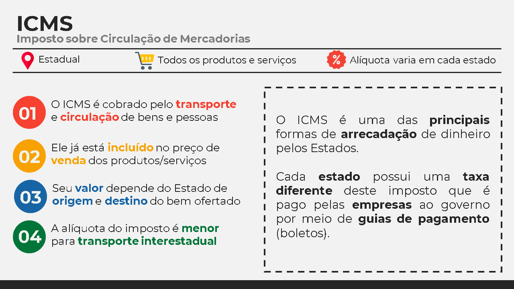

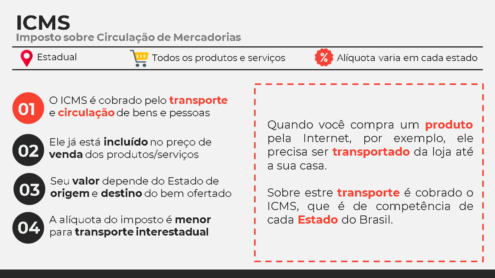

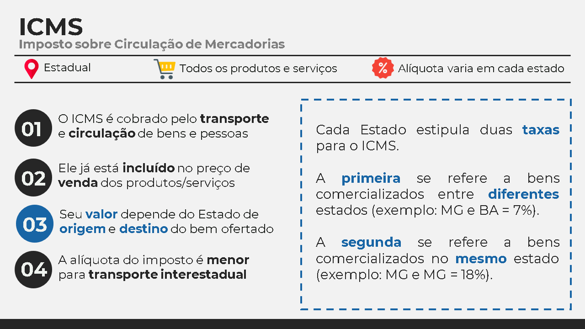

### IOF - Imposto sobre Operações Financeiras

O IOF é cobrado de pessoas físicas e jurídicas em empréstimos e operações de crédito internacionais ou em transações de títulos públicos.

O imposto também incide sobre seguros, como de vida, de veículos e de bens.

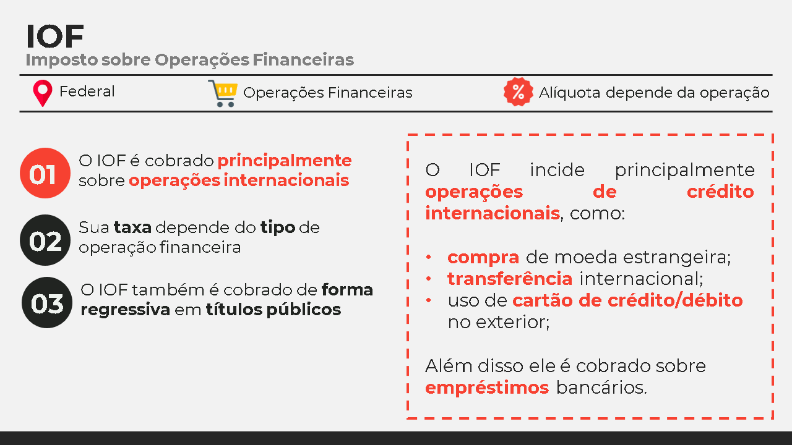

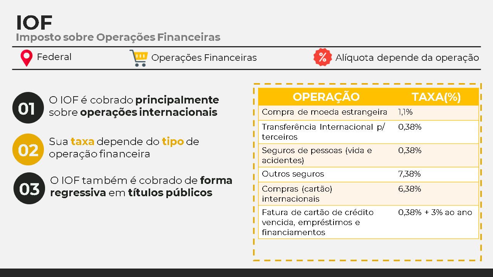

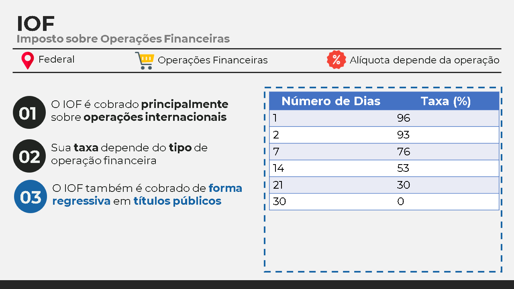

### IPI - Imposto sobre Produtos Industrializados

Todo produto produzido em indústrias brasileiras (ou importados) possui o IPI incidido sobre ele.

O imposto é pago pelas indústrias (ou o importador), que  pode repassar o preço aos consumidores.

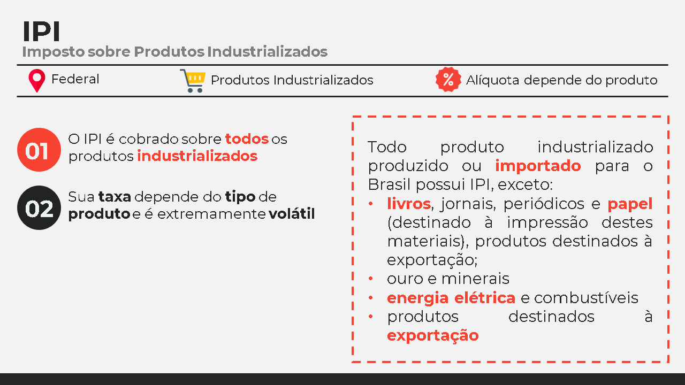

### ISS - Imposto sobre Serviços

Também conhecido como ISSQN, este imposto incide sobre todos os tipos de serviço prestados por empresas e autônomos.

O imposto é pago pelo prestador de serviços, em regras específicas de modalidade.

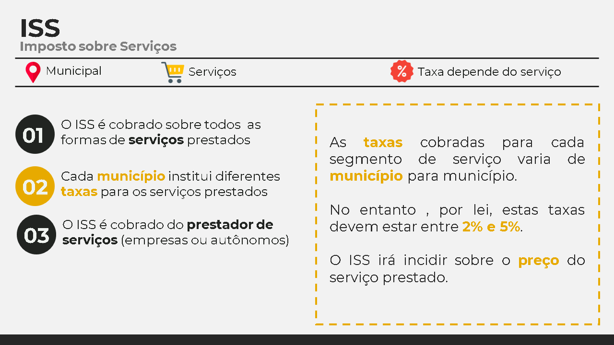

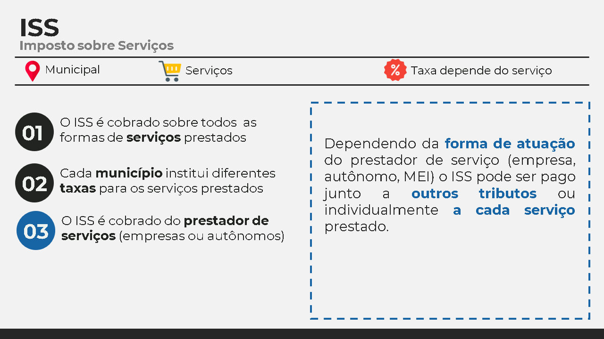

---

## Impostos sobre Renda e Propriedade

Estes impostos incidem sobre a renda e a propriedade de pessoas físicas e jurídicas 
São eles: IPVA, IR, 	ITCMD, ITR, IPTU e ITBI.

Destes iremos estudar detalhadamente o IPVA, IT e IPTU.

### IPVA - Imposto sobre a Propriedade de Veículos Automotores

O IPVA é cobrado, anualmente, sobre veículos automotores.

Sua taxa varia em cada estado e também em diferentes meses do ano.

A taxa do IPVA é calculado levando em conta o preço do veículo, podendo variar de 1% a 6%.

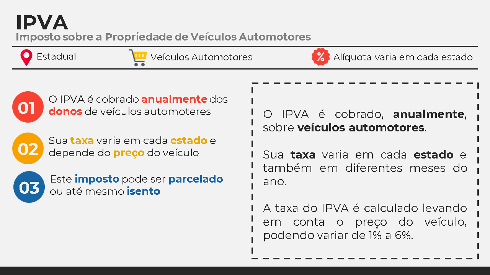

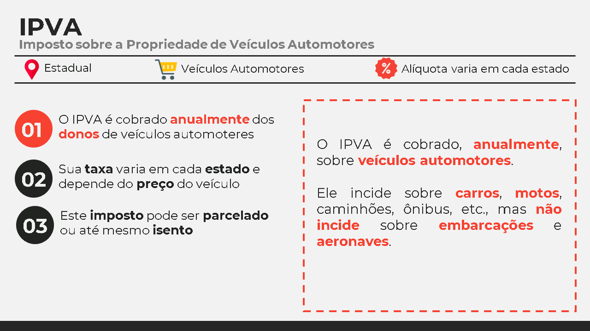

### IR - Imposto de Renda

Este tributo incide sobre a renda de pessoas físicas (IRPF) ou jurídicas (IRPJ).

O valor cobrado de Imposto de Renda depende dos rendimentos anuais.

Os cálculos do IR serão vistos no curso de Departamento Pesoal.

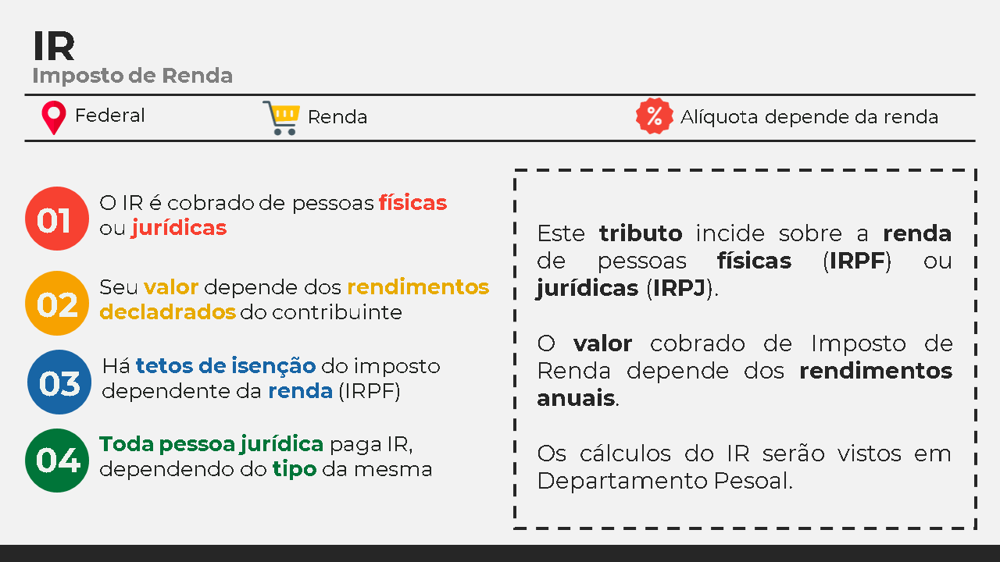

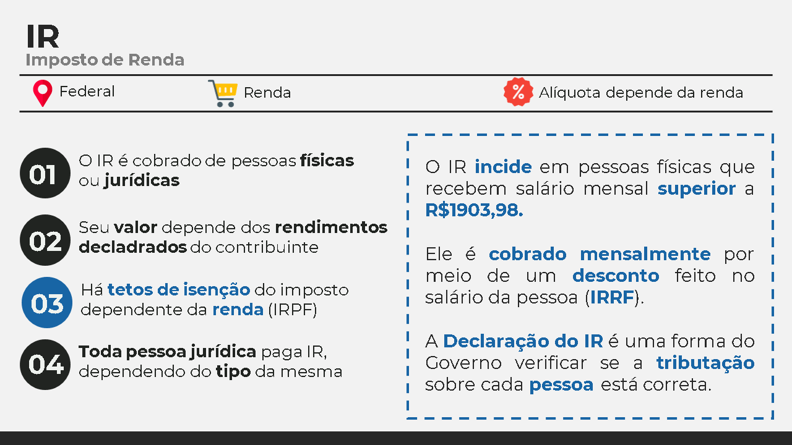

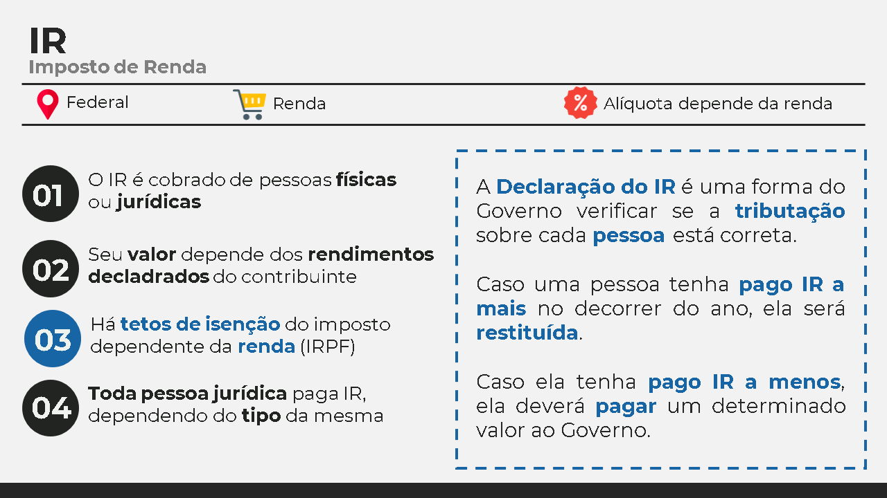

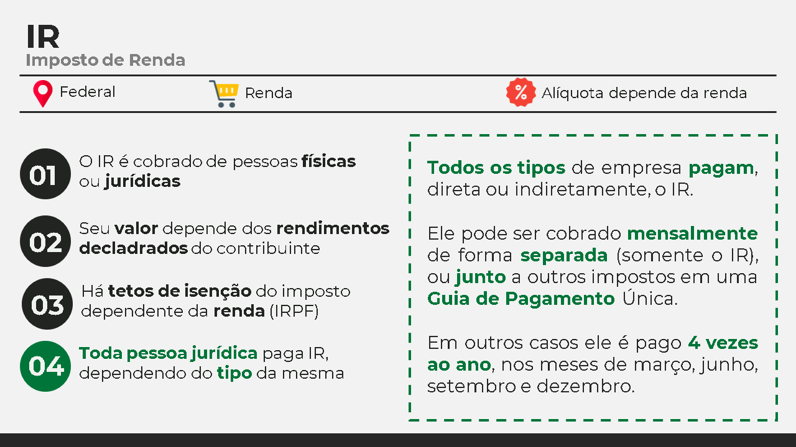

### IPTU -  Imposto sobre a Propriedade Predial e Territorial Urbana & ITR - Imposto sobre a Propriedade Territorial Rural

Estes impostos são cobrados posse de propriedades rurais ou imóveis, de pessoas físicas e jurídicas.

---

## Impostos sobre o Comércio Exterior

Estes impostos incidem sobre a importação e exportação de produtos

São eles: II, IE, CIDE

### II e IE - Importo sobre Importação/Exportação

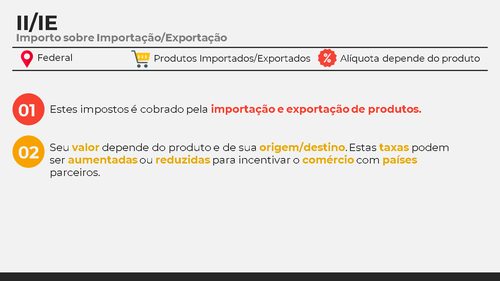

---

## Impostos Trabalhistas

Há outros impostos cobrados no Brasil, cuja natureza é principalmente trabalhista.

São eles: CSLL, FGTS, COFINS, INSS, PIS/PASEP

Estudaremos cada um individualmente no módulo de Departamento Pessoal

---

## Carga Tributária

Muito se fala sobre a grande quantidade de impostos cobrados no Brasil e a necessidade de realizarmos reformas em nosso sistema tributário.

Os impostos municipais, estaduais e federais são cobrados em produtos e serviços, e sua arrecadação serve para financiar e alavancar projetos que abrangem a população em geral (em teoria).

Há uma maneira de se calcular o impacto dos tributos sobre a economia de um país - por meio da **Carga Tributária**.

A Carga Tributária (CT) calcula a porcentagem de impostos pagos em um país em relação ao seu PIB.

$CT = \frac{Arrecadação Total de Tributos}{PIB} * 100$

### CT do Brasil

Vamos calcular o PIB do Brasil em 2018 utilizando dados disponibilizados pela [The Heritage Foundation](https://herit.ag/3fKVMs3).

- PIB do Brasil (2018) = 6.9 Trilhões de Dólares
- Tributos Arrecadados (2018) = 2.18 Trilhões de Dólares

$CT = \frac{Arrecadação Total de Tributos}{PIB} * 100 = \frac{2.18}{6.9} * 100 = $ 31,59%

A Carga Tributária indica que, no Brasil, a cada R\$ 100,00 produzidos em forma de bens, produtos ou serviços, R\$ 31,59 provêm dos impostos.

Há um site interessantísimo que mostra em tempo real a arrecadação de impostos no Brasil - o [Impostômetro](https://impostometro.com.br/). A iniciativa partiu do IBPT (Instituto Brasileiro de Planejamento e Tributação) em parceria com as Associações Comerciais dos estados. A ideia central é mensurar todos os impostos pagos pelos cidadãos e o que poderia ser realizado com o dinheiro em prol da sociedade.

Nossa alta carga tributária implica que, em 2018, os brasileiros precisaram trabalhar 153 dias somente para pagar os impostos cobrados sobre suas necessidades - como produtos, serviços e renda!

Uma pesquisa realizada em [2015 pelo IBPT](http://ibpt.impostometro.s3.amazonaws.com/Arquivos/06%2BIRBES%2B2015.pdf) mostra que, dentre os 30 países com maior carga tributária do mundo, o Brasil é o que apresenta pior retorno sobre os impostos pagos.

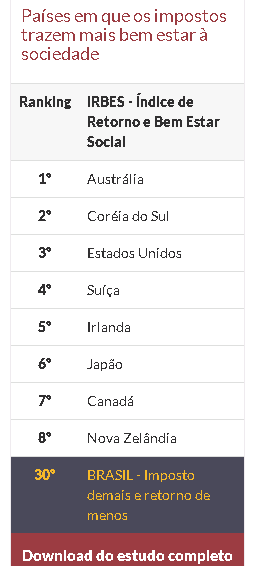

### Relação entre Carga Tributária e o PIB

Será que os países que mais cobram impostos também estão na mesma situação do Brasil?

Para fazer uma análise bem simplificada deste cenário, vamos analisar alguns países em ordem crescente de Carga Tributária, utilizando dados disponibilizados pela [The Heritage Foundation](https://herit.ag/3fKVMs3), [Gapminder](https://www.gapminder.org/) e [ONU](http://hdr.undp.org/sites/default/files/hdr2019.pdf):

| Posição    | País                       | Carga Tributária (% do PIB) | PIB Per Capita  | IDH   |
|------------|----------------------------|-----------------------------|-----------------|-------|
|    1º      |    Lesoto                  |    47%                      |    $ 3.581      | 0,518 |
|    2º      |    Dinamarca               |    45,9%                    |    $ 49.883     | 0,930 |
|    3º      |    França                  |    45,3%                    |    $ 43.761     | 0,891 |
|    4º      |    Bélgica                 |    44,2%                    |    $ 46.553     | 0,919 |
| ...        | ...                        | ...                         | ...             | ...   |
|    23º     |    Portugal                |    34,4%                    |    $ 30.417     | 0,850 |
|    30º     |    Reino   Unido           |    33,2%                    |    $ 44.118     | 0,920 |
|    34º     |    Brasil                  |    32,2%                    |    $ 15.603     | 0,761 |
|    36°     |    Canadá                  |    31,7%                    |    $ 48.265     | 0,922 |
|    38º     |    África do   Sul         |    31,3%                    |    $ 13.545     | 0,705 |
| ...        | ...                        | ...                         | ...             | ...   |
|    165°    |    Emirados   Árabes U.    |    8,9%                     |    $ 67.741     | 0,866 |
|    173º    |    Qatar                   |    5,7%                     |    $ 124.529    | 0,848 |
|    176º    |    Nigéria                 |    5,2%                     |    $ 5.929      | 0,534 |
|    178º    |    Arábia   Saudita        |    3,4%                     |    $ 57.777     | 0,857 |
|    179º    |    Kuwait                  |    1,6%                     |    $ 66.163     | 0,808 |

A Carga Tributária é uma maneira de calcular os **impactos dos tributos** na economia de um país.

Repare que entre os países analisados, não há uma relação direta e simples entre a Carga Tributária e a qualidade de vida. 

Ter uma alta carga tributária não significa que o país será desenvolvido ou rico.

---

## Notas Fiscais e Cupons Fiscais

---

## Resumo

---

## Exercícios

---

## Referências BIbliográficas

AGÊNCIA SENADO. Principais impostos e contribuições pagos no Brasil. Brasília: Senado Federal, 2006. Disponível em <https://bit.ly/2LoE93k>. Acesso em *12 de mai. de 2020*.

BACARJI, Alencar Garcia. Formação Incial e Continuada Auxiliar Administrativo. Curitiba: Instituto Federal do Paraná, 2012.

BRASIL. LEI Nº 5.172, DE 25 DE OUTUBRO DE 1966. Dispõe sobre o Sistema Tributário Nacional e institui normas gerais de direito tributário aplicáveis à União, Estados e Municípios. Brasília, DF. Disponível em: <https://bit.ly/2zy7ju6>. Acesso em *12 de mai. de 2020*.

BRASIL. Carga Tributária no Brasil 2018. Análise por Tributos e Base de Incidência. Brasília: Ministério da Fazenda, 2020. Disponível em <https://bit.ly/2WtA6JC>. Acesso em *13 de mai. de 2020*.

CARAVANTES, G. R.P; KLOECKNER, C. M.; PANNO, C. Administração: teoria e processos. São Paulo: Pearson Prentice Hall, 2005.

FRASER INSTITUTE. Economic Freedom of the World: 2019 Annual Report. Vancouver: The Fraser Institute, 2019. Disponíel em <https://bit.ly/2WqCLDD>. Acesso em *12 de mai. de 2020*.

HERITAGE FOUNDATION. 2020 Index of Economic Freedom. Washington: The Heritage Foundation, 2020. Disponível em <https://herit.ag/3fKVMs3>. Acesso em *12 de mai. de 2020*.

NETO, J. S. Uma montanha ainda maior de impostos. O GLOBO, n. 29995, 21//09/2015. Economia, p. 17. Disponível em <https://bit.ly/2Z87M1d>. Acesso em *12 de mai. de 2020*.

PORTAL TRIBUTÁRIO. Os Tributos no Brasil. Curita: Portal Tributário, 2020. Disponível em <https://bit.ly/3bseH7C>. Acesso em *12 de mai. de 2020*.

SACHIDA, A. Tributação no Brasil : estudos, ideias e propostas : ICMS, seguridade social, carga tributária, impactos econômicos. Brasília : Ipea, 2017. 220 p. : gráfs., mapas color.