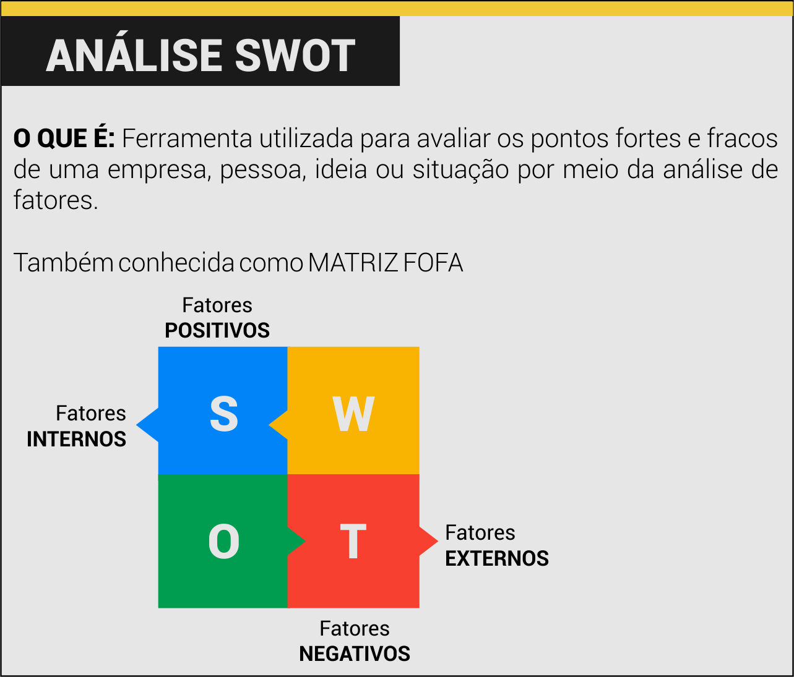
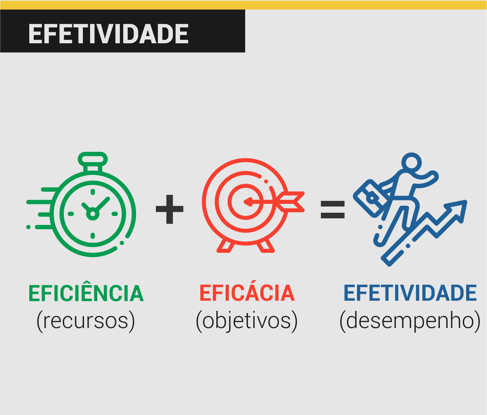
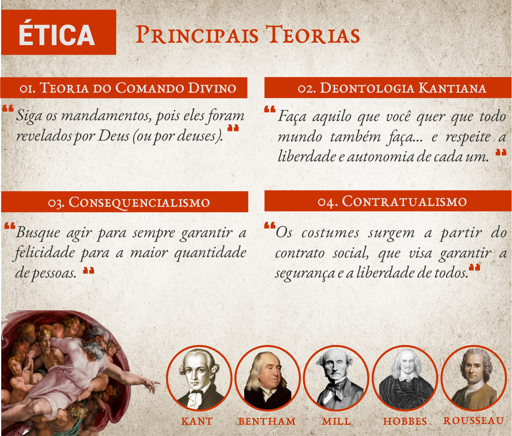
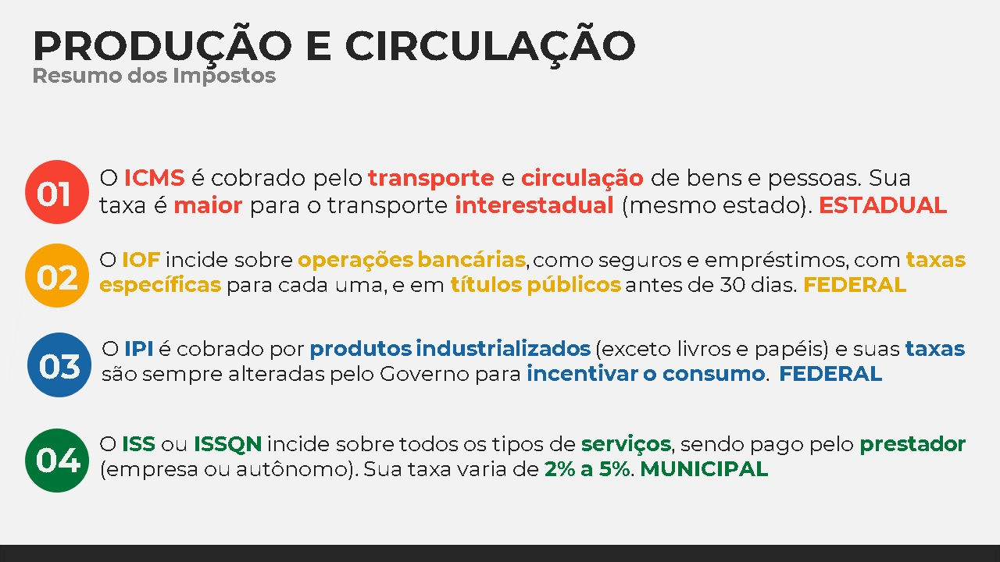
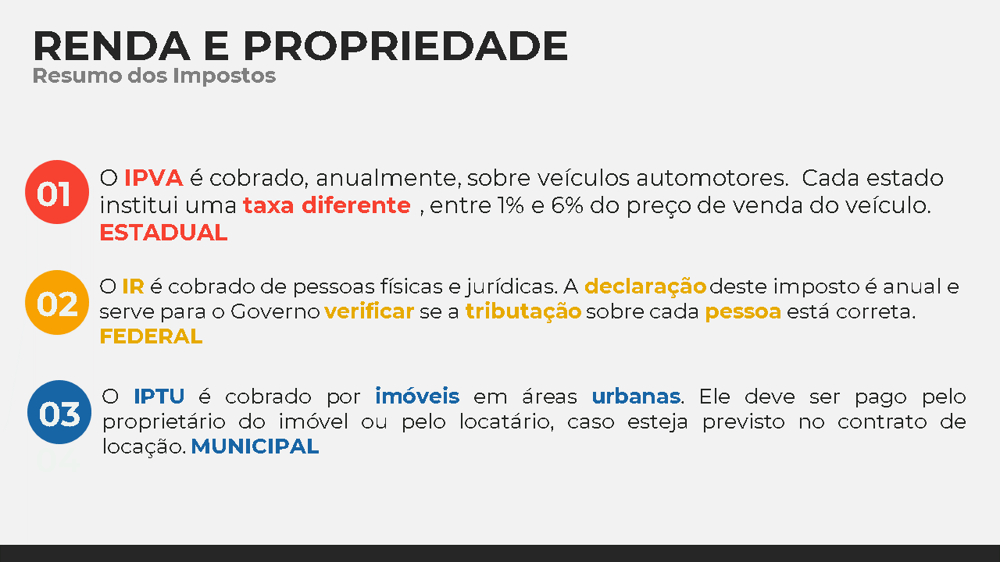
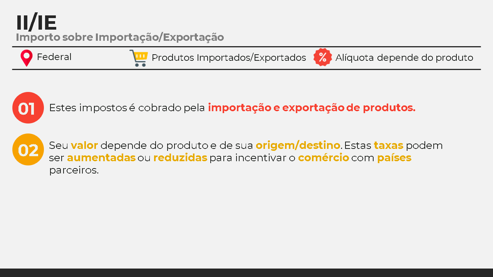

Bem vindx à mais uma aula do curso de Auxiliar Administrativo!

Hoje iremos revisar todo o conteúdo visto no decorrer deste módulo. Estude este material com bastante atenção e tire suas dúvidas com seu professor se achar necessário.

Ao longo deste primeiro módulo foram utilizados diversos materiais de referência que foram citados ao fim de cada aula. Destes materiais, os mais importantes são:

Se quiser, consulte o material acima para maiores detalhes sobre os temos estudados.

Sem mais delongas, vamos à nossa 2ª aula de revisão deste curso.

---

## Aulas 01 e 02

- A **Análise SWOT**, também conhecida como Matriz FOFA é uma estratégia utilizada para identificar os pontos fortes e fracos de uma pessoa, situação, ideia ou empresa.

- **Eficiência** e **eficácia** são palavras semelhantes, mas com significados diferentes:  `Eficiência` consiste em utilizar bem os recursos e `Eficácia` consiste em atingir o objetivo ou metas de uma tarefa.

- Toda ideia apresenta, por si só, **pontos fortes e fracos**. Há sempre um **momento certo** para apresentar suas ideias: o melhor momento é quando um projeto necessita ser planejado ou um problema foi detectado.

- Quando falamos sobre **ética ou moral**, estamos nos referindo aos costumes, comportamentos e hábitos de um povo ou sociedade. As duas palavras são traduzidas para o português como **costume**: *ethos* tem origem grega; e *mores* tem origem latina.
  - A **moral** está relacionada ao **agir de acordo com os costumes** e regras socialmente difundidas.
  - A **ética** nasce quando se passa a indagar o que são, de onde vêm e o que valem os costumes.

- Os Códigos de Ética Profissional são um conjunto de regras éticas próprias que orienta e direciona o comportamento dos profissionais da área.
  - O Código de Ética do Administrador possui 23 artigos que dispõe sobre direitos, deveres e proibições inerentes aos profissionais administrativos.

### Código de Ética do Administrador - Trechos

(Art. 2º) São deveres do profissional de Administração:

<ul>
  <li class='item-ok'>II – defender os direitos e interesses do cliente;</li>
  <li class='item-ok'>III - guardar sigilo sobre o que saiba em razão do exercício profissional lícito de seu ofício,</li>
  <li class='item-ok'>IV - manter independência técnica na orientação de serviços, sem abdicar de sua dignidade e prerrogativas, seja como profissional liberal ou empregado;</li>
  <li class='item-ok'>VII – esclarecer o cliente sobre a função social da organização e a necessidade de preservação do meio ambiente.</li>
</ul>

(Art. 3º) Constitui infração disciplinar::

<ul>
  <li class='item-not'>I. tratar outros profissionais ou profissões sem urbanidade, de modo a ofender sua dignidade, ou discriminá-los de qualquer forma; </li>
  <li class='item-not'>III. assinar documentos elaborados por terceiros sem a sua orientação ou supervisão; </li>
  <li class='item-not'>IV. afastar-se, sem justificativa, de suas atividades profissionais sem comunicar previamente ao seu cliente ou empregador;</li>
  <li class='item-not'>V. violar, sem justa causa, sigilo profissional;</li>
  <li class='item-not'>XV. praticar, no exercício da atividade profissional, ato contrário à lei ou destinado a fraudá-la, ou contribuir para a realização de ato definido como ilícito penal;</li>
  <li class='item-not'>XVI. usar de artifícios enganosos ou fraudulentos para obter vantagem indevida;</li>
</ul>

(Art. 4º) São direitos do Profissional de Administração:

<ul>
  <li class='item-ok'>I - exercer a profissão independentemente  de questões religiosas, raça, sexo, nacionalidade, cor, idade, condição social, orientação sexual ou de qualquer natureza discriminatória; </li>
  <li class='item-ok'>II - apontar falhas nos regulamentos e normas das instituições, quando as julgar indignas do exercício profissional ou prejudiciais ao cliente, devendo, nesse caso, dirigir-se aos órgãos competentes, em especial ao Conselho Regional de Administração;</li>
  <li class='item-ok'>III - exigir justa remuneração por seu trabalho, a qual corresponderá às responsabilidades assumidas a seu tempo de serviço dedicado, sendo-lhe livre firmar acordos sobre salários, velando, no entanto, pelo seu justo valor;</li>
</ul>

-  As empresas podem ser classificadas de acordo com **seu tipo de atividade** (INDÚSTRIA, COMÉRCIO E PRESTAÇÃO DE SERVIÇOS) ou com o **objetivo financeiro** (COM OU SEM FINS LUCRATIVOS).

---

## Aulas 03 e 04

- A **Regra de Três** é uma maneira simples e fácil de resolver problemas que envolvem calcular **valores desconhecidos** quando já dispomos de 3 valores conhecidos. Elas podem ser **simples** ou **compostas**.

- O **Princípio do 1%** afirma que ao dividir qualquer número por 100 você obtém como resultado **1% daquele número**. A partir daí fica muito fácil encontrar o percentual de qualquer número.

- Outra maneira fácil de se resolver problemas envolvendo porcentagens é por meio de regras de três simples.

- Os juros são a remuneração obtida pelo uso do capital por um intervalo de tempo, isto é, é o custo do crédito obtido. Pode ser entendido também como sendo o aluguel pelo uso do dinheiro. Ele pode ser **simples** ou **composto**

- O Capital (C) é a quantia emprestada ou investida no início da aplicação.

- Toda aplicação financeira possui um prazo (t), ou seja, um período para ser finalizado. No caso de um empréstimo o prazo indica o tempo proposto para se quitar a dívida; no caso de uma aplicação, o prazo indica o período no qual o capital será resgatado.

- Montante é a quantia total, em dinheiro, paga ou resgatada no fim da aplicação, sendo a soma do capital aplicado e o juro produzido em um determinado período.

- No Regime de Capitalização Simples a taxa de juros incide diretamente sobre o valor do capital. Sua fórmula é dada por: $J = C * i * t$  
  - Capital =  100,00
  - Taxa = 5%
  - Após 1 mês = 5% de  100,00 = 5,00 + 100,00 = 105,00
  - Após 2 meses = 10% de  100,00 = 10,00 + 100,00 = 110,00
  - Após 3 meses = 15% de  100,00 = 15,00 + 100,00 = 115,00
  - Após 4 meses = 20% de  100,00 = 20,00 + 100,00 = 120,00
  - Após 5 meses = 25% de  100,00 = 25,00 + 100,00 = 125,00
  - Após 6 meses = 30% de  100,00 = 30,00 + 100,00 = 130,00
  ...

- No Regime de Capitalização Composta, a taxa de juros incide diretamente sobre o valor do montante do período anterior. É também chamado de Juros Compostos. SUa fórmula é: $M = C * (1+i)^t$
  - Capital =  100,00
  - Taxa = 5%
  - Após 1 mês = 5% de  100,00 = 5,00 + 100,00 = 105,00
  - Após 2 meses = 5% de  105,00 = 5,25 + 100,00 = 110,25
  - Após 3 meses = 5% de  110,25 = 5,51 + 110,25 = 115,76
  - Após 4 meses = 5% de  115,76 = 5,79 + 115,76 = 121,55
  - Após 5 meses = 5% de  121,55 = 6,08 + 121,55 = 127,63
  - Após 6 meses = 5% de  127,63 = 6,38 + 127,63 = 134,01

---

## Aulas 06 a 08

- Há 3 **tipos principais** de tributos no Brasil, que se diferenciam por sua origem e finalidade. São eles: os taxas, contribuições e impostos.

- **Taxas e Contribuições** são valores pagos por serviços prestados pelo Estado, como limpeza urbana, iluminação pública, emissão de documentos e combate a incêndios. O valor arrecadado por estes tirbutos vai diretamente para o seu *fato gerador*.

- **Impostos** são valores pagos por produtos, renda e serviços privados. O valor arrecadado pelos impostos não possui destino fixo, sendo enviado para as **reservas do Governo**.

- É com os tributos que o Estado obtêm sua renda, que pode ser utilizada para a melhoria de serviços, pagamento de funcionários, execução de obras, etc.

- Algumas instituições e produtos não pagam impostos (imunidade tributária).

- Dos 92 tributos existentes no Brasil, 19 são impostos. Alguns deles são pagos por pessoas físicas e outro por pessoas jurídicas
  -  
  -  
  - 

- A Carga Tributária é uma maneira de calcular os **impactos dos tributos** na economia de um país.

- **Notas ficais** são documentos obrigatórios emitidos por empresas que possuem muitas informações sobre os clientes, e devem ser feitas em programas ou arquivos específicos.

- **Cupons fiscais** são documentos fiscais que devem ser impressos em uma impressora especial e não possuem tantos dados quanto as notas fiscais.

- Existem diversos modelos diferentes de documentos empresariais, cada qual com suas particularidades e regras de escrita.

|    DOCUMENTO    |    ORIGEM    |    DESTINO    |    OBJETIVOS    |
|-----------------------|--------------------------------|-------------------------------------------|--------------------------------------------------------------------------|
|    Ata    |    Empresa    |    Interno    |    Registrar o que aconteceu em uma reunião    |
|    Carta Comercial    |    Empresa    |    Cliente, fornecedor ou patrocinador    |    Divulgar a empresa   para atrair e manter clientes ou parceiros    |
|    Declaração    |    Empresa    |    Empresa    |    Atestar a   veracidade de   uma informação sobre uma pessoa física    |
|    E-mail    |    Pessoa Física ou Empresa    | Interno ou Externo |    Enviar documentos ou encaminhar informações    |
|    Memorando    |    Empresa    |    Interno    |    Comunicação interna da empresa    |
|    Ofício    |    Empresa    |    Externo    |    Comunicação externa da empresa    |
|    Procuração    |    Pessoas Físicas    | Interno ou Externo |    Transferir poderes a terceiros    |
|    Recibo    |    Empresa    |    Pessoa Física ou empresa    |    Registrar o recebimento de produtos/serviços e o seu pagamento    |
|    Requerimento    |    Pessoa Física ou Empresa    |    Autoridades Públicas    |    Realizar   solicitações ou pedidos aos órgãos públicos    |

- A comunicação ocorre por meio da interação de um **emissor** que transmite uma **mensagem** cifrada em determinada **código**, utilizando-se determinado **canal**, para um **receptor**.

- Várias línguas fazem distinção entre a **capacidade de ouvir** (*hearing*, *entendre*), ou seja, a habilidade sensorial de identificar variações nos sons, e a **arte de escutar** (*listening*, *écouter*), ou seja, tramitar e conectar sentidos e conceitos. 

- No contexto da improvisação, a escuta ocorre por meio da percepção e do rebote do que acontece no espaço.

- O empreendedorismo pode ser de 4 tipos principais:
  - Empreendedorismo Privado: focado na obtenção de lucros e ganhos pessoais;
  - Empreendedorismo Social: focado na obtenção de benefícios para a sociedade, sem obtenção de lucros;
  - Empreendedorismo por Necessidade: ocorre devido a necessidades econômicas por parte do indivíduo, geralmente sem grande inovação e estruturação (informalidade);
  - Intraempreendedorismo: ocorre no interior de organizações já existentes, alterando o seu *modus operandi* em busca de maior eficiência e eficácia.

- De acordo com a Teoria das Necessidades Adquiridas, há 3 tipos diferentes de motivação por trás de todas as ações, incluindo as empreendedoras:
  - Motivo de Relização: busca alcançar sucesso e metas elevadas, reagindo bem às competições;
  - Motivo de Afiliação: busca construir relações interpessoais fortes, atribuindo mais importância às pessoas do que às tarefas;
  - Motivo de Poder: busca controlar, dominar e influenciar outras pessoas, espontaneamente assumindo posições de liderança.

- Diversas críticas históricas e sociais são feitas à visão do empreendedorismo como uma *farmacopeia* (remédio) para a felicidade e o sucesso pessoal.

---

## Exercícios

01) 
