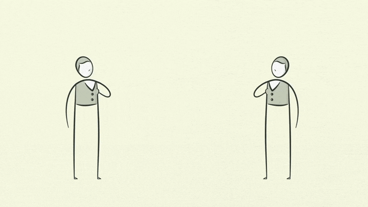
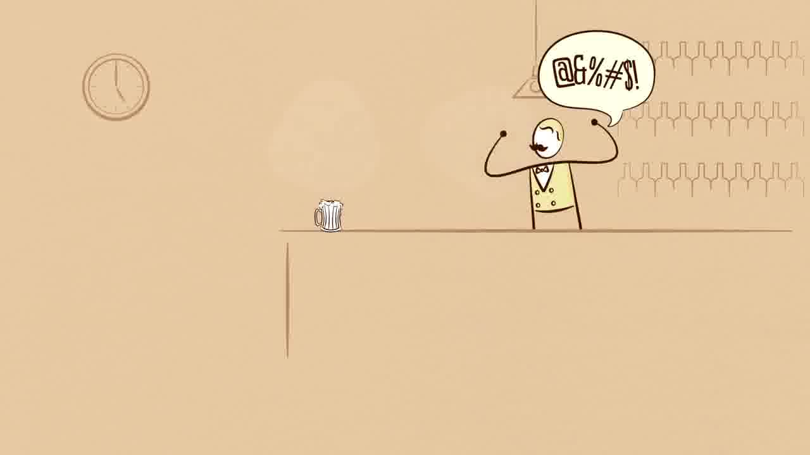
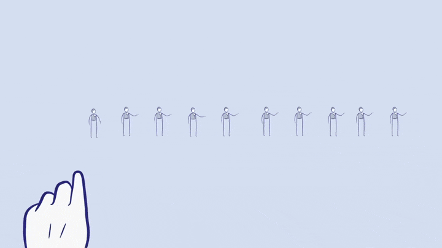

Bem vindx a mais uma aula de Contabilidade.

Hoje, finalmente, iremos entender o que é a Contabilidade e qual a importância dela no contexto da administração das empresas.

Além disso, aprenderemos o básico sobre economia e sua importância social.

Para melhor entender os conceitos desta aula, sugiro o material descrito nas referências bibliográficas, em especial:

[BÄCHTOLD, Ciro. Contabilidade Básica](http://redeetec.mec.gov.br/images/stories/pdf/proeja/contabil_basica.pdf)

[<i class="icofont-ui-video-chat"></i> DALIO, Ray. How The Economic Machine Works by Ray Dalio](https://www.youtube.com/watch?v=0unv5QSsoCs)

[OLIVO, A. M.; BOSCHILIA, L. Contabilidade geral e gerencial - conceitos introdutórios para os cursos superiores de tecnologia](https://www.ifsc.edu.br/documents/30701/523474/Livro_contabilidade_miolo.pdf/f149d841-667c-9e0f-5cd2-a8bfb13d4ebf)

Assista, em especial, o vídeo do Ray Dalio sobre a máquina econômica, e sua versão resumida:
 
[<i class="icofont-ui-video-chat"></i> STUDIO 306. Como Funciona a Economia?](https://www.youtube.com/watch?v=YDF3kNQhfGY)

Vamos lá!

---

## Sumário da Aula

1. [Teoria Estruturalista](#Teoria-Estruturalista)
2. [Teoria de Sistemas](#Teoria-de-Sistemas)
3. [Teoria Contingencial](#Teoria-Contingencial)
4. [Resumo](#Resumo)
5. [Referências Bibliográficas](#Referencias-Bibliograficas)

---

## Como funciona a economia?

Como vimos na última aula, as **Teorias de Sistema Aberto** consideram as organizações como estruturas dinâmicas que interagem com diferentes **influências externas**. Por esta razão a solução dos diversos **problemas** que uma empresa pode enfrentar deve ser relativizado, levando em consideração as **contingências** de cada situação.

Esta relativização está relacionada ao **contexto econômico** desempenhado pela organização. No contexto da Teoria de Sistemas, podemos considerar a existência de 4 diferentes tipos de organização:

1) **Organizações Econômicas ou Produtivas**: relacionadas com o fornecimento de mercadorias e serviços, entre as quais estão as empresas, inclusive as agrícolas.

2) **Organizações de Manutenção**: relacionadas com a socialização e o treinamento das pessoas que irão desempenhar papéis em outras organizações e na sociedade global. Entre essas estão as escolas, qualquer que seja o seu nível, e as igrejas.

3) **Organizações Adaptativas**: relacionadas com a criação de conhecimentos e com o desenvolvimento de novas soluções para problemas. Entre essas estão os laboratórios e organizações de pesquisa, inclusive algumas universidades.

4) **Organizações Político-Administrativas**: relacionadas com a coordenação e o controle de recursos humanos e materiais. O estado, os órgãos públicos em geral, os sindicatos e os grupos de pressão estão nesse grupo.

Esta ideia de que existem diferentes "*tipos de organizações*", cada uma com uma função, é uma das bases para se entender como a **economia** funciona.

---

## A Máquina Econômica de Ray Dalio

Ray Dalio, famoso investidor britânico, possui uma visão simples e mecânica sobre a economia. Esta visão fez com que Dalio [previsse](https://www.newyorker.com/magazine/2011/07/25/mastering-the-machine) a crise econômica de 2008 e faturasse, mesmo no auge da recessão, mais de **US$ 16 bilhões**.

Para ele a Economia nada mais é do que uma **máquina**, composta por 4 atores principais: pessoas, empresas, bancos e o Governo.

(Imagem retirada do vídeo de [Ray Dalio](https://www.youtube.com/watch?v=PHe0bXAIuk0) - Todos os direitos reservados aos seus autores)

O princípio básico por trás da máquina econômica de Dalio são as **transações**. Toda vez que um **comprador** adquire um produto, serviço ou ativo financeiro de um **vendedor**, por meio de *dinheiro ou crédito*, ocorre uma transação.

Desde o pão que compramos na padaria, até os mais complexos investimentos no mercado de ações - todas essas atividades são consideradas **transações econômicas**.

(Imagem retirada do vídeo de [Ray Dalio](https://www.youtube.com/watch?v=PHe0bXAIuk0) - Todos os direitos reservados aos seus autores)

"*Todos os ciclos e todas as forças de uma economia são guiadas por transações. Então, se pudermos entender transações podemos entender toda a economia!*" (DALIO, 2013)

Continuando com o exemplo da padaria, na visão de Dalio, para entendermos a economia, devemos pensar em **todas** as padarias existentes, ou seja, no **mercado das padarias.**

Um **mercado** consiste em todos os **compradores e vendedores** fazendo transações pela mesma coisa (produto, serviço ou ativo): há mercados de trigo, automóveis, alimentos, ações, e, claro, padarias.

(Imagem retirada do vídeo de [Ray Dalio](https://www.youtube.com/watch?v=PHe0bXAIuk0) - Todos os direitos reservados aos seus autores)

A própria **Economia**, por sua vez, é o conjunto de todas as transações de todos os mercados que existem.  Embora pareça complexa à primeira vista, um economia é apenas a soma de diversas transações acontecendo ao mesmo tempo.

(Imagem retirada do vídeo de [Ray Dalio](https://www.youtube.com/watch?v=PHe0bXAIuk0) - Todos os direitos reservados aos seus autores)

### Preços

Um importante conceito envolvido em qualquer Teoria Econômica é a **Lei da Oferta e Demanda** e sua relação com o **preço** dos produtos. 

A **demanda** representa a quantidade de bens ou serviços que as pessoas estão dispostas a comprar de um vendedor a um **preço específico**. Quanto maior o preço, menos pessoas vão querer comprar, chegando a um ponto em que simplesmente se recusarão a comprar.

De modo análogo, a **oferta** indica a quantidade de bens ou de serviços fornecidos por um vendedor a determinado preço. Quanto menor o preço, menos bens o vendedor desejará vender, pois, para produzi-los, despende dinheiro e tempo.

Se considerarmos, a exemplo, as vendas de uma barra de chocolate em uma loja de doces, poderíamos montar uma tabela como a mostrada abaixo.

**Produto**: Barra de Chocolate ao Leite 250g da Marca XYZ

| Preço da Barra | Quantidade em Estoque (mês) | Quantidade de Pedidos (mẽs) |
| :-----:        | :-----:                     | :-----:                  |
| R$ 3,00        | 325                         | 600                      |
| R$ 3,50        | 350                         | 550                      |
| R$ 4,00        | 425                         | 500                      |
| R$ 4,50        | 450                         | 450                      |
| R$ 5,00        | 525                         | 400                      |
| R$ 5,50        | 550                         | 350                      |
| R$ 6,00        | 625                         | 300                      |

Neste exemplo, pode-se perceber que:

1) Quanto maior o preço, menor a quantidade de pedidos;

2) Há um preço de equilíbrio em que a quantidade do produto em estoque (oferta) é igual (ou o mais próximo possível) da quantidade de pedidos (demanda).

> EXERCÍCIO: Qual é o preço de equilíbrio da barra de chocolate do exemplo?

O segredo da economia é que, na verdade, os preços raramente estão em **equilíbrio**.  O preço dos chocolates tendem a aumentar antes da Páscoa pois existe uma maior **demanda**. Da mesma forma, o preços destes produtos caem logo após as datas festivas pois a demanda diminui. Esta variação de preços recebe o nome de **sazonalidade** ou **ruído**.

O **preço de equilíbrio** de um produto qualquer depende da quantidade deste no estoque de em vendedor (oferta) e o **preço** que as pessoas estão dispostas a pagar (demanda).

Pensando no exemplo da Páscoa, podemos analisar a sazonalidade no preço de uma barra de 250g de chocolate, por exemplo.

**Produto**: Barra de Chocolate ao Leite 250g da Marca XYZ

| Mês       | Preço da Barra | Quantidade em Estoque (mês) | Quantidade Vendida (mẽs) |
| :-----:   | :-----:        | :-----:                     | :-----:                  |
| Janeiro   | R$ 4,00        | 200                         | 110                      |
| Fevereiro | R$ 4,50        | 250                         | 160                      |
| Março     | R$ 4,75        | 450                         | 320                      |
| Abril     | R$ 5,50        | 570                         | 430                      |
| Maio      | R$ 4,50        | 200                         | 100                      |
| Junho     | R$ 4,50        | 250                         | 115                      |
| Julho     | R$ 4,00        | 300                         | 160                      |
| Agosto    | R$ 4,20        | 200                         | 130                      |
| Setembro  | R$ 4,30        | 230                         | 110                      |
| Outubro   | R$ 4,50        | 180                         | 090                      |
| Novembro  | R$ 4,20        | 220                         | 120                      |
| Dezembro  | R$ 4,20        | 330                         | 150                      |

Representando graficamente estes dados, podemos perceber, claramente, algumas coisas:

1) O preço das barras, bem como a quantidade vendida, tende a aumentar **antes** da Páscoa (Abril);

2) O preço das barras caí após a Páscoa;

3) No decorrer do ano, excetuando a Páscoa, conforme o preço da barra de chocolate aumenta, a quantidade vendida diminui.

No exemplo acima, o **preço de equilíbrio** é mais difícil de ser percebido, porém, nas próximas aulas iremos aprender como calculá-lo.

Ocasionalmente, oferta e demanda podem se adaptar às **mudanças nos preços** rapidamente ou lentamente. 

Se uma loja de doces aumenta o preço da barra de chocolate, as pessoas tendem a comprar menos barras em um curto período de tempo (exceto nos períodos sazonais) ou procurar um lugar onde elas estejam mais baratas. Em termos econômicos, sua demanda é **elástica** – altera-se com as mudanças nos preços.

Em outros casos, os consumidores **reagem lentamente** a mudanças de preços – são **inelásticos** a preços. Um exemplo importante é a variação nos preços das passagens dos ônibus. Quando as passagens aumentam, os usuários tendem a, inicialmente, manterem utilizado os mesmos transportes (e muitos acabam não tendo outra opção a não ser pagar mais caro). No entanto, com o tempo, outros usuários podem encontrar alternativas (**substituições), como vans, metrô ou carros populares.

Concluindo: o **preço** de um produto varia com o tempo (sazonalidade), dependendo da **oferta e demanda** do mesmo no mercado.

### Crédito e Empréstimos

Além das **transações**, outro fator importante do modelo de Ray Dalio é o **crédito**.

Devemos lembrar que, para Dalio, toda a base da economia está nas **transações**. Toda transação precisa, pem algum momento, ser **quitada**, ou seja, paga: se você compra um produto (mesmo que a prazo) você deve pagar por ele.

Caso dependêssemos apenas do **dinheiro físico** como forma de pagamento, a **única maneira** que teríamos para aumentar nosso consumo (excetuando, pelo amor de Deus, práticas ilícitas) seria tendo mais dinheiro - e para ter mais dinheiro precisaríamos trabalhar mais e ser mais produtivos (aqui volta o conceito do *Homo economicus*).

Os economistas possuem algumas métricas para analisar o **crescimento de produtividade**. A principal (e mais utilizada) é a **Renda per capita**.

Utilizando as fantásticas ferramentas feitas por [Hans Rosling](https://www.youtube.com/watch?v=WwOZJULQMgY) e sua equipe do [Gapminder](https://www.gapminder.org/tools-offline/) podemos analisar graficamente diversos parâmetros estatísticos dos países no decorrer dos anos.

Analisando a renda per capita de alguns países nos últimos 210 anos, percebe-se que a produtividade tem aumentado. Com isso aumenta também o **consumo**.

No entanto outro fator que está diretamente relacionado ao consumo é o **crédito**. 

**Crédito** nada mais é do que uma relação de confiança financeira entre um **consumidor** (devedor) e uma **instituição financeira** (credor). Em resumo: um banco empresta dinheiro para um cliente que deverá pagá-lo, com juros, após um período de tempo.

Empréstimos, cartões de crédito e financiamentos são alguns dos **tipos de crédito** que existem no mercado - e todos eles se baseiam na **reputação financeira** do **devedor**. Esta reputação está baseada na probabilidade do devedor não pagar a sua dívida com o credor.

É por isso que existem empréstimos e créditos especiais para funcionários públicos, aposentados e pensionistas (pois estes clientes tendem a pagar suas contas em dia) da mesma maneira que pode ser difícil para uma pessoa jovem e desempregada conseguir fazer um cartão de crédito (pois a possibilidade da pessoa não pagar a fatura é alta).

> EXERCÍCIO: Explique o que é o *crédito* dos [cartões de crédito](https://www.serasaconsumidor.com.br/ensina/seu-credito/cartao-de-credito-o-que-e-e-como-funciona/).

### Crédito e Consumo

O crédito funciona como um **empréstimo**. Desta forma ele permite **aumentar o consumo** das pessoas a curto e médio prazo. A longo prazo, no entanto, a situação é diferente (logo veremos porquê).

Apesar de ser uma importante parte da economia, o crédito ainda é bastante mal-compreendido. Parte desta confusão vêm de sua própria natureza: o crédito pode **surgir espontâneamente**, do nada.

Imagine que você vá até um bar para comprar uma bebida (se você for menor de 18 anos ou de exatas, considere que você foi comprar um **Toddynho**). Esta transação será considerada **concluída** quando você tiver pago, em dinheiro, o dono do bar.

(Imagem retirada do vídeo de [Ray Dalio](https://www.youtube.com/watch?v=PHe0bXAIuk0) - Todos os direitos reservados aos seus autores)

Como nossa economia tem as opções de empréstimo e crédito, você poderia levar <strike>sua bebida </strike> seu *Toddyinho* para casa e só depois de um tempo pagar o dono do Bar.

Esta opção de **crédito** não precisa estar relacionada diretamente ao **cartão de crédito**. Caso você comprasse o seu produto "*fiado*" e, futuramente, pagasse a sua dívida, você também estaria utilizando-se do crédito.

(Imagem retirada do vídeo de [Ray Dalio](https://www.youtube.com/watch?v=PHe0bXAIuk0) - Todos os direitos reservados aos seus autores)

Toda vez que o crédito é criado ele irá gerar 2 produtos diferentes: o **crédito** e o **débito**.

(Imagem retirada do vídeo de [Ray Dalio](https://www.youtube.com/watch?v=PHe0bXAIuk0) - Todos os direitos reservados aos seus autores)

Para o **devedor**, aquela transação gerou um **débito**, ou seja, uma **obrigação financeira** que deverá ser paga no futuro. Já para o **credor** aquela mesma transação gerou um **crédito**, ou seja, um **direito** de que ele irá receber o dinheiro emprestado, acrescido ou não de juros, no futuro.

Quando o devedor pagar em dinheiro seu débito com o credor a transação será finalizada, e o crédito/débito deixará de existir.

(Imagem retirada do vídeo de [Ray Dalio](https://www.youtube.com/watch?v=PHe0bXAIuk0) - Todos os direitos reservados aos seus autores)

Por outro lado, caso o devedor dê um **calote** no seu credor e não pague a sua dívida, aquela relação de confiança criada no início do processo será quebrada, e com isso o devedor será **negativado** no mercado, tornando muito mais difícil que ele consiga outro empréstimo ou crédito. Do ponto de vista do credor, ele sairá lesionado nesta situação e poderá até mesmo recorrer a **meios jurídicos** para recuperar o seu dinheiro!

(Imagem retirada do vídeo de [Ray Dalio](https://www.youtube.com/watch?v=PHe0bXAIuk0) - Todos os direitos reservados aos seus autores)

É importante perceber, acima de tudo, que o crédito significa uma maneira de se aumentar o consumo, **gerar mais transações** e com isso manter a economia funcionando.

No entanto, para que os créditos não se tornem apenas uma infinidade de **calotes financeiros**, o devedor deverá **quitar** suas dívidas. Isto significa que, em algum momento no futuro ele deverá utilizar **parte do seu dinheiro** para pagar sua dívida. Com isso ele terá **menos dinheiro físico** para utilizar, e com isso poderá recorrer novamente ao crédito.

(Imagem retirada do vídeo de [Ray Dalio](https://www.youtube.com/watch?v=PHe0bXAIuk0) - Todos os direitos reservados aos seus autores)

Não pense, no entanto, que o crédito é algo ruim! O próprio Ray Dalio afirma que este recurso deve ser utilizado para **aumentar nossa capacidade de gerar valor**. Isto significa que utilizar o crédito para comprar um *TV de Tela Plana 4K Full-HD 3D pt-br vinda de Marte, que fala árabe e cuida dos seus filhos* pode não ser uma escolha tão boa quanto comprar um trator (ou utilizar o crédito para pagar as parcelas de um curso ou faculdade), já que este segundo exemplo irá ampliar sua capacidade de gerar renda!

Repare que esta série de eventos constitui um **ciclo**! Quanto mais crédito alguém utilizar no presente, menos dinheiro ele terá no futuro (já que precisa pagar suas dívidas) e com isso ele poderá recorrer novamente ao crédito.

### Inflação, Deflação e Crises

Todos os ciclos de inflação, deflação, crises e *booms econômicos* surgem deste fenômeno! Quanto mais pessoas estiverem devendo seus credores, menos eles vão querem emprestar e com isso menos crédito terá disponível no mercado.

---

## Contabilidade e Economia

---

## Conceitos Contábeis

---

## Resumo

---

##  Referências Bibliográficas

BACARJI, Alencar Garcia. Formação Incial e Continuada Auxiliar Administrativo. Curitiba: Instituto Federal do Paraná, 2012. Disponível em <https://bit.ly/2vZG4Y5>. Acesso en *20 de mar. de 2020*. 

BÄCHTOLD, CIRO. Contabilidade Básica. Curitiba: Instituto Federal do Paraná, 2012.Disponível em <https://bit.ly/342pLX5>. Acesso en *20 de mar. de 2020*.

DALIO, R. A Template for Understanding How the Economic Machine Works and How it is Reflected Now. Westport: BRIDGETWATER, 2011

GULLO, J. Administração: Para quem estuda, ensina e pratica. São Paulo, Bom Dia, 2006. 147 p

MOTTA, F. C. P. A teoria geral dos sistemas na teoria das organizações. Rev. adm. empres.,  São Paulo ,  v. 11, n. 1, p. 17-33,  Mar.  1971 .   Disponível em <http://www.scielo.br/scielo.php?script=sci_arttext&pid=S0034-75901971000100003&lng=en&nrm=iso>. Acesso en *03 de abr. de 2020*.

NOGUEIRA, R.; BOLPETI, E. R.;SANTOS, C. F. C. dos. Síndrome de Burnout. Um estudo dos fatores mais relevantes que a desencadeiam.

OLIVO, Ana Maria; BOSCHILIA, Luiz. Contabilidade geral e gerencial: conceitos introdutórios para os cursos superiores de tecnologia. Florianópolis: Publicações do IF-SC, 2012. 102 p. : il.

RENNÓ, R. Administração Geral para Concursos. Rio de Janeiro, Campus Concursos, 2013. 645 p
