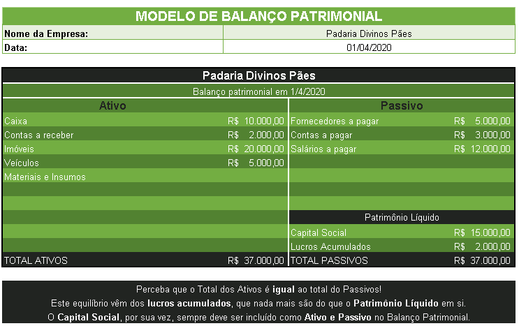

Bem vindx a mais uma aula de Contabilidade.

Hoje, finalmente, iremos entender o que é a Contabilidade e qual a importância dela no contexto da administração das empresas.

Para melhor entender os conceitos desta aula, sugiro o material descrito nas referências bibliográficas, em especial:

[BÄCHTOLD. Contabilidade Básica](http://redeetec.mec.gov.br/images/stories/pdf/proeja/contabil_basica.pdf)

[OLIVEIRA & MOREIRA. Noções de Contabilidade Básica Para Cursos Técnicos](https://www.ifb.edu.br/attachments/6243_no%C3%A7%C3%B5es%20de%20contabilidade%20b%C3%A1sica%20para%20cursos%20t%C3%A9cnicos%20final.pdf)

[OLIVO & BOSCHILIA. Contabilidade geral e gerencial - conceitos introdutórios para os cursos superiores de tecnologia](https://www.ifsc.edu.br/documents/30701/523474/Livro_contabilidade_miolo.pdf/f149d841-667c-9e0f-5cd2-a8bfb13d4ebf)

*Allons-y, Alonso!*

---

## Sumário da Aula

1. [O que é a Contabilidade - Revisão](#O-que-e-a-Contabilidade-Revisao)
2. [Conceitos Contábeis](#Conceitos-Contabeis)
3. [Patrimônio Líquido](#Patrimonio-Liquido)
4. [Resumo](#Resumo)
5. [Exercícios](#Exercicios)
6. [Referências Bibliográficas](#Referencias-Bibliograficas)

---

## O que é a Contabilidade (Revisão)

O 1º Congresso Brasileiro de Contabilidade, que aconteceu de 17 a 24 de agosto de 1924, aprovou como oficial, a seguinte definição para a contabilidade:

“*É a ciência que estuda e pratica as funções de orientação, controle e registro relativo aos atos e fatos da administração econômica*”.

A Contabilidade busca entender a dinâmica de funcionamento das empresas para ajudar seus gestores a tomar decisões e traçar objetivos para a entidade. Isso significa que é com as ferramentas contábeis que podemos conhecer a real situação de uma empresa e até mesmo prever o seu futuro.

Entender as dinâmicas de funcionamento do mercado, bem como os eventos econômicos de cada momento (desvalorização, inflação, deflação, crises...) são essenciais para uma boa análise contábil.

Todas as empresas nascem com uma finalidade. A grande maioria das empresas visa resultados financeiros; outras buscam resultados sociais; outras buscam expansão. Mas no final, todas buscam atingir os objetivos traçados.

A contabilidade é indispensável para que a empresa realize negócios, por exemplo, com órgãos governamentais (por meio de contratos e licitações), ou com os bancos, com fornecedores, etc (BÄCHTOLD, 2012).

A própria expansão e continuidade das empresas dependem das análises contábeis: Nos últimos anos, o SEBRAE (Serviço Brasileiro de Apoio às Micro e Pequenas Empresas) vem realizando pesquisas para detectar o índice de mortalidade (fechamento) das empresas no primeiro ano de vida (abertura). Na mais recente pesquisa, os números apontavam que cerca de 48% dos negócios são fechados antes de completar 12 meses de funcionamento.

A principal causa desta mortalidade é a falta de planejamento e controle dos negócios. Em suma, é a falta de Contabilidade. (BÄCHTOLD, 2012). 

---

## Conceitos Contábeis

A função mais importante da contabilidade é o **controle**, pois ele permite, como vimos, uma análise minuciosa da verdadeira situação de uma empresa. Esta análise está baseada em alguns princípios e conceitos básicos:

1) **Princípio da Entidade**: o patrimônio de uma entidade é diferente e autônomo do patrimônio particular de seus gestores ou sócios. Em resumo: o patrimônio de uma empresa não deve ser confundido com o patrimônio de seus donos/sócios.

2) **Princípio da Continuidade**: pressupõe-se que a empresa continuará a existir no futuro. Por esta razão, mesmo que a situação não seja favorável, deve-se sempre levar em consideração que a empresa continuará existindo.

3) **Princípio da Prudência**: pressupõe-se que uma empresa precisa manter-se prudente quanto às estimativas de condições incertas. Em resumo: uma empresa deve tomar cuidado em relação à ofertas e ideias miraculosas ou mui pessimistas.

Apesar de existirem outros princípios, os três mostrados acima descrevem bem a dinâmica de uma empresa. Para melhor entender estes princípios, devemos conhecer alguns conceitos básicos da contabilidade.

### Patrimônio

Toda empresa possui um **patrimônio**, isto é, um conjunto de bens, direitos e obrigações vinculados a ela.

Imagine que você seja o dono de uma padaria. Conforme o tempo foi passando, e sua padaria gerando lucro, você conseguiu adquirir alguns **bens**, tanto para você quanto para a sua padaria: 

<ul>
  <li class='item-ok'>2 Fornos Industriais</li>
  <li class='item-ok'>1 automóvel para seu uso pessoal</li>
  <li class='item-ok'>1 Freezer Horizontal</li>
  <li class='item-ok'>2 Geladeiras Comerciais</li>
  <li class='item-ok'>1 imóvel comercial próprio para a sede da padaria</li>
  <li class='item-ok'>3 Computadores de Atendimento</li>
  <li class='item-ok'>1 Motocicleta para o seu primo</li>
  <li class='item-ok'>5 Fatiadores de Frios</li>
  <li class='item-ok'>1 casa de praia para você e sua família passarem os fins de semana</li>
  <li class='item-ok'>2 Balcões de Encosto</li>
  <li class='item-ok'>1 *TV de Tela Plana 4K Full-HD 3D pt-br vinda de Marte, que fala árabe e leva seu cachorro para passear*</li>
</ul>

Repare que nesta lista estão misturados os **bens** da padaria com os os seus bens pessoais. O princípio da Entidade nos diz que devemos sempre separar as duas coisas: o patrimônio da empresa é diferente do patrimônio do seu dono.

> EXERCÍCIO 01: Em seu caderno, separe os bens acima pelo Princípio da Entidade.

### Bens

Em contabilidade **bens** são os elementos que podem ser **avaliados monetariamente** e podem ser destinados para uso, troca ou venda. Os bens **possuem utilidade**, pois são eles que satisfazem as necessidades de seus proprietários (BÄCHTOLD, 2012). 

Os bens podem ser **classificados** de diversas maneiras. Utilizaremos 3 definições diferentes:

**Bens Tangíveis & Intangíveis**: são aqueles que podemos, respectivamente, tocar ou não. Exemplo: um automóvel é um bem tangível; o nome comercial da empresa é um bem intangível.

**Bens Móveis & Imóveis**: são aqules bens que, respectivamente, podem ou não ser movidos ou deslocados. Exemplo: um estoque de mercadorias pode ser movido; um prédio comercial (sede de uma empresa) não o pode.

**Bens Permanentes & Bens de Consumo**: são aqueles que possuem longa ou curta vida útil. Exemplo: um automóvel é um bem permanente, pois será usado durante muito tempo; já um pacote de folhas de papel (bem de consumo) será utilizado em pouco tempo.

<ul>
  <li class='item-ok'>2 Fornos Industriais</li>
  <li class='item-ok'>1 automóvel para seu uso nas entregas de pedidos da padaria</li>
  <li class='item-ok'>1 Freezer Horizontal</li>
  <li class='item-ok'>1 Conta Bancária Empresarial</li>
  <li class='item-ok'>2 Geladeiras Comerciais</li>
  <li class='item-ok'>1 imóvel comercial próprio para a sede da padaria</li>
  <li class='item-ok'>3 Computadores de Atendimento</li>
  <li class='item-ok'>2 Filiais da Padaria</li>
  <li class='item-ok'>5 Fatiadores de Frios</li>
  <li class='item-ok'>O Nome Empresarial da Padaria</li>
  <li class='item-ok'>2 Balcões de Encosto</li>
  <li class='item-ok'>5 Receitas de Bolo Exclusivas da Padaria</li>
</ul>

> EXERCÍCIO 02: Em seu caderno, classifique os bens acima. Você pode utilizar mais de uma classificação (exemplo: bem imóvel intangível e permanente).

### Direitos

**Direitos** são os elementos que representam os bens que a empresa tem a receber. Exemplo: contribuições a receber, títulos a receber, adiantamento concedido, **créditos** a receber, etc.

Direitos geralmente aparecem acompanhados da expressão “a receber”, “a compensar”, a “recuperar”, “a creditar”, ou outra similar, indicando a **promessa de recebimento** ou que permita recuperar parte do bem transferido.

### Obrigações

**Obrigações** são as responsabilidades de pagamento por bens adquiridos ou despesas realizadas. Portanto, temos aqui uma obrigação, uma **dívida** que poderá ser paga imediatamente ou a prazo. As obrigações na contabilidade recebem o nome técnico de **exigível**, por se exigir da empresa o pagamento das dívidas (BÄCHTOLD, 2012). 

Os exigíveis geralmente aparecem acompanhadas da expressão: “a pagar”, “a recolher”, “passivos”, “a liquidar” ou outra similar. Exemplo: salários a pagar, impostos a recolher, fornecedor, entre muitas outras.

<ul>
  <li class='item-ok'>Caixa</li>
  <li class='item-ok'>Empréstimos Bancários</li>
  <li class='item-ok'>Financiamentos a Pagar</li>
  <li class='item-ok'>Empréstimos a Sócios</li>
  <li class='item-ok'>Empréstimos de Sócios</li>
  <li class='item-ok'>SIMPLES a Recolher</li>
  <li class='item-ok'>IPI a Recolher</li>
  <li class='item-ok'>Títulos a Receber</li>
  <li class='item-ok'>Terrenos</li>
  <li class='item-ok'>INSS a Pagar</li>
  <li class='item-ok'>Computadores</li>
  <li class='item-ok'>Contas a Receber</li>
  <li class='item-ok'>Salários a Pagar</li>
  <li class='item-ok'>Banco conta corrente</li>
  <li class='item-ok'>FGTS a Pagar</li>
  <li class='item-ok'>Fornecedores</li>
  <li class='item-ok'>Títulos a Pagar</li>
  <li class='item-ok'>Máquinas e Equipamentos</li>
  <li class='item-ok'>COFINS a Recolher</li>
  <li class='item-ok'>PIS a Recolher</li>
  <li class='item-ok'>Duplicatas a Receber</li>
  <li class='item-ok'>Contas a Pagar</li>
  <li class='item-ok'>ICMS a recuperar</li>
  <li class='item-ok'>Estoque de Mercadorias</li>
  <li class='item-ok'>Móveis e Utensílios</li>
  <li class='item-ok'>Aluguéis a Pagar</li>
  <li class='item-ok'>Comissões a Pagar</li>
  <li class='item-ok'>ICMS a Recolher</li>
  <li class='item-ok'>Duplicatas a Pagar</li>
  <li class='item-ok'>Encargos Sociais a Pagar</li>
  <li class='item-ok'>Água, Luz e Telefone a Pagar</li>
  <li class='item-ok'>Veículos</li>
  <li class='item-ok'>Provisão para Imposto de Renda a Pagar</li>
  <li class='item-ok'>Provisão para Contribuição Social a Pagar</li>
</ul>

> EXERCÍCIO 03: Classifique os elementos patrimoniais acima em bens, direitos ou obrigações. Classifique-os também como ativos ou passivos.

### Ativos e Passivos

O **ativo** compreende os **bens e os direitos** controlados pela entidade e expresso em moeda e possuem a característica de **gerar benefícios de fluxos de Caixa** futuros para a entidade (OLIVEIRA & MOREIRA, 2012).

Exemplos de bens e direitos registrados no Ativo: Caixa, bancos, clientes, contas a receber, Estoque, empréstimos concedidos a terceiros, imóveis, veículos, máquinas e equipamentos, entre outros.

Já os **passivos** são todas as **obrigações a pagar** que a empresa possui, ou seja, são compromissos para com terceiros devido ao consumo de recursos (OLIVEIRA & MOREIRA, 2012).

Exemplos de compromissos registrados no Passivo: fornecedores, contas a pagar, empréstimos a pagar, financiamentos a pagar, salários a pagar, entre outros.

---

## Patrimônio Líquido

O **Patrimônio Líquido** é definido como o **saldo** resultante da diferença entre o valor do Ativo e do Passivo de uma empresa.

Exemplo: se uma empresa possuir um Ativo (bens + direitos) no valor de R$ 50.000 e um Passivo (obrigações) no valor de R$ 30.000, então, tem-se um Patrimônio Líquido de R$ 20.000

`PATRIMÔNIO LÍQUIDO (PL) = ATIVOS - PASSIVOS`

O **Patrimônio Líquido** deve ser registrado no **Balanço Patrimonial**, que consiste num gráfico ou demonstrativo da situação financeira (patrimonial) de uma empresa em um dado momento. Em aulas futuras etudaremos o Balanço Patrimonial com detalhes.

Para se fazer um Balanço Patrimonial deve-se montar uma **tabela** na qual são representados, por convenção, os ativos, do lado **esquerdo**, e os passivos do lado **direito**. Junto aos passivos deve ser somado também o **Patrimônio Líquido** e o **Capital Social**.

Na próxima aula entenderemos em detalhes o que é o Capital Social, mas por ora considere-o como **o dinheiro que os donos ou sócios de uma empresa investem nela**. Este dinheiro é um passivo, que será convertido em ativo para a compra de bens para a empresa ou como capital de giro em Caixa.

> EXERCÍCIO 04: Calcule o Patrimônio Líquido de uma empresa com os seguintes elementos:

- Caixa: R$ 10.000,00 
- Pagamento Fornecedores: R$ 2.500,00
- Imóveis Próprios: R$ 25.000,00
- Veículos Próprios: R$ 5.500,00
- Contas a Receber: R$ 3.000,00
- Salários a Pagar: R$ 5.000,00
- Contas a Pagar: R$ 6.00,00
- Capital Social: R$ 15.000,00

> EXERCÍCIO 05: Calcule o Patrimônio Líquido de uma empresa com os seguintes elementos:

- Caixa: R$ 25.000,00 
- Pagamento Fornecedores: R$ 5000,00
- Imóveis Próprios: R$ 10.000,00
- Veículos Próprios: R$ 20.000,00
- Impostos a pagar: R$ 2.000,00
- Contas a Receber: R$ 3.000,00
- Salários a Pagar: R$ 15.000,00
- Empréstimos Bancários: R$ 10.000,00
- Contas a Pagar: R$ 25.000,00
- Capital Social: R$ 15.000,00

---

## Resumo

- A Contabilidade busca estudar e praticar as funções de orientação, controle e registro relativo aos atos e fatos da administração econômica de uma empresa.

- A função mais importante da contabilidade é o **controle**, pois ele permite analisar a verdadeira situação de uma empresa. Esta análise está baseada em alguns princípios e conceitos básicos.

- O **Princípio da Entidade** nos diz que devemos sempre separar o patrimônio da empresa e o patrimônio do seus donos ou sócios.

- O **Princípio da Continuidade** pressupõe-se que a empresa continuará a existir no futuro. Por esta razão, mesmo que a situação não seja favorável, deve-se sempre levar em consideração que a empresa continuará existindo.

- O **Princípio da Prudência**: pressupõe-se que uma empresa deve tomar cuidado em relação ao mercado, a fim de manter seu funcionamento.

- **Patrimônio** é um conjunto de bens, direitos e obrigações vinculados às organizações.

- **Bens** são os elementos que podem ser **avaliados monetariamente** e **possuem utilidade**. Podem ser tangíveis, intangíves, móveis, imóveis, permanentes ou de consumo.

- **Direitos** são os elementos que representam os bens que a empresa tem a receber.

- **Obrigações** são as responsabilidades de pagamento por bens adquiridos ou despesas realizadas, isto é, dívidas.

- **Ativos** compreendem os **bens e os direitos** da empresa; já os **passivos** são todas as **obrigações a pagar** que a empresa possui.

- O **Patrimônio Líquido (PL)** é definido como o **saldo** resultante da diferença entre o valor do Ativo e do Passivo de uma empresa.

---

## Exercícios

**Nesta aula os exercícios 01 ao 05 estão distribuídos pela matéria. Leia-a com atenção!**

06. Relacione o conceito de crédito com os direitos contábeis de uma empresa.

07. Explique porque o Capital Social é, ao mesmo tempo, ativo e passivo contábil.

---

##  Referências Bibliográficas

BACARJI, Alencar Garcia. Formação Incial e Continuada Auxiliar Administrativo. Curitiba: Instituto Federal do Paraná, 2012. Disponível em <https://bit.ly/2vZG4Y5>. Acesso en *20 de mar. de 2020*. 

BÄCHTOLD, CIRO. Contabilidade Básica. Curitiba: Instituto Federal do Paraná, 2012.Disponível em <https://bit.ly/342pLX5>. Acesso en *20 de mar. de 2020*.

DALIO, R. A Template for Understanding How the Economic Machine Works and How it is Reflected Now. Westport: BRIDGETWATER, 2011

GULLO, J. Administração: Para quem estuda, ensina e pratica. São Paulo, Bom Dia, 2006. 147 p

MOTTA, F. C. P. A teoria geral dos sistemas na teoria das organizações. Rev. adm. empres.,  São Paulo ,  v. 11, n. 1, p. 17-33,  Mar.  1971 .   Disponível em <http://www.scielo.br/scielo.php?script=sci_arttext&pid=S0034-75901971000100003&lng=en&nrm=iso>. Acesso en *03 de abr. de 2020*.

OLIVEIRA, M. S. de; MOREIRA, S C. Noções de contabilidade básica para cursos técnicos. Brasília, DF : Instituto Federal de Educação, Ciência e Tecnologia de Brasília, 2012. 120p.

OLIVO, Ana Maria; BOSCHILIA, Luiz. Contabilidade geral e gerencial: conceitos introdutórios para os cursos superiores de tecnologia. Florianópolis: Publicações do IF-SC, 2012. 102 p. : il.

RENNÓ, R. Administração Geral para Concursos. Rio de Janeiro, Elsevier, 2013.