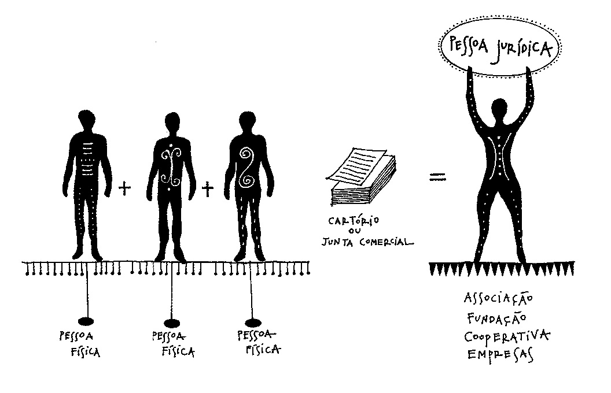

Bem vindx a mais uma aula de Contabilidade.

Hoje vamos começar a entender sobre a constituição das empresas, bem como os diferentes tipos de organização que existem.

Este conteúdo é **fundamental** para o desenvolvimento do Trabalho de Conclusão de Módulo (TCM), que será apresentado na próxima aula.

Os conceitos estudados podem ser aprofundados com maiores detalhes nas obras abaixo:

[VALLE & BAPTISTA. Formas de Organização – Associação, Fundação, Cooperativa, Empresa](https://bit.ly/2XzFvj9)

[RENNÓ. Administração Geral para Concursos](https://bit.ly/3beO2w4)

*Empieza el matriarcado... i els estudios!*

---

## Sumário da Aula

1. [Pessoas Físicas e Jurídicas](#Pessoas-Fisicas-e-Juridicas)
2. [Sociedades e Organizações](#Sociedades-e-Organizacoes)
3. [Tipos de Organização](#Tipos-de-Organizacao)
4. [Estatutos](#Estatutos)
5. [Estrutura das Organizações](#Estrutura-das-Organizacoes)
6. [Resumo](#Resumo)
7. [Exercícios](#Exercicios)
8. [Referências Bibliográficas](#Referencias-Bibliograficas)

---

## Pessoas Físicas e Jurídicas

Todo **ser humano** nasce com **direitos e obrigações** natas à sua existência. Isso significa que toda pessoa tem **direito** à alimentação, à moradia, à liberdade, à vida… assim como também possui **deveres**, como os de pagar impostos, votar e possuir documentos de identificação. 

Esses direitos e deveres natos significam que todos os seres humanos possuem **personalidade jurídica** que é adquirida com o nascimento desta pessoa.

**Personalidade Jurídica**, é a ideia de que todas as pessoas (físicas e jurídicas) possuem direitos e deveres.

Isso não quer dizer, no entanto, que toda pessoa é uma **pessoa jurídica**. Mas, afinal de contas, o que é uma pessoa física e uma pessoa jurídica?

**Pessoa Física** nada mais é do que um termo utilizado para designar todo e qualquer ser-humano.

Já uma **Pessoa Jurídica** consiste simplesmente um um conjunto de pessoas físicas que se unem para alcançarem **objetivos comuns**, sejam eles econômicos ou não, formando uma **sociedade** ou organização.

---

## Sociedades e Organizações

Imagine que um alguns amigos, todos com formação em pedagogia, decidam se unir para formar um grupo de apoio para auxiliar crianças carentes com dificuldades de aprendizagem. Este grupo, a parir do momento em que é estruturado, regulamentado e organizado passará a constituir uma **organização**.

Uma **organização** (ou sociedade) é um sistema humano, social e cultural, que, através de colaboração das pessoas entre si (cooperação), recursos, normas estabelecidas e divisão de tarefas, realiza atividades com o objetivo de alcançar objetivos comuns (compartilhados) (GULLO, 2006).

Para que uma organização se torne uma **Pessoa Jurídica** é necessário que a mesma se registre em um cartório, junta comercial ou órgãos afins (Receita Federal, Associação ou Organização de Controle, etc). Cabe ressaltar que **não é necessária** a regulamentação como Pessoa Jurídica para se consolidar uma sociedade.

(Imagem retirada do livro [Formas de Organização – Associação, Fundação, Cooperativa, Empresa](https://bit.ly/2XzFvj9) - Todos os direitos reservados aos seus autores)

Se considerarmos um **grupo de vizinhos** que se voluntariam para fazer alguma obra de melhoria em sua rua, ou mesmo para coletar alimentos para outras organizações, há um exemplo de **sociedade**, mesmo não sendo necessário que a mesma se registre formalmente (Pessoa Jurídica).

Neste ponto é importante avisar que existem algumas **vantagens** ao se registrar formalmente uma Pessoa Jurídica.

A principal vantagem é a obtenção do direito de se abrir contas bancárias **para a organização** (lembre-se do Princípio Contábil da Entidade) e de conseguir, em alguns casos, dinheiro público para se investir na organização (em especial associações e ONGs). Além disso as Pessoas Jurídicas podem conseguir condições especiais para o pagamento de dívidas (como contas de água e luz).

Outra vantagem do registro é a possibilidade de conseguir parcerias comerciais e estratégicas que podem facilitar e alavancar os objetivos e visões da organização.

A Legislação Brasileira, por meio do seu Código Civil, divide as Pessoas Jurídicas em 2 classificações diferentes: as de **direito público** e as de **direito privado**.

As **Pessoas Jurídicas de Direito Público** são organizações geridas pelo Estado, como é o caso da União (País), dos Estados, dos Municípios, das Autarquias (como o INSS), as nações estrangeiras e os organismos internacionais (ONU, União Europeia, Mercosul, UNESCO, FAO...).

Já as **Pessoas Jurídicas de Direito Privado** são aquelas formadas por pessoas físicas que buscam objetivos comuns e gerem estes objetivos sem a intervenção do Estado, como é o caso do **grupo de vizinhos**.

---

## Tipos de Organização

O Código Civil Brasileiro reconhece diferentes **tipos de pessoas jurídicas de direito privado** – Associações, OSCIPs, Fundações, Cooperativas e Empresas.

Estas organizações se diferenciam, principalmente, por suas  **finalidades sociais** e seus **objetivos econômicos**.

Cada uma possui as suas particularidades, que poderão ser estudadas detalhadamente nas obras citadas nas [Referências Bibliográficas](#Referencias-Bibliograficas).

> TRABALHO PARCIAL DO MÓDULO: Não se esqueça de fazer o Trabalho Parcial do Módulo!

### Associações Sem Fins Lucrativos

**Quando são criadas:** quando um grupo de pessoas se reúne para atingir um objetivo comum, sem finalidades econômicas. As pessoas que ajudam a formas a associação são chamadas de **sócios** ou **associados**.

**O que é necessário para formá-las:** para criar uma associação não é preciso ter um patrimônio formado, apenas a **vontade** de um grupo de pessoas para fazer alguma coisa.

**Principais características:** não podem ter fins lucrativos. Isto significa que o dinheiro arrecadado por estas organizações deve ser obrigatoriamente utilizado em seus projetos e atividades.

**Associações podem realizar vendas?** Sim, desde que este não seja o objetivo principal da associação. Vendas e outras formas de arrecadação devem ter seu capital convertido para a manutenção da associação.

**Associações podem ter funcionários?** Sim. Mesmo com a proibição de se distribuir lucro entre os associados, estas organizações podem ter **funcionários remunerados**, conforme as leis trabalhistas.

**Exemplos:** Associações de Proteção aos Direitos dos Animais; Associações de Divulgação da Cultura; Associações para Arrecadação de Medicamentos e Alimentos; etc.

### Organização da Sociedade Civil de Interesse Público OSCIP

**O que são:** OSCIPs são um tipo especial de associações sem fins lucrativos que mantém uma parceria com o Governo.

**Toda Associação é uma OSCIP?** Não, a OSCIP é uma categoria à parte das associações. No entanto, **associações** das áreas de assistência social, cultura, educação gratuita, meio ambiente e outras temáticas sociais de interesse público podem se tornar OSCIPs por meio de parcerias com o Governo, diretamente com o Ministério da Justiça.

**O que garante esta parceria?** As parcerias com o Governo garantem às OSCIPs uma facilitação ao acesso de fundos públicos (dinheiro público) para o desenvolvimento de seus projetos. Por outro lado, todas as contas da OSCIP passarão a ser fiscalizadas e controladas pelo Governo.

**O acesso ao fundo público é imediato?** Não. A qualificação de OSCIP não garante o acesso os fundos públicos - apenas facilita-os de algumas maneiras.

### Fundações

**O que são:** a fundação é uma organização sem fins lucrativos cuja **origem** se encontra na vontade de um **instituidor** em destinar parte do seu patrimônio para realizar atividades sem finalidade lucrativa.

**O instituidor (ou seus herdeiros) é o dono da Fundação?** Não. A transformação do patrimônio do instituidor em uma Fundação é um ato irrevogável e regido pelo *Princípio da Entidade* - o patrimônio passa a pertencer à Fundação, de forma separada do seu fundador.

**Como funcionam as Fundações?** Para se criar uma fundação o instituidor deve registrar em cartório um documento que declare os bens que irá doar e os fins que estes bens se destinam. A partir deste momento estes bens passarão a ser da Fundação que é fiscalizada de perto pelo Ministério Público, afim de garantir que o dinheiro da mesma está sendo bem aplicado - e que os objetivos do instituidor estão sendo alcançados.

**Especificidades:** ao contrário das associações e OSCIPs, que podem ser ter qualquer finalidade, as Fundações só podem ser criadas para fins religiosos, morais, culturais ou de assistência social.

**Exemplo:** Fundação Ezequiel Dias (FUNED) - Instituto  mineiro que realiza pesquisas na área de saúde pública, com produção de medicamentos, vacinas e soros.

### Cooperativas

**Quando são criadas:** quando um grupo de pessoas se reúne para atingir um objetivo comum, **com finalidades econômicas**. As pessoas que ajudam a formas a associação são chamadas de **cooperados**.

**Como funciona as Cooperativas?** Imagine que um grupo de artesãos deseja se unir para vender seus produtos juntos. Além disso o grupo também deseja realizar cursos de profissionalização para os cooperados e a comunidade. Como há um objetivo econômico (vender os produtos) e um objetivo social (capacitação), a melhor forma de organização para o grupo é uma **cooperativa**.

**De onde vem os recursos da Cooperativa?** As cooperativas, diferentemente das associações e OSCIPs, pode cobrar pelos serviços prestados. Supondo que uma cooperativa realize uma feira e venda, nesta feira, um produto de um artesão por R$ 100,00 ela pode cobrar uma taxa de contribuição por esta venda, digamos R$ 5,00, e devolver ao artesão o restante R$ 95,00.

**Quais as vantagens das Cooperativas?** Em primeiro lugar o objetivo principal destas organizações deve ser de **prestar serviços** aos seus associados (fornecer cursos e planos médicos, por exemplo). No entanto, pelo fato de contar com vários profissionais de uma mesma área (artesões, por exemplo) a Cooperativa também está autorizada a **vender os produtos** e repassar o dinheiro arrecadado (excetuando das taxas de contribuição) para os cooperados. Outra vantagem pode estar na socialização das ferramentas e locais, ou seja, na sede da Cooperativa pode contar com ferramentas e matérias-primas que podem usados por todos os cooperados, sem a necessidade deles comprarem estes materiais por conta própria.

**Exemplo:** Cooperfins - cooperativa dos taxistas que trabalham próximo ao Aeroporto de Confins. A organização oferece aos cooperados uma série de vantagens, como sede própria, sala de reuniões e pagamentos de *vouchers* aos taxistas.

### Empresas

**Quando são criadas:** Também chamadas de **sociedades comerciais**, as empresas são criadas com objetivos comerciais visando o lucro financeiro de seus **sócios**.

**Como funcionam as Empresas?** Diferentemente das outras formas de organização, nas quais existe uma preocupação social em facilitar a vida dos associados e da comunidade, as empresas distribuem o lucro obtido pela venda (ou prestação de serviços) entre os sócios.

**Diferenças entre Cooperativas e Empresas:** A principal diferença entre as duas formas de organização está na distribuição do **poder de voto**. Quando é necessário realizar alguma decisão nas organizações, todos os associados devem opinar e votar. Nas cooperativas todos os associados tem direito ao voto - e todos os votos tem o mesmo valor. Já nas empresas, devido ao **capital social** o voto de um sócio que investiu mais dinheiro na empresa tem mais valor e importância do que o voto de outro sócio que não investiu tanto assim.

**É possível formar empresas com apenas 1 sócio?** Sim. Diferentemente de outras formas de associação onde é necessário um grupo organizado de pessoas para se estruturar a organização - as empresas podem ser constituídas por apenas 1 dono.

---

## Estatutos

Uma importante característica comum a todas as formas de organização vistas é a existência de um **estatuto**.

Quando um grupo de pessoas decide iniciar uma organização é necessário estruturar as regras de funcionamento da mesma.

Imagine que você junto a alguns colegas de classe decidam formar um grupo (organização) de estudos e plantão, em alguns dias e horários durante a semana, para tirarem dúvidas das matérias. Neste grupo haveriam pelo menos 2 tipos de integrantes: aqueles alunos que estão com dúvidas e aqueles que irão tirar estas dúvidas (monitores).

Repare que neste exemplo temos uma **divisão de tarefas**, entre os monitores e os alunos e algumas **regras de funcionamento**, como os dias e horários que o grupo irá se reunir.

Mesmo neste exemplo simples existe a necessidade de se criar regras de funcionamento para este grupo. Conforme vimos nas aulas de história da administração, como o tempo houve a necessidade de se estruturar estas regras em **estruturas formais e impessoais**, ou seja, em documentos escritos (Teoria da Burocracia de Weber).

No contexto das organizações também é necessário possuir documentos escritos com as regras daquele grupo. O principal documento que define as regras, objetivos, estrutura e divisão de tarefas de uma organização é o **estatuto**.

As empresas possuem uma forma específica de estatuto chamada de **contrato social**, que será estudado na próxima aula.

De modo geral, os estatutos devem conter:

<ul>
  <li class='item-ok'>A denominação da organização (nome);</li>
  <li class='item-ok'>O endereço da sede;</li>
  <li class='item-ok'>A duração da organização, isto é, por quanto tempo ela irá existir;</li>
  <li class='item-ok'>Os fins (objetivos) da organização;</li>
  <li class='item-ok'>A estrutura da organização (órgãos que a compõe);</li>
  <li class='item-ok'>Delimitação do patrimônio;</li>
  <li class='item-ok'>Disposições Gerais (regras gerais da organização, como a cláusula de dissolução e asa regras de votação)</li>
</ul>

---

## Estrutura das Organizações

Uma importante parte dos estatutos é a **delimitação da estrutura** de uma organização, ou seja, quais são os órgãos que compõe aquele grupo.

A exemplo iremos analisar uma Cooperativa de Artesãos, pelo fato desta organização possuir características híbridas.

Esta cooperativa é formada pelos artesãos de uma determinada região e tem por objetivo ofertar cursos, ferramentas, matéria-prima e tratamento médico para os seus cooperados.

Por ser uma cooperativa, esta organização será constituída por... **cooperados**. A legislação prevê que uma cooperativa necessita de, no mínimo, 20 cooperados para poder ser definida como tal.

O principal órgão de uma organização (salvo as empresas) é a sua **Assembleia Geral**, que consiste no grupo com todos os seus cooperados ou associados.

A Assembleia Geral tem por objetivo definir as estratégias da cooperativa e realizar **deliberações **(sugestões) sobre o futuro da mesma.

É importante e necessário que as organizações possuam uma **Direção** ou **Conselho de Administração** formado por integrantes da Assembleia Geral escolhidos por meio da votação.

Cabe ao **Conselho de Administração** realizar todas as **decisões** econômicas e sociais de interesse da cooperativa e seus cooperados. Isto significa que, as sugestões dadas pela Assembleia Geral são, por sua vez, analisadas e sancionadas (ou vetadas) pela Direção.

Além destes 2 órgãos, é importante que as organizações possuam um **Conselho Fiscal** independente que irá **fiscalizar** o Conselho Administrativo e as operações financeiras da organização.

Estas estruturas podem variar de uma organização para outra, mas, em geral tem-se uma divisão do poder e das tarefas. A própria esfera política e governamental de um país segue este particionamento, por meio dos 3 Poderes (Executivo, Legislativo e Judiciário) e dos diferentes cargos políticos (Prefeitos/Governadors/Presidentes, Vereadores/Deputados/Senadores e Juízes/Ministros).

---

## Resumo

- **Personalidade Jurídica** é o conceito que afirma que todas as pessoas (físicas e jurídicas) possuem direitos e deveres.

- **Pessoa Física** é um termo utilizado para designar todo e qualquer ser-humano.

- **Pessoa Jurídica** é um um conjunto de pessoas físicas que se unem para alcançarem **objetivos comuns**, sejam eles econômicos ou não, formando uma **sociedade** ou organização.

- Pessoas Jurídicas podem assumir-se como de direito público ou privado, dependendo da influência do Estado em sua gestão.

- No Brasil existem diferentes **tipos de pessoas jurídicas de direito privado** – Associações, OSCIPs, Fundações, Cooperativas e Empresas. Estas organizações se diferenciam por suas **finalidades sociais** e seus **objetivos econômicos**.

- O documento que define as regras, objetivos, estrutura e divisão de tarefas de uma organização é o seu **estatuto**.

- As organizações (excetuando as empresas) se estruturam internamente em Assembleia Geral, Conselho Administrativo e Conselho Fiscal, cada um responsável por um conjunto de funções especificadas no Estatuto da Organização.

---

## Exercícios

01. Dê 3 exemplos de Pessoas Físicas e Pessoas Jurídicas.

02. Dê exemplos da **personalidade jurídica** (direitos e deveres) de Pessoas Físicas e Pessoas Jurídicas. 

03. Quais são as **vantagens e desvantagens** de se registar uma Pessoa Jurídica?

04. Dê 5 exemplos de Pessoas Jurídicas de Direito Público e Privado.

05. Diferencie OSCIP de Associação, dando 5 exemplos de cada uma e indicando suas áreas de atuação. Exemplo: Associação de Pais e Mestres da Escola XYZ - Área de atuação: educação

06. Diferencie sociedade econômica de cooperativa.

07.  Dê exemplos de situações nas quais é mais viável constituir uma cooperativa do que uma empresa.

08. Explique as semelhanças e diferenças entre Contrato Social e Estatuto Social.

09. Relacione cada um dos 3 Poderes Políticos aos órgãos da cooperativa utilizada como exemplo.

---

##  Referências Bibliográficas

BÄCHTOLD, CIRO. Contabilidade Básica. Curitiba: Instituto Federal do Paraná, 2012. Disponível em <https://bit.ly/342pLX5>. Acesso en *20 de mar. de 2020*.

RENNÓ, R. Administração Geral para Concursos. Rio de Janeiro, Elsevier, 2013.

VALLE, R. S. T. do; BAPTISTA, F. M. Formas de Organização – Associação, Fundação, Cooperativa, Empresa. INSTITUTO SOCIOAMBIENTAL, São Paulo, 2002.  Disponível em <https://bit.ly/2XzFvj9>. Acesso em 14 abr. 2020.
