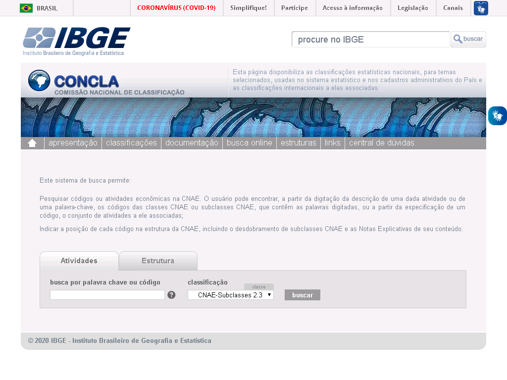

Bem vindx a mais uma aula de Contabilidade.

Na última aula estudamos o conceito de **Personalidade Jurídica** e entendemos como o mesmo está relacionado com as Pessoas Fìsicas e Jurídicas.

Vimos também que existem diferentes **formas de organização** que se diferenciam pelos seus objetivos sociais e econômicos. Além disso, discutimos brevemente sobre os estatutos - documentos que regem o funcionamento das sociedades.

Hoje iremos discutir sobre os estatutos e planos de negócios, e falar sobre um tipo de documento específico que existe em toda **sociedade comercial** (empresa): o Contrato Social.

[RENNÓ. Administração Geral para Concursos](https://bit.ly/3beO2w4)

Vamos lá!

---

## Sumário da Aula

1. [Formalização de Empresas](#Formalizacao-de-Empresas)
2. [Conceitos Importantes](#Conceitos-Importantes)
3. [Tipos de Empresa](#Tipos-de-Empresa)
4. [Contrato Social](#Contrato-Social)
5. [Plano de Negócios](#Plano-de-Negocios)
6. [Resumo](#Resumo)
7. [Exercícios](#Exercicios)
8. [Referências Bibliográficas](#Referencias-Bibliograficas)

---

## Formalização de Empresas

Assim como existem diferentes tipos de Pessoas Jurídicas e de formas de organização, o mesmo se aplica para as Empresas.

As empresas surgem como uma forma de ofertar produtos ou serviços para a sociedade visando o **lucro** para os seus sócios. No entanto, a **formalização** de uma sociedade como uma empresa trás uma de benefícios e de deveres para os seus fundadores (ANTIONARO, 2014).

Os principais benefícios da formalização, ou seja, do registro de uma empresa perante ao Governo, são:

<ul>
  <li class='item-ok'><strong>Emissão de Notas Fiscais</strong>: isso garante a possibilidade da sua empresa vender para outras empresas e até mesmo para o Governo;</li>
  <li class='item-ok'><strong>Contratação de Funcionários</strong>: garante a divisão de tarefas e maior produtividade na sua empresa;</li>
  <li class='item-ok'><strong>Acesso a Serviços Bancários</strong>: permite que as empresas façam empréstimos com juros reduzidos e outros incentivos fiscais;</li>
  <li class='item-ok'><strong>Formação de Consórcios</strong>: as empresas possuem o direito de se unirem em grupos para venderem e comprarem em conjunto, reduzindo gastos e aumentando a cartela de clientes;</li>
</ul>

Por outro lado a formalização apresenta algumas desvantagens, como:

<ul>
  <li class='item-not'><strong>Pagamento de Impostos</strong>: parte do lucro obtido pela empresa deve ser destinada para o pagamento de tributos governamentais (impostos, taxas e contribuições) diversas, como Seguro Desemprego, ICMS, ISS, etc.;</li>
  <li class='item-not'><strong>Documentação</strong>: o registro de uma empresa, bem como o seu funcionamento, demanda de uma série de documentos (Alvarás, Licenças, Contratos, CNPJ, pagamentos fiscais e trabalhistas, etc) que devem ser mantidos atualizados e guardados durante algum tempo, o que demanda de uma organização documental dentro da empresa;</li>
  <li class='item-not'><strong>Burocracia</strong>: a regularização ou atualização de dados cadastrais pode ser extremamente demorada, sendo necessário recorrer a diversos órgãos de registro ou governamentais;</li>
  <li class='item-not'><strong>Sistemas Descentralizados</strong>: o pagamento de impostos e as pendências fiscais e trabalhistas devem ser feitos por diferentes departamentos da empresa (ou tercerizados) utilizando diferentes sites e sistemas fornecidos pelo Governo, devido a falta de um Sistema Único por parte do Governo;</li>
</ul>

O processo de formalização de um negócio deve ser feito em várias etapas distintas, o que pode ser bastante lento em alguns casos. Estas etapas são:

1) **Consulta Prévia**: O empresário deve realizar uma consulta prévia na Junta Comercial Estadual sobre o nome de sua empresa (para garantir se ele já foi ou não utilizado); além disso, ele deve solicitar à Prefeitura de sua cidade o TVL (Termo de Viabilidade de Localização), um documento que será utilizado para a emissão do alvará de funcionamento.

2) **Receita Federal**: Após realizar as consultas prévias é hora de registrar a empresa na Receita Federal, gerando um CNPJ e um número de inscrição estadual (IE). Este processo pode ser feito pela Internet.

3) **Registro Comercial**: Tendo recebido o CNPJ, a empresa deverá ser registrada na Junta Comercial do seu Estado, garantindo assim que ela seja devidamente regulamentada. Neste ponto, a empresa passa a possuir o NIRE (Número de Identificação de Registro de Empresa) que garante que a mesma possa emitir notas fiscais, obter empréstimos e crédio bancário e até mesmo fazer compras de alguns fornecedores.

4) **Registro Municipal**: A última etapa do processo consiste na emissão do alvará de localização e funcionamento, que assegura à empresa operar em sua sede.

---

## Conceitos Empresariais

No processo de abertura de uma empresa, bem como do preenchimento de seu contrato social e plano de negócios, é importante definir algumas bases que guiarão o funcionamento da mesma. Por esta razão é importante conhecer alguns termos.

### Capital Social

Para se abrir uma empresa é necessário investir um capital inicial (dinheiro), seja por meio de dinheiro em espécie, crédito ou bens (como móveis, imóveis, equipamentos...). Este investimento recebe o nome de **capital social**.

### Quotas

Em empresas formadas por mais de 1 empresário, o Capital Social é formado pela união do cada sócio contribuiu.

Imagine que 4 amigos resolveram abrir uma lanchonete, e por isso cada um deles irá investir uma quantia em espécie:

- João  = R$ 2.000,00
- Pedro = R$ 2.500,00
- Maria = R$ 3.000,00
- Ana   = R$ 7.500,00

O Capital Social desta lanchonete foi de R$15.000,00. No entanto cada sócio investiu uma parte deste valor, ou seja, uma **quota** diferente.

Quotas geralmente são definidas pelo seu valor, em espécie, e pela **porcentagem** que este valor representa do Capital Social (CS).

- João  = R$ 2.000,00 = 13,3%
- Pedro = R$ 2.500,00 = 16,7%
- Maria = R$ 3.000,00 = 20,0%
- Ana   = R$ 7.500,00 = 50,0%

Vamos supor que, após alguns meses, a lanchonete tenha lucrado R$ 5000,00. Como este valor deverá ser dividido entre os sócios?

A resposta é simples: cada um receberá proporcionalmente àquilo que investiram, ou seja:

- João receberá 13,3% do lucro da empresa
- Pedro receberá 16,7% do lucro da empresa
- Maria receberá 20% do lucro da empresa
- Ana receberá 50% do lucro da empresa

O mesmo princípio se aplica caso a empresa tenha algum prejuízo... se ela contrair uma alta **dívida**, Ana deverá (na maioria dos casos) contribuir com mais dinheiro do que João.

### Nome Empresarial e Nome Fantasia

Toda empresa deve possuir 2 denominações diferentes: o Nome Fantasia e o Nome Empresarial (razão social).

O **Nome Fantasia** de uma empresa é o nome pelo qual os clientes e o mercado a conhecem. Exemplos:

- Padaria da Dona Maria
- Supermercados BH
- C&A
- Ricardo Eletro
- Gol Linhas Aéreas
- Positivo Tecnologia
- UBER

Já o **Nome Empresarial** é o nome de registro da empresa, ou seja, o nome pelo qual ela responde legalmente. Esta denominação é utilizada nos documentos da empresa (CNPJ, contratos) e nas relações comerciais que ela realiza no mercado. Exemplos:

- Isabel G. B. Confeiteira
- Supermercados BH Comércio de Alimentos LTDA.
- C&A Modas S.A.
- RN Comércio Varejista S.A.
- Gol Linhas Aéreas Inteligentes S.A.
- Positivo Tecnologia S.A.
- Uber do Brasil Tecnologia LTDA.

Para formar o nome empresarial, é necessário utilizar os nomes dos titulares e as atividades efetuadas pela empresa:

Existem dois tipos diferentes de [nomes empresariais](https://www.sebrae.com.br/sites/PortalSebrae/artigos/como-formalizar-seu-nome-empresarial,538a634e2ca62410VgnVCM100000b272010aRCRD).

Regras para nomeação por Denominação.

Regras para nomeação por Firma.

### Objeto Social e CNAE

Todas as empresas são fundadas para realizarem algum tipo de atividade específico: uma padaria e uma pizzaria, apesar de possuírem semelhanças, desempenham atividades comerciais diferentes. O **objeto social** de uma empresa é o conjunto de atividades econômicas que a mesma irá desempenhar.

O Objeto Social deve ser explicitamente indicado no Contrato Social, bem como profundamente analisado no Plano de Negócios. 

O IBGE possui um sistema de classificação das atividades econômicas do Brasil, chamado de **CNAE**.

O CNAE consiste em uma base de dados que relaciona cada atividade econômica a um código específico. Esta classificação se estrutura em uma hierarquia específica.

Para fins contábeis geralmente seu utiliza a **subclasse** da atividade econômica, que corresponde ao nível com maior descrição da mesma:

A base de dados do CNAE pode ser acessada no site do [IBGE](https://concla.ibge.gov.br/busca-online-cnae.html). Para relizar uma pesquisa basta inserir o termo procurado na caixa de pesquisa e clicar sobre a opção "Buscar".

A página de resultados mostrará um série de atividades relacionadas ao tema. Leia cuidadosamente cada descrição para encontrar a atividade correta da empresa em questão.

Ao clicar sobre o código da atividade, abrirá uma nova página contendo importantes detalhes sobre a subclasse escolhida. Lembrando que o código utilizado está apresentado no item **subclasse**.

Uma empresa pode realizar mais de 1 atividade (CNAE). No entanto, uma destas atividades deverá ser a **principal**  e as outras deverão ser consideradas **secundárias**.  Considerando, a exemplo, uma padaria, pode-se ter:

ATIVIDADE PRINCIPAL:
- 1091-1/02 Fabricação de produtos de padaria e confeitaria com predominância de produção própria

ATIVIDADES SECUNDÁRIAS:
- 1092-9/00 Fabricação de biscoitos e bolachas
- 5611-2/03 Lanchonetes, casas de chá, de sucos e similares
- 1094-5/00 Fabricação de massas alimentícias

### Portes de Empresas

As empresas podem ser classificadas conforme o seu tamanho. Este porte é utilizado como base para se definir o enquadramento tributário das mesmas.

O porte de uma empresa pode ser definido tendo como base sua renda anual:

Outro tipo de classificação utilizada diz respeito ao tipo de funcionários. Neste caso a área de atuação da empresa (comércio ou indústria) também é levada em consideração.

### Enquadramento Jurídico

Trata-se do tipo da empresa, que será apresentado abaixo.

### Enquadramento Tributário

Toda empresa, por exercer atividade comercial ou técnico-científica, deve pagar uma série de impostos e taxas ao Governo. Este pagamento pode ser feito por meio de diferentes modelos de tributação.

No **Simples Nacional**, modelo criado em 2006, micro e pequenas empresas com lucro anual de até R$ 4,8 milhões, o recolhimento de vários impostos (IRPJ, CSLL, PIS/Pasep, Cofins, IPI, ICMS, ISS e a Contribuição para a Seguridade Social destinada à Previdência Social a cargo da pessoa jurídica (CPP)) é feito por meio de um Documento Único de Arrecadaçã (DAS).

Outra vantagem do Simples está na existência de um sistema eletrônico centralizado, com todas as funcionalidades necessárias para a tributação.

Para empresas com lucro anual entre R$ 4,8 milhões e R$ 78 milhões, o sistema mais indicado é o de **Lucro Presumido**, que possui vantagens relacionadas ao porte das empresas - mas a principal desvantagem é que o pagamento de cada imposto deve ser feito separadamente.

O modelo de **Lucro Real**, por sua vez, garante diversos benefícios fiscais à empresa (taxas de juros reduzidas, condições especiais de crédito) mas tende a ter custos operacionais altos, vistos que os impostos são pagos individualmente e com maior rigor.

---

## Tipos de Empresa

Durante o processo de formalização de uma empresa, os empresários (ou sócios) podem optar de enquadrarem seus negócios de acordo com um **tipo empresarial** (enquadramento jurídico) diferente.

Em alguns casos pode ser vantajoso para o empresário pagar uma menor quantidade de impostos tendo, para isso, que limitar o número de funcionários de sua empresa. Pense em um pequeno bar, por exemplo: para o seu proprietário não há a necessidade de se contratar muitos funcionários, visto que o seu negócio é pequeno e localizado - e nesse caso ele terá como vantagem o pagamento de menos impostos.

Por outro lado, uma grande empresa, como uma rede de supermercados, precisa de muitos funcionários. Isso aumenta os gastos com impostos e taxas de contribuição, mas também garante que a mesma possa fazer empréstimos bancários, e até mesmo associações com outras empresas, de maneira mais facilitada e com maiores vantagens.

Vamos analisar os diferentes tipos de empresa existentes no Brasil, de acordo com o Código Civil (BRASIL, 2002).

### MEI - Microempreendedor Individual

O enquadramento jurídico MEI é recente no Brasil (criado em 2008) e garante às pessoas físicas a possibilidade de abrirem seus negócios sem muita burocracia.

Todo o processo de registro e regularização é feito [online](http://www.portaldoempreendedor.gov.br/), não demandando por parte do empreendedor uma maior preocupação com os quesitos jurídicos envolvidos.

Este enquadramento associa o CNPJ única e exclusivamente à própria pessoa física, ou seja, neste caso a pessoa (física) passa também a ser uma empresa (pessoa jurídica).

Diferentemente dos demais tipos, ao MEI não se aplica o Princípio Contábil da Entidade, ou seja, não há a separação patrimonial - não existe distinção entre o que é da empresa e o que é do MEI. O lado negativo da MEI (e do EI) é que se a empresa começar a se endividar, os bens como pessoa física podem ser confiscados.

<ul>
  <li class='item-warning'><strong>Atividades</strong>: há <a href="http://www.portaldoempreendedor.gov.br/temas/quero-ser/formalize-se/atividades-permitidas">atividades específicas</a> que podem ser desempenhadas pelo MEI;</li>
  <li class='item-ok'><strong>Faturamento</strong>: máximo de R$ 81.000,00 por ano (ou R$ 6.750,00 por mês);</li>
  <li class='item-ok'><strong>Funcionários</strong>: pode ter apenas 1 funcionário contratado;</li>
  <li class='item-ok'><strong>Enquadramento Tributário</strong>: os impostos são pagos de forma centralizada por meio do Simples Nacional (SIMEI);</li>
  <li class='item-not'><strong>Filiais</strong>: não pode possuir filiais, apenas 1 estabelecimento;</li>
  <li class='item-not'><strong>Sócios</strong>: só é permitido 1 pessoa física, que não pode participar como sócio de outra empresa;</li>
</ul>

### Empresário Individual

Assim como o MEI, o Empresário Individual se constitui como uma empresa em que não há a separação dos bens da pessoa física e da pessoa jurídica (não se aplica o Princípio da Entidade).

Ao contrário do MEI, não há limitações quanto as [atividades econômicas](http://www.redesim.gov.br/servicos/constitua-sua-pj/conheca-os-tipos-de-pessoa-juridica/ei) que podem ser desempenhadas pelo empresário.

Por outro lado, não pode ser empresário o prestador de serviços que exerce profissão intelectual, de natureza científica, literária ou artística como médicos, engenheiros, arquitetos, psicólogos e entre outros. Esses atuarão individualmente como **autônomos** (pessoa física com registro na Prefeitura Municipal) ou com **sócios** através da constituição de uma Sociedade Simples.

<ul>
  <li class='item-ok'><strong>Atividades</strong>: não há restrições em termos de atividades comerciais (excetuando atividades intelectuais);</li>
  <li class='item-ok'><strong>Faturamento</strong>: Até R$ 4,8 milhões no enquadramento simples, e R$ 78 milhões no Lucro Presumido;</li>
  <li class='item-ok'><strong>Funcionários</strong>: não há limite máximo;</li>
  <li class='item-ok'><strong>Enquadramento Tributário</strong>: os impostos podem ser pagos por meio do Simples Nacional (SIMEI) ou Lucro Presumido;</li>
  <li class='item-ok'><strong>Filiais</strong>: não há limites máximos, desde que as filiais possuam o mesmo objeto social da matriz;</li>
  <li class='item-not'><strong>Sócios</strong>: só é permitido 1 pessoa física, que pode participar como sócio de outra empresa;</li>
</ul>

### EIRELI - Empresa Individual de Responsabilidade Limitada 

Neste tipo de empresa, também formada por um único empresário, aplica-se o Princípio da Entidade, ou seja, ocorre distinção entre os bens da empresa e do empresário.

Trata-se do mais novo tipo empresarial, regulamentado em 2011, e possui uma importante de particularidades em relação à MEI e EI.  Na EIRELI, o **Capital Social** necessário para se abrir a empresa deve ser de, no mínimo, 100 salários mínimos. Para EI e MEI não há esse limite.

A EIRELI foi criada para combater um crime bastante comum no país. Se o proprietário de uma empresa não desejasse responder pessoalmente por suas dívidas (Princípio da Entidade), ele poderia abrir uma Sociedade Limitada com sócio fictício.

Esse “jeitinho” era a maneira encontrada para proteger seu patrimônio pessoal. Com o advento da Eireli, a prática se tornou desnecessária e caiu em desuso.

Outro aspecto positivo da EIRELI é que a empresa pode se beneficiar diretamente de vários incentivos e subsídios do governo. Alguns deles são a Inovação Tecnológica e o PAT (Programa de Alimentação do Trabalhador).

<ul>
  <li class='item-ok'><strong>Atividades</strong>: não há restrições em termos de atividades comerciais;</li>
  <li class='item-ok'><strong>Faturamento</strong>: teoricamente não há um valor máximo!;</li>
  <li class='item-ok'><strong>Funcionários</strong>: não há limite máximo;</li>
  <li class='item-ok'><strong>Enquadramento Tributário</strong>: os impostos podem ser pagos por meio do Simples Nacional (SIMEI) ou Lucro Presumido;</li>
  <li class='item-ok'><strong>Filiais</strong>: não há limites máximos, desde que as filiais possuam o mesmo objeto social da matriz;</li>
  <li class='item-not'><strong>Sócios</strong>: só é permitido 1 pessoa física, que pode participar como sócio de outra empresa;</li>
</ul>

### SS - Sociedade Simples

As restrições de atividades científicas, técnicas, artísticas e intelectuais que se aplicam ao IE podem ser facilmente resolvidas com as Sociedades Simples, também chamadas de Sociedades Profissionais.

Uma Sociedade Simples é constituída por 2 ou mais sócios que se unem para **prestar serviços** de profissão intelectual, de natureza científica, artística ou literária, sem elemento de empresa (ex. médicos, psicólogos, dentistas, engenheiros, arquitetos, etc.).

Estas sociedades apresentam **responsabilidade ilimitada**, ou seja, a responsabilidade dos sócios não está limitada à sua quota do capital social.

Vejamos um exemplo: Paula e Fernanda são psicólogas que resolveram abrir um Sociedade Simples. Paula forneceu, para a abertura da empresa R$5.000,00 (25% do Capital Social) e Fernanda forneceu R$15.000,00 (75% do Capital). A natureza de responsabilidade ilimitada afirma que, caso a empresa contraia uma dívida, de digamos R$ 10.000,00, não há um limite de quanto cada uma poderia ofertar para quitar o débito.

Caso a empresa fosse de natureza limitada, o que não pode ser feito pelas SS, cada uma das sócios só poderia ofertar uma porcentagem do valor da dívida, relativa a suas quotas do Capital Social. 

<ul>
  <li class='item-ok'><strong>Atividades</strong>: devem obrigatoriamente ser de natureza intelectual, científica, artística ou literária;</li>
  <li class='item-ok'><strong>Faturamento</strong>: Até R$ 4,8 milhões no enquadramento simples, e R$ 78 milhões no Lucro Presumido;</li>
  <li class='item-ok'><strong>Funcionários</strong>: não há limite máximo;</li>
  <li class='item-ok'><strong>Enquadramento Tributário</strong>: os impostos podem ser pagos por meio do Simples Nacional (SIMEI) ou Lucro Presumido;</li>
  <li class='item-ok'><strong>Filiais</strong>: não há limites máximos, desde que as filiais possuam o mesmo objeto social da matriz;</li>
  <li class='item-not'><strong>Sócios</strong>: 2 ou mais sócios ;</li>
</ul>

### Ltda - Sociedade Empresária Limitada

A espécie de sociedade empresária mais adotada no Brasil é a Sociedade Limitada (LTDA.), por ser mais simples e pela proteção ao patrimônio pessoal dos sócios. Como o nome já sugere, esse tipo de empresa deve conter dois ou mais sócios. Cada sócio se responsabiliza pela parte financeira e administrativa, de acordo com o capital investido, que é indicado no contrato social da empresa.

As Sociedades Empresárias Limitadas limitam a participação dos sócios por suas quotas do capital social. Isto significa que os ganhos e perdas feitos pela empresa serão distribuídos proporcionalmente entre os sócios.

Este tipo de empresa pode exercer atividades de produção, circulação de bens, prestação de serviços e outras atividades de natureza comercial - excetuando aquelas cabíveis às Sociedades Simples.

Os sócios das empresas podem responder com seus bens pessoais nos casos de comprovação de má-fé, sonegação fiscal, confusão patrimonial, estelionato, fraude contra credores e etc. Dívidas trabalhistas: A Justiça do Trabalho, recorrentemente, condena os sócios ao pagamento da dívida trabalhista com o patrimônio pessoal, no caso de os bens da empresa não serem suficientes.

<ul>
  <li class='item-ok'><strong>Atividades</strong>: não podem ser de natureza intelectual, científica, artística ou literária;</li>
  <li class='item-ok'><strong>Faturamento</strong>: Até R$ 4,8 milhões no enquadramento simples, e R$ 78 milhões no Lucro Presumido;</li>
  <li class='item-ok'><strong>Funcionários</strong>: não há limite máximo;</li>
  <li class='item-ok'><strong>Enquadramento Tributário</strong>: os impostos podem ser pagos por meio do Simples Nacional (SIMEI) ou Lucro Presumido;</li>
  <li class='item-ok'><strong>Filiais</strong>: não há limites máximos;</li>
  <li class='item-not'><strong>Sócios</strong>: 2 ou mais sócios;</li>
</ul>

### SA - Sociedade Anônima

As Sociedades Anônimas são tipos empresariais utilizados para empresas de grande porte (Companhias). Neste enquadramento jurídico o capital da empresa é dividido em quotas chamadas ações.

Diferentemente dos outros modelos, nas Sociedades Anônimas os sócios são chamados de acionistas e podem comprar ações (isso será visto em aulas futuras sobre Economia), que são semelhantes às quotas de responsabilidade limitada.

Além disso, as sociedades anônimas possuem uma administração mais fragmentada devido a uma presença menos significativa dos acionistas, comparada aos sócios das sociedades limitadas.

<ul>
  <li class='item-ok'><strong>Atividades</strong>: não podem ser de natureza intelectual, científica, artística ou literária;</li>
  <li class='item-ok'><strong>Faturamento</strong>: Mais de R$ 3,6 milhões por ano;</li>
  <li class='item-ok'><strong>Funcionários</strong>: não há limite máximo;</li>
  <li class='item-ok'><strong>Enquadramento Tributário</strong>: os impostos são pagos em um complexo modelo chamado Lucro Presumido;</li>
  <li class='item-ok'><strong>Filiais</strong>: não há limites máximos;</li>
  <li class='item-not'><strong>Sócios</strong>: 2 ou mais acionistas ;</li>
</ul>

---

## Contrato Social

Quando um grupo de sócios decide fundar uma empresa é necessário estruturar as regras de funcionamento da mesma. Estas regras são definidas pelo Estatuto das empresas, que recebe o nome especial de **Contrato Social**.

Os contratos Sociais devem conter todas as informações referentes ao funcionamento interno da empresa, podendo ser modificados no futuro. Alguns dos pontos abordados neste documento são:

<ul>
  <li class='item-ok'>A denominação da organização (nome);</li>
  <li class='item-ok'>O endereço da sede;</li>
  <li class='item-ok'>A duração da organização, isto é, por quanto tempo ela irá existir;</li>
  <li class='item-ok'>Os fins (objetivos) da organização;</li>
  <li class='item-ok'>A estrutura da organização (órgãos que a compõe);</li>
  <li class='item-ok'>A responsabilidade de cada sócio;</li>
  <li class='item-ok'>As regras para a entrada ou saída de sócios;</li>
  <li class='item-ok'>Capital Social e Quotas;</li>
  <li class='item-ok'>As regras para a divisão dos lucros;</li>
  <li class='item-ok'>Delimitação do patrimônio;</li>
  <li class='item-ok'>Disposições Gerais (regras gerais da organização, como a cláusula de dissolução e asa regras de votação)</li>
</ul>

Cada tipo de Empresa possui particularidades em relação ao Contrato Social.

O MEI não precisa possuir este documento, visto que se trata de uma única pessoa adotando um sistema de empresa simplificado.

Para o EI, o Contrato Social recebe o nome de **Requerimento de Empresário**. e nada mais é do que um formulário estabelecido pelo Governo Federal, que não pode ser modificado. Por esta razão, é indicado a empresas que possuem uma atividade já estabelecida no mercado, sem previsões de mudanças a curto e médio prazo.

O EIRELI possui o **Ato Constitutivo**, que funciona de modo semelhante ao Contrato Social padrão, possuindo algumas diferenças pontuais.

Para as Sociedades Empresárias (SS, LTDA e SA) os contratos devem ser registrados - em cartório, no caso das SS, e nas juntas comercias, no caso das LTDA e SA - e, em alguns casos, deve possuir a assinatura de um advogado (exceto se a empresa for ME ou EPP)

Abaixo seguem os diferentes tipos de contratos sociais, explicados detalhadamente. Acesse cada página e faça um pequeno resumo sobre os mesmos.

É importante avisar que todos estes documentos possuem cláusulas em comum, podendo variar a posição onde as mesmas estão localizadas. Estas cláusulas podem ser adaptadas e receber adendos, mas recomenda-se não retirá-las.

[EI - Requerimento de Empresário](../../anexos/contabilidade-modelo-requerimento-empresario)

[EI - Ato Constitutivo](../../anexos/contabilidade-modelo-ato-constitutivo-ei)

[EIRELI - Ato Constitutivo](../../anexos/contabilidade-modelo-ato-constitutivo-eireli)

[SS e LTDA](../../anexos/contabilidade-modelo-contrato-social-ss-ltda)

Após a confeção e registro do contrato, o mesmo poderá ser modificado. Para a alteração do Contrato Social, deve-se reunir todos os sócios da empresa (ou maioria simples) afim de se realizar uma **Assembleia** (reunião).

Nesta assembleia ocorrerá a modificação do contrato social conforme as necessidades da situação. Em toda reunião deverá ser feita uma **Ata** contendo os pontos abordados na mesma.

[Modelo de ATA Explicada](../../anexos/contabilidade-modelo-ata)

---

## Plano de Negócios

Antes mesmo de se iniciar a redação dos Contratos Sociais, os sócios das empresas precisar realizar um estudo aprofundado sobre o mercado em que vão atuar.

Este levantamento recebe o nome de Plano de Negócios. 

"Um plano de negócio é um documento que descreve por escrito os objetivos de um negócio e quais passos devem ser dados para que esses objetivos sejam alcançados, diminuindo os riscos e as incertezas. Um plano de negócio permite identificar e restringir seus erros no papel, ao invés de cometê-los no mercado." (SEBRAE, 2013)

A análise realizada pelo Plano de Negócios é complexa e composta por várias etapas. Futuramente iremos estudá-las com profundidade. Por ora é importante saber que é o Plano de Negócios o responsável pelo sucesso de uma empresa, pois nele está o planejamento do seu negócio.

---

## Resumo

- O processo de formalização de empresas é composto por várias etapas que devem ser seguidas a risca.

- O CNPJ é o número de identificação de uma empresa - assim como o CPF é o documento de identificação das pessoas físicas. Além dele, as empresas necessitam de uma Inscrição Estadual (IE), de um cadastro na junta comercial (NIRE) e de um alvará municipal de funcionamento.

- Há 6 principais tipos de empresas no Brasil, que se diferenciam conforme o tipo de atividade ofertado e a quantidade de sócios:
  - | Tipo de Empresa | Nº de Sócios | Atividades Permitidas | Faturamento Máximo Anual |
|-----------------|--------------|-----------------------------------------------------------------------------------------------------------------------------|---------------------------|
| MEI | 1         | Limitadas a uma [lista restrita](http://www.portaldoempreendedor.gov.br/temas/quero-ser/formalize-se/atividades-permitidas) | R$ 81.000,00 |
| EI | 1         | Exceto atividades intelectuais | R$ 4.800.000,00 (simples) |
| EIRELI | 1         | Sem exceções | R$ 4.800.000,00 (simples) |
| SS | 2 ou mais | Científicas, técnicas, artísticas e intelectuais | R$ 4.800.000,00 (simples) |
| LTDA | 2 ou mais | Exceto atividades intelectuais | R$ 4.800.000,00 (simples) |

- O Contrato Social define as regras, objetivos, estrutura e divisão de tarefas de uma empresa.
  - MEI não precisa possuir Contrato Social;
  - EI e EIRELI possuem modelos específicos de Contrato denominados, respectivamente, *Requerimento Empresário* e *Ato Constitutivo*.
  - EI, EIRELI, SS, SA e LTDA devem registrar os Contratos Sociais em Cartório ou na Junta Comercial. Algumas vezes pode ser necessário a assinatura de um advogado nos mesmos.

- O Plano de Negócios é um documento escrito que formaliza os objetivos de um negócio e analisa seus pontos fortes e fracos, o mercado, a divisão de processos, etc.

---

## Exercícios

01.	Quais as diferenças entre empresários, empreendedores, autônomos e comerciantes?

02.	Pesquise o nome empresarial das empresas abaixo (ou de uma de suas filiais):
a) Supermercados EPA
b) Supermercados Verdemar
c) FIAT
d) Lenovo
e) Microsoft
f) McDonald's
g) Burguer King

03. Pesquise o CNPJ das sociedades abaixo:
a) Município de Belo Horizonte
b) Google Akwan Internet LTDA (*sede da Google em BH*)
c) Fiat Betim
d) Subway
e) Rede Globo de Televisão
f) Assembleia Legislativa do Estado de Minas Gerais
g) UFMG

04.	O que é uma sociedade anônima? Quais as diferenças entre este modelo e as sociedades limitadas?

05.	Quais as diferenças entre a Empresa Individual, EIRELI e MEI?

06. Qual é o passo-a-passo necessário para se abrir uma empresa no Brasil?

---

##  Referências Bibliográficas

ANTIONARO, Fábio. Formalização para começar bem: como formalizar o seu negócio: manual do participante. Brasília : Sebrae, 2014. 36 p. il. Disponível em <https://bit.ly/2W2KaZV>. Acesso em *4 de mai. de 2020*.

BRASIL. LEI N o 10.406, DE 10 DE JANEIRO DE 2002. Institui o Código Civil. Disponível em <http://www.planalto.gov.br/ccivil_03/leis/2002/l10406.htm>. Acesso em Acesso en *4 de mai. de 2020*.

SEBRAE. Como elaborar um Plano de Negócios. Brasília, Sebrae NA, 2013. Disponível em <https://bit.ly/2VZAe34>.  Acesso em Acesso en *4 de mai. de 2020*.

SEBRAE. Abertura de Empresas. Manaues, Sebrae AM, 2018. Disponível em <https://bit.ly/3djcSLR>. Acesso em *4 de mai. de 2020*.

SEBRAE. Cartilha do empreendedor. 3. ed. rev. e ampl. - Salvador, Sebrae Bahia, 2009. 68 p. : il. Disponível em <https://bit.ly/2KVsBEJ>. Acesso em *4 de mai. de 2020*.