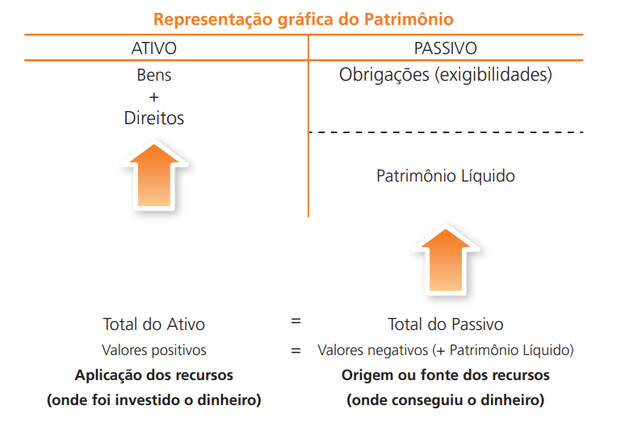
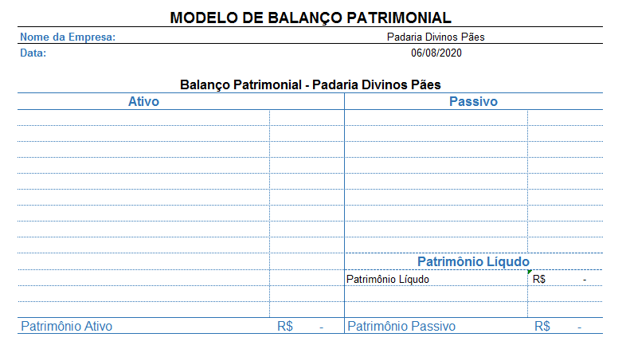
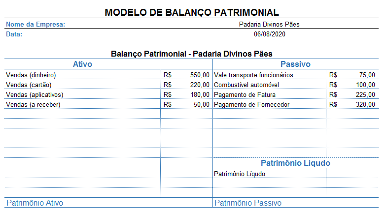
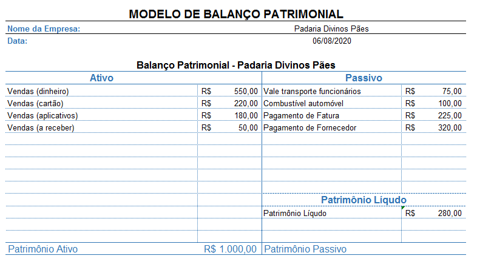
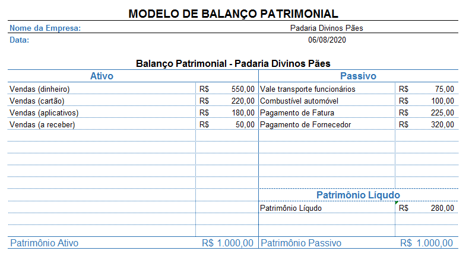
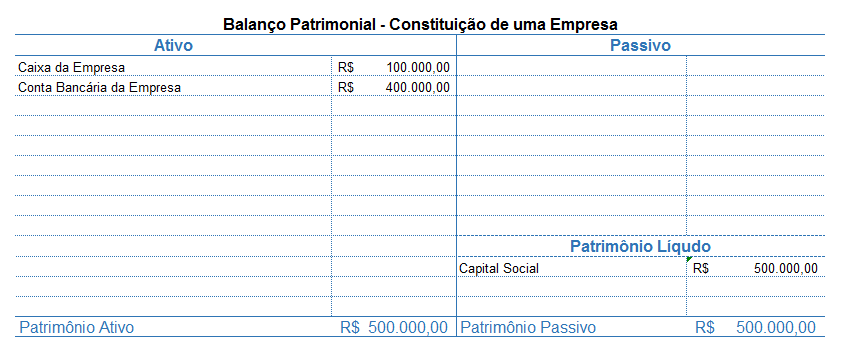
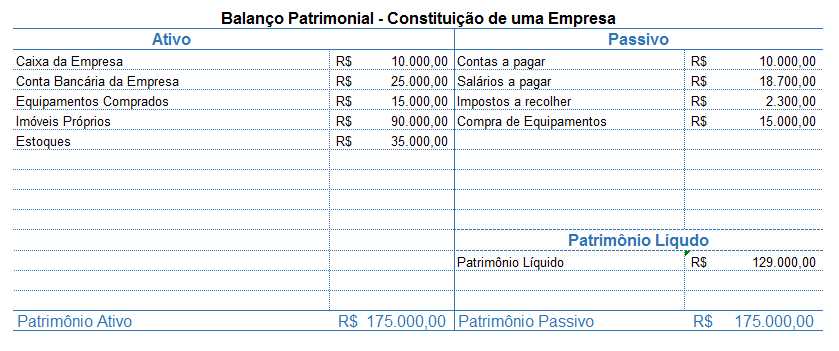
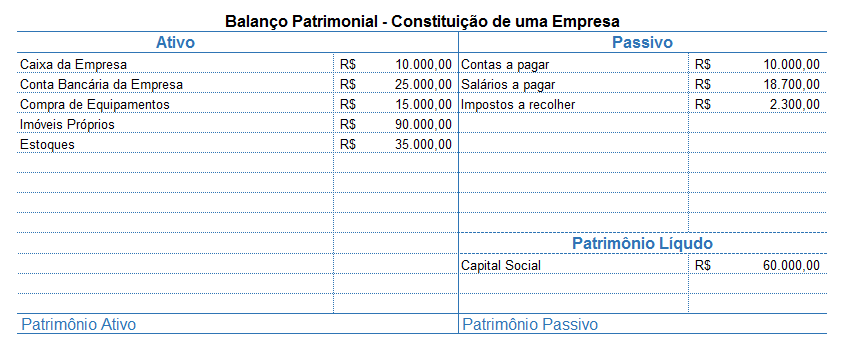
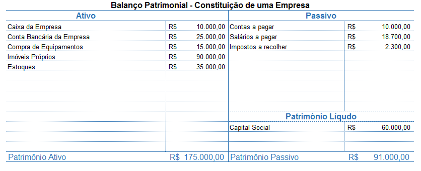
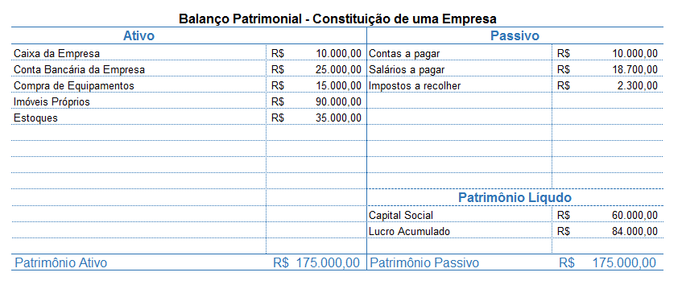

Bem vindx a mais uma aula de Contabilidade.

Até a aula passada, o nosso módulo focou nos aspectos burocráticos da Contabilidade. Dessa forma, analisamos os diferentes tipos de Pessoas Jurídicas e Formas de Organização, bem como aprendemos a importância do Contrato Social.

A partir desta aula iremos focar nos aspectos patrimoniais da contabilidade.

Para melhor absorção dos conceitos desta aula, sugiro o material descrito nas referências bibliográficas, em especial:

[BÄCHTOLD. Contabilidade Básica](http://redeetec.mec.gov.br/images/stories/pdf/proeja/contabil_basica.pdf)

[OLIVEIRA & MOREIRA. Noções de Contabilidade Básica Para Cursos Técnicos](https://www.ifb.edu.br/attachments/6243_no%C3%A7%C3%B5es%20de%20contabilidade%20b%C3%A1sica%20para%20cursos%20t%C3%A9cnicos%20final.pdf)

---

## Sumário da Aula

1. [Como funciona a economia?](#Como-Funciona-a-Economia)
2. [A Máquina Econômica de Ray Dalio](#A-Maquina-Economica-de-Ray-Dalio)
3. [Contabilidade e Economia](#Contabilidade-e-Economia)
4. [Resumo](#Resumo)
5. [Exercícios](#Exercicios)
6. [Referências Bibliográficas](#Referencias-Bibliograficas)

---

## Revisão dos Conceitos Contábeis

Na [4ª aula deste módulo](../aula-14/) analisamos alguns princípios e conceitos fundamentais para o estudo da Contabilidade.

A Resolução nº 750, aprovada pelo Conselho Federal da Contabilidade em 1993 (e alterada em alguns tópicos em 2010), delimita os 7 Princípios Fundamentais da Contabilidade. Estes princípios "*são necessários para fundamentar as técnicas ou doutrinas e orientar os profissionais da Contabilidade na utilização de parâmetros para realização de suas atividades*" (OLIVEIRA & MOREIRA, 2013).

Destes 7 Princípios, daremos ênfase especial a 1 deles:

1) **Princípio da Entidade**: o patrimônio de uma entidade é diferente e autônomo do patrimônio particular de seus gestores ou sócios. Em resumo: o patrimônio de uma empresa não deve ser confundido com o patrimônio de seus donos/sócios.

O Princípio da Entidade pressupõe que toda empresa possui um **patrimônio**, isto é, um conjunto de bens, direitos e obrigações vinculados a ela.

Em contabilidade **bens** são os elementos que podem ser **avaliados monetariamente** e podem ser destinados para uso, troca ou venda. Os bens **possuem utilidade**, pois são eles que satisfazem as necessidades de seus proprietários (BÄCHTOLD, 2012). 

**Direitos** são os elementos que representam os bens que a empresa tem a receber. Exemplo: contribuições a receber, títulos a receber, adiantamento concedido, **créditos** a receber, etc

**Obrigações** são as responsabilidades de pagamento por bens adquiridos ou despesas realizadas. Portanto, temos aqui uma obrigação, uma **dívida** que poderá ser paga imediatamente ou a prazo. As obrigações na contabilidade recebem o nome técnico de **exigível**, por se exigir da empresa o pagamento das dívidas (BÄCHTOLD, 2012). 

---

## Componentes do Patrimônio

Os diferentes elementos do patrimônio (bens, direitos e obrigações) podem ser agrupados em 2 diferentes componentes: o **ativo** e o **passivo**.

O **ativo** compreende os **bens e os direitos** controlados pela entidade e expresso em moeda e possuem a característica de **gerar benefícios de fluxos de Caixa** futuros para a entidade (OLIVEIRA & MOREIRA, 2012).

Já os **passivos** são todas as **obrigações a pagar** que a empresa possui, ou seja, são compromissos para com terceiros devido ao consumo de recursos (OLIVEIRA & MOREIRA, 2012).

O **Patrimônio Líquido** é definido como o **saldo** resultante da diferença entre o valor do Ativo e do Passivo de uma empresa.

Exemplo: se uma empresa possuir um Ativo (bens + direitos) no valor de R$ 50.000 e um Passivo (obrigações) no valor de R$ 30.000, então, tem-se um Patrimônio Líquido de R$ 20.000

`PATRIMÔNIO LÍQUIDO (PL) = ATIVOS - PASSIVOS`

Em resumo:

**Componentes do Patrimônio de uma Entidade**

| Componente         | Elementos           |
|--------------------|---------------------|
| Ativo              | * Bens; * Direitos; |
| Passivo            | * Deveres;          |
| Patrimônio Líquido | * Ativos - Passivos |

---

## Balanço Patrimonial

O Patrimônio de uma Entidade pode ser representado graficamente por meio de uma tabela especial chamada de **Balanço Patrimonial**.

No balanço patrimonial considera-se o **Patrimônio Líquido** de uma Empresa como uma parte do **Patrimônio Passivo**. Desta forma, ao realizar as devidas operações, **o total do Ativo (A) será exatamente igual ao total do Passsivo (P)**.

**Exemplo:** uma empresa possui um patrimônio composto pelos seguintes elementos:

* Bens = R$ 125.000,00
* Exigíveis = R$ 50.000,00
* Direitos = 25.000,00

Para calcular o **Patrimônio Ativo** da empresa, basta somar os **bens com os direitos**:

`PATRIMÔNIO ATIVO = BENS + DIREITOS`

* Patrimônio Ativo = 125.000,00 + 25.000,00 = R$ 150.000,00

O próximo passo é delimitar os exigíveis (deveres) da empresa:

`EXIGÍVEIS = DEVERES`

* Exigíveis da Empresa = R$ 50.000,00

Com esses dados podemos calcular o **Patrimônio Líquido da Empresa**:

`PATRIMÔNIO LÍQUIDO (PL) = ATIVOS - PASSIVOS`

* Patrimônio Líquido = 150.000 - 50.000 = R$ 100.000,00

O último passo é calcular o **Patrimônio Passivo** da Empresa:

`PATRIMÔNIO PASSIVO = EXIGÍVEIS + PL`

* Patrimônio Passivo = 50.000,00 + 100.000,00 = R$ 150.000,00

A representação gráfica do Balanço Patrimonial é feita por meio de uma tabela que apresenta a seguinte estrutura:

(Imagem retirada do livro de Ciro Bächtold - Contabilidade Básica, 2013)

Para fixar os conceitos vistos, vamos montar o Gráfico Patrimonial (Balanço Patrimonial) de uma padaria, que em determinado dia realizou as seguintes operações financeiras:

- Vendas (dinheiro): R$ 550,00
- Combustível automóvel: R$ 100,00
- Pagamento de fatura: R$ 225,00
- Vendas (a receber): R$ 50,00
- Vale transporte dos funcionários: R$ 75,00
- Vendas (cartão): R$ 220,00
- Vendas (aplicativos): R$ 130,00 
- Pagamento de fornecedor: R$ 320,00

O primeiro passo para a montagem do Balanço Patrimonial é separar os itens em ativos e passivos:

| Ativos               | Passivos                         |
|----------------------|----------------------------------|
| Vendas (Dinheiro)    | Combustível Automóvel            |
| Vendas (Cartão)      | Vale transporte dos funcionários |
| Vendas (Aplicativos) | Pagamento de Fatura              |
| Vendas (A receber)   | Pagamento de Fornecedor          |

Com os itens separados, devemos passá-los para uma tabela de Balanço Patrimonial, como a mostrada abaixo:

Em um Gráfico de Balanço Patrimonial, os ativos sempre deverão ser colocados no lado esquerdo da tabela; os passivos devem ser posicionados no lado direito da mesma.

Com as informações já inseridas no gráfico, é hora de efetuar as operações.

1) Calcule o Patrimônio Ativo: `PATRIMÔNIO ATIVO = BENS + DIREITOS`

> Patrimônio Ativo = R$ 1.000,00

2) Calcule o Passivo Exigível: `PASSIVO EXIGÍVEL = DEVERES`

> Passivo Exigível = R$ R$ 720,00

3) Calcule o Patrimônio Líquido: `PATRIMÔNIO LÍQUIDO (PL) = ATIVOS - PASSIVOS`

> Patrimônio Líquido = 1.000,00 - 720,00 = R$ 280,00

4) Calcule o Patrimônio Passivo: `PATRIMÔNIO PASSIVO = EXIGÍVEIS + PL`

> Patrimônio Passivo = 720,00 + 280,00 = R$ 1.000,00

Conforme o esperado, o Patrimônio Ativo é exatamente igual ao Patrimônio Passivo.

---

## Transações Especiais do Balanço Patrimonial

Algumas transações especiais, como é o caso da **constituição de empresas**, do **investimento de capital** e as **compras a prazo** provocam variações no Balanço Patrimonial.

### Conceitos Importantes

Antes de analisarmos os casos de transações especiais, é necessário definir alguns conceitos muito utilizados em contas patrimoniais:

1) **Origem  dos Recursos**: também chamada de **fonte de recursos**, é de onde a empresa está conseguindo o capital para investimento. Estas fontes podem ser de Capital Próprio (CP) ou Capital de Terceiros (CT).

2) **Capital Próprio**:  É o capital dos sócios e está representada no Balanço Patrimonial pelo Patrimônio Líquido.

3) **Capital de Terceiros**: É o capital dos outros (terceiros) que estão representados no Balanço Patrimonial pelas obrigações (exigíveis). Tratam-se, neste caso, de empréstimos e outras modalidades de aplicações, que serão futuramente explicadas.

4) **Aplicação de Recursos**: É onde estão sendo investidos os recursos na empresa, podendo estar em aplicações de curto ou longo prazo.

### Constituição de uma Empresa

Como vimos nas aulas anteriores, ao se abrir uma empresa faz-se necessário um investimento inicial por parte de seus sócios-fundadores. Este investimento recebe o nome de **Capital Social**.

O Capital Social se caracteriza, ao mesmo tempo, como uma **ativo** e um **passivo**.

Por um lado, este valor é considerado um **passivo**, parte do Patrimônio Líquido, devido ao fato de ser um investimento feito pelos sócios da empresa. Após algum tempo, conforme os lucros da empresa forem sendo mantidos, este valor será retornado aos sócios.

Por outro lado, o Capital Social é visto como um **ativo** devido ao fato de ser aplicada ao caixa da empresa ou à sua conta bancária.

O Patrimônio Líquido da empresa, neste caso, aumentou devido ao investimento realizado na mesma.

**Exemplo:** 2 sócios investiram R$ 250.000,00 cada um para a fundação de uma empresa. Deste capital, R$ 100.000,00 foram aplicados diretamente ao caixa da empresa, e o valor restante foi transferido para a conta bancária da instituição. Monte o Balanço Patrimonial referente à esta transação.  

### Compras a prazo

Ao efetuar uma compra a prazo deve-se preencher o Balanço Patrimonial de forma semelhante à mostrada no tópico anterior. Compras a prazo são vistas, simultaneamente, como um ativo e um passivo para o patrimônio da empresa. 

**Exemplo:** Uma empresa realizou a compra de produtos no valor de R$ 15.000,00, para pagamento a prazo.

Os produtos adquiridos são considerados **ativos**, pois serão incorporado ao patrimônio já existente da mesma. Por outro lado, os mesmos produtos serão considerados **passivos**, pois a empresa contraiu uma dívida de R$ 15.000,00 referente à compra dos mesmos.

O patrimônio líquido da empresa será, neste caso, não seria afetado - pois o produto adquirido foi incorporado como ativo e passivo, simultaneamente.

### Investimento de Capital

Quando uma empresa realiza recebe um investimento de capital, seja ele próprio ou de terceiros, tem-se uma situação diferenciada em relação ao Patrimônio Líquido.

Vamos considerar uma empresa que tenha realizado as seguintes transações:

- Imóveis próprios: 90.000,00
- Contas a pagar: R$ 10.000,00
- Salários a pagar: R$ 18.700,00
- Estoques: R$ 35.000,00
- Impostos a recolher: $2.300,00

Esta empresa recebeu um investimento de capital (Capital Social) de 60.000,00 - que foi utilizado da seguinte forma:
- Caixa da empresa: R$ 10.000,00
- Conta Bancária: R$ 25.000,00
- Compra de Equipamentos: R$ 15.000,00

Crie o Balanço Patrimonial referente às transações mostradas acima.

1º Passo: Preencher o gráfico de Balanço Patrimonial.

2º Passo: Calcular os Patrimônios Ativo e Passivo.

Repare que houve uma diferença de R$ 84.000,00 entre os Patrimônios Ativo e Passivo (P.A. - P.P.). Esta diferença deve ser analisada como o **Lucro Acumulado** da empresa.

`LUCRO ACUMULADO = PATRIMÔNIO ATIVO - PATRIMÔNIO PASSIVOS`

---

## Situações Patrimoniais Possíveis

Existem 3 diferentes tipos de situações patrimoniais que podem ser vivenciados por uma empresa. Estas situações refletem o estado da Patrimônio Líquido da instituição.

As Situações Patrimoniais possíveis devem ser analisadas a partir do cálculo do PL da empresa: `PATRIMÔNIO LÍQUIDO (PL) = ATIVOS - PASSIVOS`

### Situação Líquida Positiva (superavitária)

Quando o conjunto de bens e direitos é maior do que as obrigações de uma instituição, diz-se que a empresa possui uma **situação líquida positiva**, também conhecida como **situação líquida ativa** ou **superavitária**.

Essa situação implica diretamente que o Patrimônio Líquido será maior que 0.

`Situação Superavitária: Ativo > Passivo; PL > 0`

Exemplo: o Patrimônio Ativo de uma empresa é de R$ 150.000,00, ao passo em que o Patrimônio Passivo da mesma é de R$ 25.000,00.

Repare que o ativo da empresa (R$ 150.000,00) é maior que o passivo da mesma (R$ 25.000,00). Neste caso, o Patrimônio Líquido foi de R$ 125.000,00.

### Situação Líquida Negativa (deficitária)

Essa situação ocorre quando o passivo de uma empresa (exigíveis) é superior ao ativo da mesma. Também conhecida como **situação líquida passiva** ou **deficitária**.

Essa situação implica diretamente que o Patrimônio Líquido será menor que 0. Em termos técnicos, essa situação é chamada de **Passivo a Descoberto** e indica que a empresa não consegue cobrir (honrar) as suas obrigações com terceiros.

`Situação Deficitária: Ativo < Passivo; PL < 0`

Exemplo: o Patrimônio Ativo de uma empresa é de R$ 100.000,00, ao passo em que o Patrimônio Passivo da mesma é de R$ 125.000,00.

Repare que o ativo da empresa (R$ 100.000,00) é menor que o passivo da mesma (R$ 125.000,00). Neste caso, o Patrimônio Líquido foi de - R$ 25.000,00.

### Situação Líquida Nula

Essa situação ocorre quando o passivo de uma empresa é igual ao ativo da mesmo.

Essa situação implica que o Patrimônio Líquido da mesma é zero (ou nulo).

`Situação Nula: Ativo = Passivo; PL = 0`

---

## Resumo

- Os diferentes elementos do patrimônio (bens, direitos e obrigações) podem ser agrupados em 2 diferentes componentes: o **ativo** e o **passivo**.

- O **Patrimônio Líquido** é definido como o **saldo** resultante da diferença entre o valor do Ativo e do Passivo de uma empresa.

- O Patrimônio de uma Entidade pode ser representado graficamente por meio de uma tabela especial chamada de **Balanço Patrimonial**.

- 

- No balanço patrimonial considera-se o **Patrimônio Líquido** de uma Empresa como uma parte do **Patrimônio Passivo**. 

- Existem 3 diferentes tipos de situações patrimoniais que podem ser vivenciados por uma empresa. Estas situações refletem o estado da  Patrimônio Líquido da instituição.

- Quando o conjunto de bens e direitos é maior do que as obrigações de uma instituição, diz-se que a empresa possui uma **situação líquida positiva**, também conhecida como **situação líquida ativa** ou **superavitária**. `Situação Superavitária: Ativo > Passivo; PL > 0`

- Essa situação ocorre quando o passivo de uma empresa (exigíveis) é superior ao ativo da mesma. Também conhecida como **situação líquida passiva** ou **deficitária**. `Situação Deficitária: Ativo < Passivo; PL < 0`

- Essa situação ocorre quando o passivo de uma empresa é igual ao ativo da mesmo.

---

## Exercícios

01. Em seu caderno, monte o Balanço Patrimonial de uma empresa com os seguintes elementos. Caso necessário, calcule o **Lucro Acumulado**.

- Caixa: R$ 10.000,00 
- Pagamento Fornecedores: R$ 2.500,00
- Imóveis Próprios: R$ 25.000,00
- Veículos Próprios: R$ 5.500,00
- Contas a Receber: R$ 3.000,00
- Salários a Pagar: R$ 5.000,00
- Contas a Pagar: R$ 6.00,00
- Capital Social: R$ 15.000,00

02: Em seu caderno, monte o Balanço Patrimonial de uma empresa com os seguintes elementos. Caso necessário, calcule o **Lucro Acumulado**.

- Caixa: R$ 25.000,00 
- Pagamento Fornecedores: R$ 5000,00
- Imóveis Próprios: R$ 10.000,00
- Veículos Próprios: R$ 20.000,00
- Impostos a pagar: R$ 2.000,00
- Contas a Receber: R$ 3.000,00
- Salários a Pagar: R$ 15.000,00
- Empréstimos Bancários: R$ 10.000,00
- Contas a Pagar: R$ 25.000,00
- Capital Social: R$ 15.000,00

03: Em seu caderno, monte o Balanço Patrimonial de uma empresa com os seguintes elementos. Caso necessário, calcule o **Lucro Acumulado**.

- Caixa: R$ 7.500,00 
- Pagamento Fornecedores: R$ 8000,00
- Imóveis Próprios: R$ 80.000,00
- Veículos Próprios: R$ 45.500,00
- Impostos a pagar: R$ 2.500,00
- Contas a Receber: R$ 3.000,00
- Salários a Pagar: R$ 25.000,00
- Empréstimos Bancários: R$ 18.000,00
- Contas a Pagar: R$ 52.000,00

04. Em seu caderno, monte o Balanço Patrimonial de uma empresa com os seguintes elementos. Sabendo que o Lucro Acumulado da empresa foi nulo, calcule o valor transferido ao Caixa da Empresa. 

- Imóveis próprios: R$ 9.000,00
- Contas a pagar: R$ 1.000,00
- Salários a pagar: R$ 7000,00
- Empréstimos Bancários: R$ 18.000,00
- Estoques: R$ 3.500,00
- Impostos a recolher: $2.400,00

 05. Encontre a Situação Líquida Patrimonial de cada empresa. Monte o Balanço Patrimonial em cada item.

 a) Empresa 01
- Caixa: R$ 500,00
- Fornecedores: R$ 1.500,00
- Salários a pagar: R$ 3.000,00
- Contas a receber: R$ 1.200,00
- Impostos a recuperar: R$ 200,00
- Impostos a pagar: R$ 350,00
- Conta Bancária: R$ 8.000,00

b) Empresa 02
- Caixa: R$ 7.200,00
- Fornecedores: R$ 4.500,00
- Salários a pagar: R$ 3.000,00
- Contas a receber: R$ 2.00,00
- Impostos a recuperar: R$ 800,00
- Impostos a pagar: R$ 1.500,00
- Equipamentos: R$ 6000,00
- Conta Bancária: R$ 8.000,00
- Empréstimo Bancário: R$ 15.000,00

c) Empresa 03
- Caixa: R$ 5.000,00
- Fornecedores: R$ 4.500,00
- Salários a pagar: R$ 3.000,00
- Contas a receber: R$ 700,00
- Impostos a recuperar: R$ 800,00
- Impostos a pagar: R$ 1.050,00
- Conta Bancária: R$ 10.000,00
- Empréstimo Bancário: R$ 15.000,00

 d) Empresa 04
- Caixa: R$ 2.000,00
- Contas a receber: R$ 3.000,00
- Equipamentos: 3.000,00
- Conta Bancária: R$ 8.000,00
- Capital Social: R$ 5.000,00
- Fornecedores: R$ 8.000,00
- Salários a pagar: R$ 4.000,00

06. Calcule a situação Patrimonial Líquida de cada empresa abaixo. Não é necessário montar o Balanço Patrimonial.

a) Empresa 01
- Caixa: R$ 800,00
- Clientes: R$ 500,00
- Fornecedores: R$ 250,00
- Utensílios: R$ 300,00
- Salários a pagar: 220,00
- Duplicatas a pagar: R$ 170,00

b) Empresa 02
- Veículos: R$ 25.000,00
- Móveis e Utensílios: R$ 5.000,00
- Máquinas: R$ 2.000,00
- Caixa: R$ 2.000,00
- Promissórias a pagar: R$ 4.000,00
- Impostos a recolher: R$ 7.00,00
- Duplicatas a pagar: R$ 11.000,00
- Títulos a receber: R$ 800,00

c) Empresa 03
- Imóveis: R$ 80.000,00
- Instalações: R$ 30.000,00
- Móveis e Utensílios: R$ 5.000,00
- Veículos: R$ 14.000,00
- Caixa: R$ 3.000,00
- Conta Bancária: R$ 63.000,00
- Empréstimo Bancário: R$ 50.000,00
- Clientes: R$ 10.000,00
- Fornecederes: R$ 30.000,00

---

##  Referências Bibliográficas

BACARJI, Alencar Garcia. Formação Incial e Continuada Auxiliar Administrativo. Curitiba: Instituto Federal do Paraná, 2012. Disponível em <https://bit.ly/2vZG4Y5>. Acesso en *20 de mar. de 2020*. 

BÄCHTOLD, CIRO. Contabilidade Básica. Curitiba: Instituto Federal do Paraná, 2012.Disponível em <https://bit.ly/342pLX5>. Acesso en *20 de mar. de 2020*.

CONSELHO FEDERAL DE CONTABILIDADE. Princípios fundamentais e normas brasileiras de contabilidade. Brasília: CFC, 2003.

OLIVEIRA, M. S. de; MOREIRA, S C. Noções de contabilidade básica para cursos técnicos. Brasília, DF : Instituto Federal de Educação, Ciência e Tecnologia de Brasília, 2012. 120p.

OLIVO, Ana Maria; BOSCHILIA, Luiz. Contabilidade geral e gerencial: conceitos introdutórios para os cursos superiores de tecnologia. Florianópolis: Publicações do IF-SC, 2012. 102 p. : il.

RENNÓ, R. Administração Geral para Concursos. Rio de Janeiro, Elsevier, 2013.