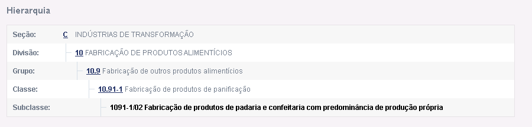
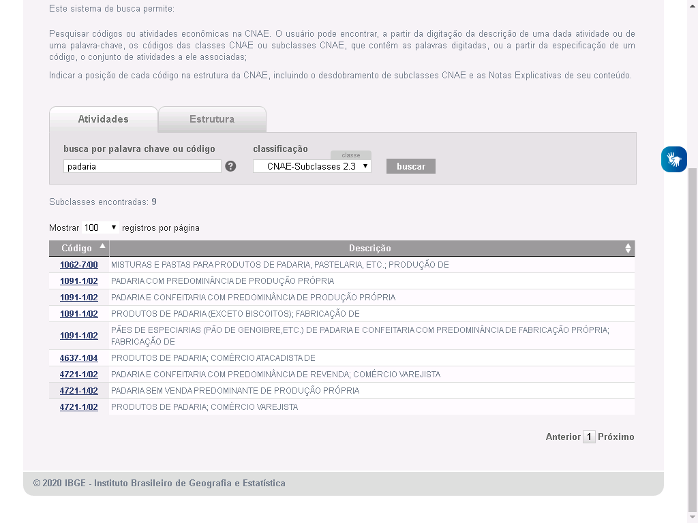
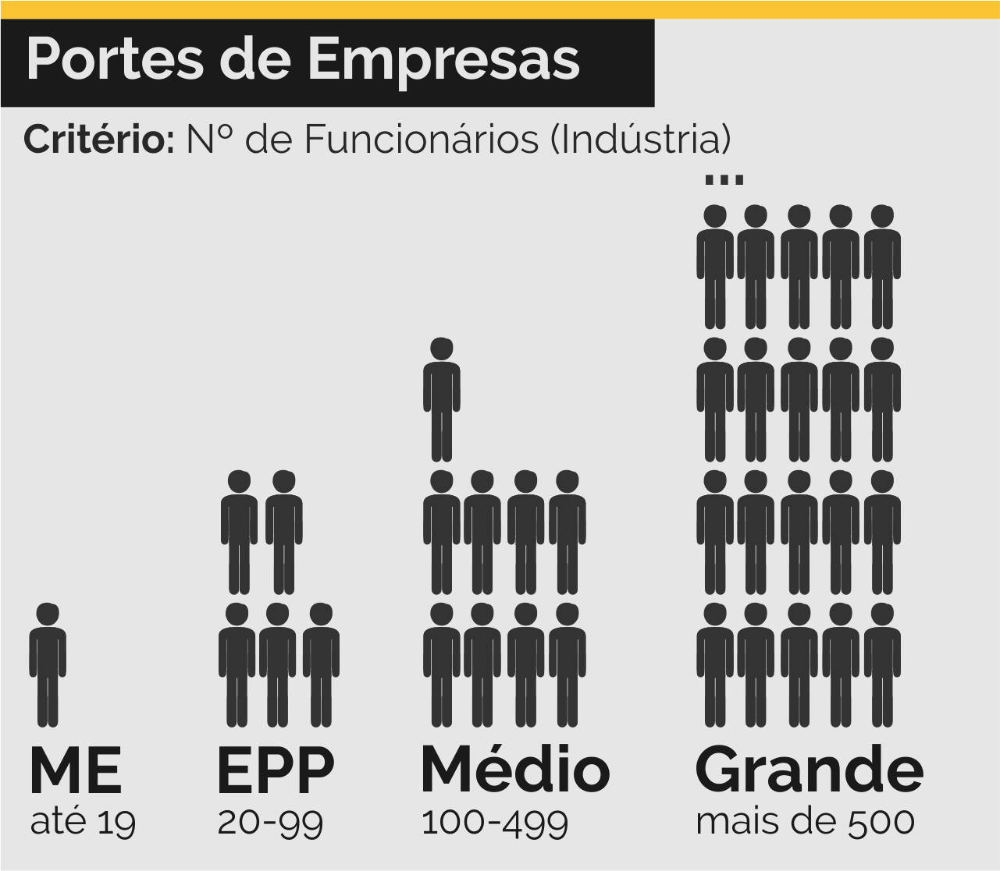

Os Trabalho de Conclusão de Módulo (individual e em grupo), conforme previsto na [ementa do curso](../../../../pages/cursos/administracao.html), equivale a 30 pontos/módulo.

Este Trabalho se estrutura em 2 partes, distintas e correlatas.

Na **1º Parte** será feito um exercício individual, pautado nos aspectos técnicos e teóricos absorvidos pelo educando no processo educacional.

Na **2ª Parte** do TCM haverá o desenvolvimento de uma série de atividades e exercícios em grupo que buscarão conciliar os aspectos teóricos e técnicos das matérias estudadas em sala, com as demandas e anseios de cada estudante e o mercado administrativo.

O principal objetivo do trabalho é o de centralizar os conhecimentos teóricos adquiridos pelo aluno no decorrer do módulo em uma atividade prática pautada nos seguintes pontos (IFC, 2015):

1. Capacitar os alunos nos aspectos técnicos das práticas administrativas, habilidades interpessoais e de liderança, organização, criatividade e interesse por tarefas de cunho administrativo e social.

2. Estimular a disseminação de conhecimento vivido e adquirido entre alunos, organização e sociedade.

3. Aguçar o empreendedorismo nos alunos, capacitando-os nas técnicas de soluções criativas e inovadoras, no âmbito da ciência da Administração.

---

## Trabalho Individual

A primeira parte do TCM de Contabilidade consiste em uma **pesquisa individual** sobre o tema **Formas de Organização**.

O professor irá sortear para cada aluno um tema diferente do livro [Formas de Organização – Associação, Fundação, Cooperativa, Empresa](https://bit.ly/2XzFvj9).

Os temas disponíveis são:

1. Associação sem fins lucrativos
2. Organização de Sociedade Civil de Interesse Público (OSCIP)
3. Fundação
4. Cooperativa
5. Empresa Sociedade Limitada
6. Empresa Sociedade Anônima
7. Empresa Microempresa

Seu objetivo será **preencher um formulário** contendo os seguintes tópicos sobre o tipo de organização sorteado:

1. Principais características
2. Objetivos
3. Funcionamento Interno Estrutura
4. Passo a Passo de criação e legalização
5. Exemplos de organizações deste tipo

Você deverá elaborar, também, 2 perguntas, referentes ao tema sorteado. As perguntas deverão ser **inseridas no formulário**, no campo disponibilizado para tal.

Você poderá escolher o tipo de pergunta, dentre as opções a seguir

1. Múltipla Escolha
2. Verdadeiro ou Falso
3. Completar/Preencher
4. Relacionar colunas
5. Resposta Longa/Aberta

*As perguntas deverão ser originais, não sendo permitido o plágio ( de materiais ou questões, seja da Internet ou de livros. O não cumprimento deste critério irá anular o seu trabalho!*

Você deverá responder às perguntas desenvolvidas, explicando detalhadamente sua resposta. Pelo amor de Deus **não responda** somente com "sim", "não", "talvez", "depende", "tanto faz" ou outras respostas monossilábicas.

Após a data de entrega disponibilizarei **guias de estudo** contendop as perguntas elaboradas por todos os alunos. **As perguntas das provas serão retiradas deste guia**.

Cada aluno deverá, então, escolher no **mínimo 10 perguntas** dentre as disponibilizadas para serem respondidas, de forma manuscrita ou digitada (a critério do professor).

Distribuição dos Pontos

| Critério                              | Nota       |
| :-----:                               | :-----:    |
| Entrega no prazo correto              | 2,5 pontos | 
| Coerências nas respostas do formulário| 2,5 pontos | 
| Originalidade nas questões elaboradas | 2,5 pontos | 
| Coerência nas respostas elaboradas    | 2,5 pontos |
| TOTAL                                 | 10 pontos  | 

### Sorteios dos Temas

Para sortear os temas, ordenei os 23 alunos das 2 turmas - Quarta e Sábado por ordem alfabética.

Em seguida embaralhei os nomes, aleatoriamente utilizando um [sorteador online](https://sorteador.com.br/).

Os temas foram, então, distribuídos para cada aluno pela sua ordem no [sorteio](https://sorteador.com.br/embaralhador/resultado/188692). 

Desta forma o primeiro aluno sorteado ficou com o primeiro tema (Associação), o segundo aluno ficou com o segundo tema(OSCIP) e assim por diante.

O resultado foi o seguinte:

- Jade Clarisse Borges de Oliveira 	- Associação sem fins lucrativos
- Milena Carla de Souza Costa 	- Organização de Sociedade Civil de Interesse Público (OSCIP)
- Pablo Henrique de Morais 	- Fundação
- Kênia Cristina de Souza 	- Cooperativa
- Debora Ferreira Santos 	- Empresa Sociedade Limitada
- Hadassa Assis Venuto Pereira 	- Empresa Sociedade Anônima
- Isabella Júlia Silva dos Santos 	- Empresa Microempresa
- Richard Gerard Silva Felix 	- Associação sem fins lucrativos
- Rosemeri Cristine Andrade 	- Organização de Sociedade Civil de Interesse Público (OSCIP)
- Simon Antony de Oliveira 	- Fundação
- Rafaela Josiane Domingos Passos 	- Cooperativa
- Vivian Leal Dias 	- Empresa Sociedade Limitada
- Guilherme Pereira dos Reis Souza 	- Empresa Sociedade Anônima
- Victor Matheus Esteve de Souza 	- Empresa Microempresa
- Thalita Ferreira de Oliveira 	- Associação sem fins lucrativos
- Camile Floriano Santos 	- Organização de Sociedade Civil de Interesse Público (OSCIP)
- Alice Azevedo Pereira 	- Fundação
- Ana Luiza Mapa 	- Cooperativa
- Samuel Martins de Souza 	- Empresa Sociedade Limitada
- Yuri dos Santos Cruz 	- Empresa Sociedade Anônima
- Luiz Davi Therezone Pereira 	- Empresa Microempresa
- Raquel Almeida de Araújo 	- Associação sem fins lucrativos
- Tainá Vitória Aparecida Florencio	- Organização de Sociedade Civil de Interesse Público (OSCIP)

---

## Trabalho em Grupo

Para o Trabalho em Grupo, os alunos deverão formar grupos de 3 a 5 pessoas.

O objetivo deste trabalho será de preencher o **Contrato Social** de uma sociedade comercial. Para isso, o grupo deverá simular a criação de uma empresa.

Além do contrato social, o grupo deverá realizar o planejamento contábil de sua empresa por meio de uma **DRE**.

Antes de preencher o Contrato, o grupo deverá preencher uma apresentação de slides com as principais informações da empresa. Alguns modelos serão disponibilizados.

Lista de Itens do Projeto em Grupo:

1) Apresentação de Slides, contendo:
  - Capa;
  - Departamentos da Empresa;
  - Organograma da Empresa;
  - Objeto Social;
  - CNAE;
  - Tabela de Produtos;
  - Promoção;
  - Nome Fantasia e Nome Empresarial;
  - Porte da Empresa;
  - Enquadramento Jurídico;
  - Enquadramento Tributário;
  - CNPJ e Inscrição Estadual;
  - Endereço da Sede;
  - Capital Social;
  - Print do fluxo de caixa;
  - Print do Comprovante de CNPJ;
  - Print da Ata de Fundação;
  - Logotipo da empresa;

2) Comprovante de CNPJ;

3) Ata de Fundação + Atas de Reuniões;

4) Fluxo de Caixa Mensal;

5) Contrato Social;

### Objeto Social e CNAE

O primeiro passo do trabalho será delimitar o **objeto social** da empresa, ou seja, em que área ela irá atuar. Vocês poderão escolher o tema que quiserem, mas recomendo que escolham um tema que agrade a todos.

Exemplos de temas (já feitos por outros alunos):

- Confeitaria
- Estúdio de Fotografia
- Loja de Artigos Esportivos
- Loja de Festas
- Loja de Roupas
- Padaria

Para complementar o Objeto Social, o grupo deverá pesquisar a subclasse CNAE das atividades principal e secundára ofertadas por sua empresa.

O CNAE consiste em uma base de dados que relaciona cada atividade econômica a um código específico. Esta classificação se estrutura em uma hierarquia específica.

Para fins contábeis geralmente seu utiliza a **subclasse** da atividade econômica, que corresponde ao nível com maior descrição da mesma:

A base de dados do CNAE pode ser acessada no site do [IBGE](https://concla.ibge.gov.br/busca-online-cnae.html). Para relizar uma pesquisa basta inserir o termo procurado na caixa de pesquisa e clicar sobre a opção "Buscar".

A página de resultados mostrará um série de atividades relacionadas ao tema. Leia cuidadosamente cada descrição para encontrar a atividade correta da empresa em questão.

Ao clicar sobre o código da atividade, abrirá uma nova página contendo importantes detalhes sobre a subclasse escolhida. Lembrando que o código utilizado está apresentado no item **subclasse**.

Uma empresa pode realizar mais de 1 atividade (CNAE). No entanto, uma destas atividades deverá ser a **principal**  e as outras deverão ser consideradas **secundárias**.  Considerando, a exemplo, uma padaria, pode-se ter:

ATIVIDADE PRINCIPAL:
- 1091-1/02 Fabricação de produtos de padaria e confeitaria com predominância de produção própria

ATIVIDADES SECUNDÁRIAS:
- 1092-9/00 Fabricação de biscoitos e bolachas
- 5611-2/03 Lanchonetes, casas de chá, de sucos e similares
- 1094-5/00 Fabricação de massas alimentícias

### Organização da Empresa

Como vimos nas aulas sobre teorias administrativas, as empresas se organizam em diversos departamentos e órgãos, cada um responsável por uma função dentre da mesma.

Para Fayol, em sua Teoria Clássica, as funções empresariais seriam: a **técnica**, a **comercial**, a **financeira**, a de **segurança**, a **contábil** e a **administrativa**. Essa última seria a responsável pela coordenação das outras funções.

Já na Teoria da Burocracia de Weber, dá-se uma importância maior às hierarquias da empresa.

Organogramas são gráficos que representam a estrutura hierárquica de uma empresa, mostrando os departamentos da mesma e suas inter-relações. 

Em nossa padaria de exemplo poderíamos ter como **departamentos**:

1) O **departamento comercial e administrativo**, responsável por administrar a empresa;
2) O **departamento de produção**, formado pelos cozinheiros, padeiros e confeiteiros, e responsável pela produção dos produtos da padaria;
3) O **departamento de vendas**, formado pelos atendentes, vendedores motoristas e entregadores.

Após delimitar os departamentos, o grupo deverá montar o **organograma** de sua empresa, utilizando o Power Point. Em nosso exemplo da padaria, ele ficaria assim:

### Produtos Ofertados

Tendo finalizado o levantamento do objeto social e CNAE, é hora de seu grupo escolher alguns dos produtos ofertados por sua empresa.

Faça uma breve pesquisa de mercado para encontrar os produtos e serviços mais oferecidos por empresas do mesmo ramo, e monte alguns pacotes, promoções ou produtos próprios. Escolha também os **preços dos seus produtos**!

Ainda continuando no exemplo de uma padaria, os produtos ofertados poderiam ser:

- Pães caseiros salgados recheados = R$ 10,00 kg
- Pães doces especiais = R$ 15,00 kg
- Bolinho de chuva recheado - Nutella ou Doce de Leite = R$ 5,00 pacote com 7 unidades
- Salgadinhos para festa sortidos = R$ 25,00 por cento de salgados
- Pacote de Festas: Bolo de Aniversário + 100 docinhos + 250 salgados + 3 refigerantes por apenas R$ 99,90

### Promoção Especial

O grupo deverá criar uma promoção especial para divulgar a empresa. Usem a imaginação.

Em nosso exemplo da padaria, e levando em conta o mês de maio (dia das mães), a promoção poderia ser:

- Cesta de Café da Manhã para dia das mães - R$ 89,90 - contendo: ... (aqui iria uma descrição dos produtos, mas fiquei com preguiça kjkjkj. Deu pra pegar a ideia, certo?)

### Nome Fantasia e Nome Empresarial

Após escolher o tema, é hora de nomear sua empresa. Escolham o nome fantasia que mais agradar ao grupo - e que mais represente o seu negócio.

Além do nome o grupo deverá desenvolver um logotipo para a Empresa. Recomenda-se que sejam utilizados modelos de fontes personalizadas, ícones e outros elementos gráficos que chamem a atenção. Por questões de simplicidade, recomendo que utilizem o PowerPoint para a criação desta arte, como será mostrado em sala de aula.

Os seguintes sites podem ser utilizados para pesquisa de imagens, ícones e outros recursos gráficos interessantes para a confecção da Logo.

[Flaticon - Site de Ícones - Inglês](https://www.flaticon.com/)
[Freepik - Site de Ícones, Imagens e Vetores - Português](https://br.freepik.com/)
[Pexels - Site com Imagens e Vídeos Gratuitos - Português](https://www.pexels.com/pt-br/)
[Pixabay - Site com Imagens e Vídeos Gratuitos - Português](https://pixabay.com/pt/)
[LibreStock - Site com Imagens e Vídeos Gratuitos - Português](https://librestock.com/)
[CCSearch - Site com Imagens, Vídeos, Áudios e Textos Gratuitos - Português](https://ccsearch.creativecommons.org/)

Criada a identidade visual básica de sua marca chegou um momento crucial: definir o nome empresarial.

O nome empresarial de um negócio está intimamente relacionado com o seu enquadramento jurídico. Existem diversas regras de colidência e nomeação de empresas - sendo as principais listadas a seguir:

> INCLUIR REGRAS AQUI

### Porte da Empresa

Você deverá estimar um lucro anual para a sua empresa. Com isso poderá definir o seu porte.

O porte de uma empresa pode ser definido tendo como base sua renda anual:

Outro tipo de classificação utilizada diz respeito ao tipo de funcionários. Neste caso a área de atuação da empresa (comércio ou indústria) também é levada em consideração.

### Enquadramento Jurídico e Tributário

Como estamos fazendo um trabalho em grupo, o enquadramento jurídico escolhido poderá ser **exclusivamente**: Sociedade Simples (SS) ou Sociedade Limitada (LTDA).

Recomenda-se que se escolha o enquadramento tributário Simples Nacional, mas o grupo é livre para fazer a escolha que melhor lhe convier.

### CNPJ e Inscrição Estadual

Outro fator importante para este trabalho será a utilização do CNPJ e da Inscrição Estadual para o preenchimento de um modelo de Comprovante de CNPJ.

Este tipo de documento pode ser gerado, por empresas verdadeiras, no site da Receita Federal. Para fins deste trabalho, o Comprovante deverá ser **simulado** preenchendo o modelo a seguir:

<a href="../../../../assets/content/administracao/modulo-02/modelo-comprovante-cnpj.pptx" target="_blank"><i class="icofont-download"></i> PPTX - Modelo de Comprovante CNPJ</a>

A Receita Federal possui uma tabela com os códigos dos diferentes tipos de natureza jurídica existentes no Brasil. Consulte a [tabela](http://receita.economia.gov.br/orientacao/tributaria/cadastros/cadastro-nacional-de-pessoas-juridicas-cnpj/tabelas-utilizadas-pelo-programa-cnpj/tabela-de-natureza-juridica-e-qualificacao-do-quadro-de-socios-e-administradores) para preencher corretamente o Comprovante do CNPJ.

- 206-2	= Sociedade Empresária Limitada
- 223-2	=	Sociedade Simples Pura
- 224-0 = Sociedade Simples Limitada

Para gerar os números do CNPJ e IE, deverá ser utilizado as ferramentas online disponibilizadas abaixo:

[Gerador de Empresas - 4Devs](https://www.4devs.com.br/gerador_de_empresas)
[Gerador de CNPJ](https://www.geradorcnpj.com/)
[Validador de CNPJ](https://www.4devs.com.br/validador_cnpj)

Os números do CNPJ são gerados utilizando regras específicas. Não se trata apenas de escolher 14 dígitos aleatórios.

Exemplo de CNPJ Válido: 54.421.474/0001-36

Os 8 primeiros dígitos do CNPJ (54.421.474) correspondem ao número-base de identificação da empresa.

Os 4 números após a barra (/) representam o número de ordem das filiais da empresa. Caso a empresa possua apenas 1 filial, o CNPJ conterá a sequência /0001; caso ela possua 2 filiais, o CNPJ conterá a sequência /0002 e assim por diante.

Os 2 últimos números do CNPJ são chamados de dígitos verificadores.

### Endereço da Sede

Por último, mas não menos importante, o grupo deverá escolher um endereço para a sede da empresa.

Esta decisão deve ser tomada com bastante atenção: a escolha de um bom endereço facilita a aquisição de clientes e a entrega dos seus produtos. Caso escolham abrir uma empresa comercial, endereços movimentados, como Centros e Bairros Comerciais são os mais indicados;

Para aquelas empresas que realizam distribuição de mercadorias, indicam-se sedes localizadas próximas a Rodovias e Estradas; já para Indústrias, deve-se utilizar áreas de grande extensão localizadas em bairros especiais, longe de residências (de preferência) visto o perigo inerente a diversos processos efetuados.

No desenvolvimento da apresentação, o grupo deverá explicar as razões que levaram a escolha do endereço sede da empresa. Deve-se incluir **um print** da localização (obviamente fictícia) da empresa, utilizado o Google Maps ou simiares.

A escolha de um bom endereço de sede é fundamental para o destaque de seu negócio. Escolha-o bem!

### Demonstrações Financeiras

A apuração de resultados financeiros é importantíssima para se verificar o balanço final das operações após determinado período.

Todas as empresas, para garantirem uma boa administração dos seus recursos, devem ter um lançamento diário de seu fluxo de caixa. Estes documentos ajudam os administradores a tomarem decisões sobre seus negócios.

Para este trabalho o grupo deverá preencher um modelo de Fluxo de Caixa que irá calcular, automaticamente, um relatório financeiro do período.

Neste modelo, deverão ser cadastrados, nesta ordem:

1) Entre 25 (mínimo) e 50 produtos (máximo);
2) Entre 90 (mínimo) e 180 vendas (máximo);
3) Entre 30 (mínimo) e 60 saídas de caixa (máximo);

Todos estes dados estão disponíveis no documento abaixo:

<a href="../../../../assets/content/administracao/modulo-02/modelo-fluxo-de-caixa-mensal.xlsx" target="_blank"><i class="icofont-download"></i> XLSX - Modelo de Fluxo de Caixa Mensal</a>

### Apresentação de Slide

Para facilitar o levantamento de informações, abaixo seguem alguns modelos de Apresentação de Slides para serem preenchidos com os dados de sua empresa.

<a href="../../../../assets/content/administracao/modulo-02/modelo-slide-tcm.pptx" target="_blank"><i class="icofont-download"></i> PPTX - Modelo de Apresentação de Slides - TCM</a>

AO FINAL DO PROCESSO VOCÊS DEVERÃO EXPORTAR A APRESENTAÇÃO PARA O FORMATO PDF!

### Contrato Social & Ata

Com o slide feito, é hora de preencher o Contrato Social, que deve ser feito em um processador de textos, como o Word ou Libre Office Writer.

AO FINAL DO PROCESSO VOCÊS DEVERÃO EXPORTAR O CONTRATO PARA O FORMATO PDF E IMPRIMI-LO!

<a href="../../../../assets/content/administracao/modelos/modelo-contrato-social.pdf" target="_blank"><i class="icofont-download"></i> PDF - Modelo de Contrato Social para Sociedade Simples Pura e Limitada</a>

<a href="../../../../assets/content/administracao/modelos/modelo-contrato-social-ltda.docx" target="_blank"><i class="icofont-download"></i> LTDA - Modelo de Contrato Social para Sociedade Simples Limitada</a>

Como vimos em sala, em toda reunião feita pelos sócios de uma empresa é necessário redigir uma ata. Por esta razão, vocês também deverão escrever as atas de suas reuniões, registrando o passo a passo da criação de sua empresa.

<a href="../../../../assets/content/administracao/modelos/modelo-basico-ata-assembleia.doc" target="_blank"><i class="icofont-download"></i> Modelo de Ata Para Reunião</a>

AO FINAL DO PROCESSO VOCÊS DEVERÃO EXPORTAR AS ATAS PARA O FORMATO PDF E IMPRIMI-LAS!

---

## Regras

- <i class="icofont-link"></i>  Link do [formulário](https://forms.gle/fmBv5KGv3KpN7r8p6)

- <i class="icofont-not-allowed"></i>  É proibido o plágio de materiais, incluindo as perguntas elaboradas e as respostas inseridas no formulário;

- <i class="icofont-clock-time"></i>  Data Máxima de Entrega - Trabalho Individual: 25/04/2020, 17:00

- <i class="icofont-dollar"></i>  Valor do Trabalho: 10 pontos (TRABALHO INDIVIDUAL); 20 pontos (TRABALHO EM GRUPO)

---

## Modelos

<a href="../../../../assets/content/administracao/modelos/modelo-slide-com-regras.pptx" target="_blank"><i class="icofont-download"></i> PPTX - Template de Apresentação de Slides - Regras</a>

<a href="../../../../assets/content/administracao/modulo-02/modelo-slide-tcm.pptx" target="_blank"><i class="icofont-download"></i> PPTX - Template de Apresentação de Slides - TCM</a>

<a href="../../../../assets/content/administracao/modulo-02/pack-slides.rar" target="_blank"><i class="icofont-download"></i> RAR - Template de Apresentação de Slides + Imagens</a>

<a href="../../../../assets/content/administracao/modulo-02/modelo-comprovante-cnpj.pptx" target="_blank"><i class="icofont-download"></i> PPTX - Modelo de Comprovante CNPJ</a>

<a href="../../../../assets/content/administracao/modulo-02/modelo-ata-fundacao-empresa.doc" target="_blank"><i class="icofont-download"></i> DOCX - Exemplo (preenchido) de Ata de Fundação de Empresa</a>

<a href="../../../../assets/content/administracao/modelos/modelo-basico-ata-assembleia.doc" target="_blank"><i class="icofont-download"></i> DOCX - Modelo de Ata Para Reunião</a>

<a href="../../../../assets/content/administracao/modelos/modelo-contrato-social.pdf" target="_blank"><i class="icofont-download"></i> PDF - Modelo de Contrato Social para Sociedade Simples Pura e Limitada</a>

<a href="../../../../assets/content/administracao/modelos/modelo-contrato-social-ltda.docx" target="_blank"><i class="icofont-download"></i> DOCX - Modelo de Contrato Social para Sociedade Simples Limitada</a>

<a href="../../../../assets/content/administracao/modulo-02/modelo-fluxo-de-caixa-mensal.xlsx" target="_blank"><i class="icofont-download"></i> XLSX - Modelo de Fluxo de Caixa Mensal</a>

---

## Referências Bibliográficas

BÄCHTOLD, CIRO. Contabilidade Básica. Curitiba: Instituto Federal do Paraná, 2012. Disponível em <https://bit.ly/342pLX5>. Acesso en *20 de mar. de 2020*.

VALLE, R. S. T. do; BAPTISTA, F. M. Formas de Organização –  Associação, Fundação, Cooperativa, Empresa. INSTITUTO SOCIOAMBIENTAL, São Paulo, 2002.  Disponível em <https://bit.ly/2XzFvj9>. Acesso em 14 abr. 2020.