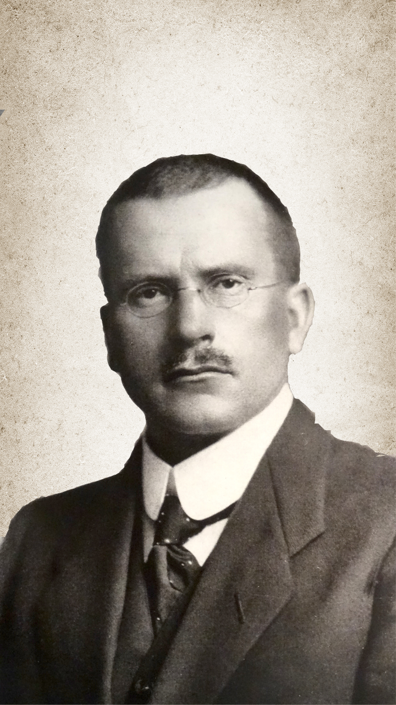
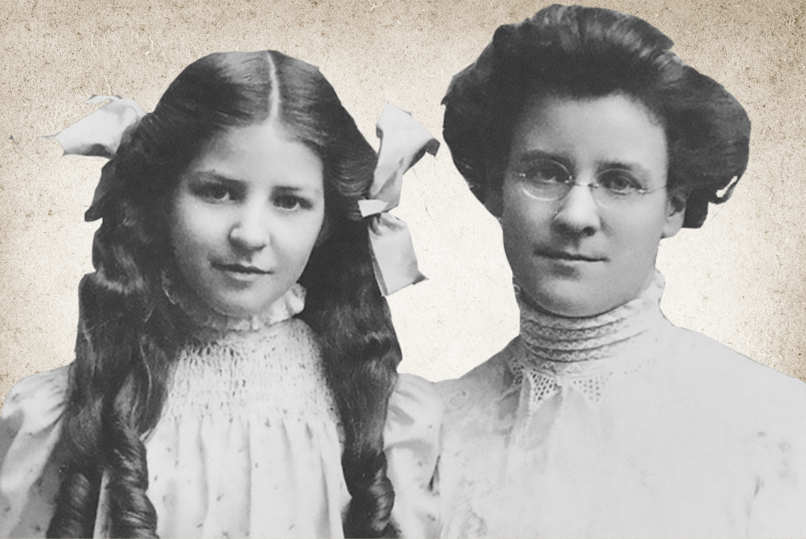

# TCM
## Módulo 01

---

# Objetivo Geral

Desenvolver um PDI (Plano de Desenvolvimento Individual), estipulando suas metas e objetivos para este curso.

***

# Objetivos Específicos

- Apresentar teorias, testes e escalas psicométricas para desenvolvimento do auto-conhecimento e inteligência emocional;
- Apresentar o PDI como ferramenta de Gestão de projetos e objetivos;
- Possibilitar o auto-conhecimento por meio da percepção de si mesmo e dos outros;
- Desenvolver habilidades sociais por meio da construção de atividades conjuntas e troca de experiências.

---

# Etapas

O TCM é constituído em 2 partes: 

- Na **1º Parte** será feito um exercício individual, pautado nos aspectos técnicos e teóricos absorvidos pelo educando no processo educacional.
- Na **2ª Parte** do TCM haverá o desenvolvimento de uma série de atividades e exercícios em grupo que buscarão conciliar os aspectos teóricos e técnicos das matérias estudadas em sala, com as demandas e anseios de cada estudante e o mercado administrativo.

---

### 1ª Parte - Projeto Individual

---

# Objetivo do  Projeto

Construir um PDI - Plano de Desenvolvimento Individual - pautado nos planos e objetivos do aluno para o decorrer do curso.

---

## Inspiração

---

<figure class="center">
  
  <figcaption>A Morte de Sócrates Jacques-Louis David - 1787  </figcaption>
</figure>

***

<blockquote>Conhece-te a Ti mesmo e conhecerás todo o universo e os deuses, porque se o que procuras não achares primeiro dentro de ti mesmo, não acharás em lugar algum. <strong>Oráculo de Delfos</strong></blockqoute>

---

# Primeira Etapa

Realizar os testes de personalidade online.

- <i class="icofont-link"></i> [Teste 16 Personalities](https://www.16personalities.com/br)
- <i class="icofont-link"></i> [Teste Inspiira](http://inspiira.org/)
- <i class="icofont-link"></i> [Teste IDRlabs](https://www.idrlabs.com/pt/teste.php)  

***

# Explicação

Estes testes foram especificamente escolhidos devido a clareza presente nos mesmos sobre a metodologia e as teorias utilizadas como base para sua construção, bem como a relação dos resultados dos mesmos com as do Instrumento MBTI;

---

# O que é MBTI?

O MBTI é um Teste de Personalidade amplamente utilizado, difundido e divulgado que se baseia na **Teoria de Tipos Psicológicos** desenvolvida por Jung na década de 1920, e mais tarde adaptada por Myers e Briggs.

Seu objetivo é delimitar os principais traços da personalidade de uma pessoa, categorizando-a em um *tipo*.

***

# Tipos de Personalidade

Na década de 1920, o psiquiatra suíço Carl Gustav Jung desenvolveu a *Teoria dos Tipos Psicológicos*, no qual traçou um quadro sobre os diferentes aspectos que compõe a personalidade.

Esta teoria se baseia em 2 conceitos importantes: disposições (atitudes) e funções.

***

## Introvertido ou Extrovertido?

***

# Disposições Psíquicas

Por trás dos termos **introversão e extroversão** reside o conceito junguiano de **disposições psíquicas**.

Para Jung, a libido (energia psíquica) de uma pessoa pode fluir de dentro para fora (extroversão) ou de fora para dentro (introversão).

Na prática isto leva as pessoas a serem orientadas por atitudes focadas em fatores/objetivos externos (extroversão) ou internos (introversão).

***

<blockquote>
Tanto o tímido quanto o extrovertido são <em>carentes</em>. [...] a diferença (entre eles) está na atitude adotada com a carência. O <em>tímido</em> tanto teme que a exposição na vida social o frustre mais ainda que prefere se arriscar no isolamento. Já o <em>extrovertido</em> tanto teme que o isolamento o frustre mais ainda que prefere o risco da exposição social.  
<strong>DANIEL GRANDINETTI. Psicologia no Cotidiano: 100 Ensaios Sobre a Psicologia de Nosso Dia-a-Dia</strong>
</blockqoute>

***

# Funções Psíquicas Jungunianas

Além das disposições, Jung desenvolveu o conceito de função psíquica. Para ele há 4 funções psíquicas diferentes:

As funções de percepção (sensação e intuição)

***

# Funções Psíquicas Myers e Briggs

Na década de 1940 as teorias de Jung receberam contribuições de Katharine Briggs e Isabel Myers, mãe e filha que de desenvolveram as funções de <em>percepção</em> e <em>julgamento</em>.

---
