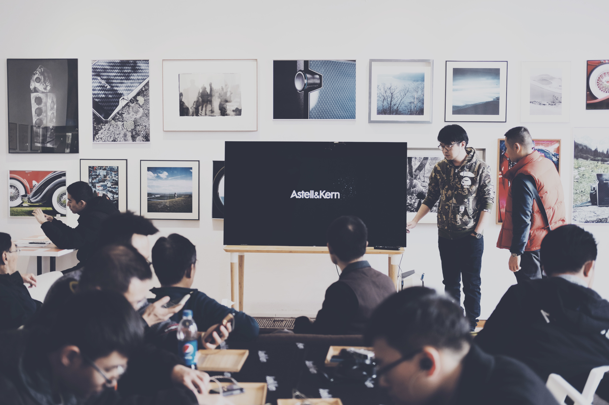

# Bonisa - Standard
## Template de Apresentação
### by: Bonisa.js

---

# Standard

Este é o tema padrão da biblioteca Bonisa.js.

---

## Títulos

---

Este tema permite a utilização dos elementos de *heading* do HTML, &lt;h1&gt; a &lt;h6&gt;, conforme mostrado abaixo.

***

# Título &lt;h1&gt;

***

## Título &lt;h2&gt;

***

### Título &lt;h3&gt;

***

#### Título &lt;h4&gt;

***

##### Título &lt;h5&gt;

***

###### Título &lt;h6&gt;

***

Neste slide não há nenhum título, apenas textos!

***

# 

Para alinhar o seu texto verticalmente sem a necessidade de inserir um título (&lt;h1&gt; a &lt;h6&gt;), basta inserir um cabeçalho em vazio!

Neste slide há um elemento  &lt;h1&gt; vazio.

---

## Textos

---

Este é um parágrafo.

Este é um exemplo em <b>negrito</b> e este utiliza o elemento <strong>strong</strong>.

Este é um exemplo de <i>itálico</i> e este é um exemplo do tipo <em>ênfase</em>.

Aqui temos um exemplo de código-fonte: <code>for(;;){console.log('Loop');} </code>

Este é um [link](#).

<blockqoute>Este é um exemplo simples de uma frase utilizando o &lt;blockqoute&gt;</blockquote>

***

# Este é um cabeçalho &lt;h1&gt;

Este é um parágrafo.

Este é um exemplo em <b>negrito</b> e este utiliza o elemento <strong>strong</strong>.

Este é um exemplo de <i>itálico</i> e este é um exemplo do tipo <em>ênfase</em>.

Aqui temos um exemplo de código-fonte: <code>for(;;){console.log('Loop');} </code>

Este é um [link](#).

<blockqoute>Este é um exemplo simples de uma frase utilizando o &lt;blockqoute&gt;</blockquote>

***

### Este é um cabeçalho &lt;h3&gt;

Este é um parágrafo.

Este é um exemplo em <b>negrito</b> e este utiliza o elemento <strong>strong</strong>.

Este é um exemplo de <i>itálico</i> e este é um exemplo do tipo <em>ênfase</em>.

Aqui temos um exemplo de código-fonte: <code>for(;;){console.log('Loop');} </code>

Este é um [link](#).

<blockqoute>Este é um exemplo simples de uma frase utilizando o &lt;blockqoute&gt;</blockquote>

***

##### Este é um cabeçalho &lt;h5&gt;

Este é um parágrafo.

Este é um exemplo em <b>negrito</b> e este utiliza o elemento <strong>strong</strong>.

Este é um exemplo de <i>itálico</i> e este é um exemplo do tipo <em>ênfase</em>.

Aqui temos um exemplo de código-fonte: <code>for(;;){console.log('Loop');} </code>

Este é um [link](#).

<blockqoute>Este é um exemplo simples de uma frase utilizando o &lt;blockqoute&gt;</blockquote>

***

###### Este é um cabeçalho &lt;h6&gt;

Este é um parágrafo.

Este é um exemplo em <b>negrito</b> e este utiliza o elemento <strong>strong</strong>.

Este é um exemplo de <i>itálico</i> e este é um exemplo do tipo <em>ênfase</em>.

Aqui temos um exemplo de código-fonte: <code>for(;;){console.log('Loop');} </code>

Este é um [link](#).

<blockqoute>Este é um exemplo simples de uma frase utilizando o &lt;blockqoute&gt;</blockquote>
---

## Efeitos de Imagens

---

***

### Imagem com classe *full*

***

### Imagem com classe *gray*

***

### Imagem com classe *transparent*

***

### Imagem com classe *gray-transparent*

---

## Tamanhos de Imagens

---

### Imagem padrão - width = 75vw

***

### Imagem com classe *size-50*

***

### Imagem com classe *size-25*

***

### Imagem com classe *size-20*

***

### Imagem com classe *size-15*

***

### Imagem com classe *size-10*

***

### Imagem com classe *size-5*

---

## Alinhamento de Imagens

---

### Imagem com classe *left*

***

### Imagem com classe *right*

---

## Tabelas

---

### Obras de Arthur Schopenhauer

|                           Obra                          | Ano de Publicação |
|:-------------------------------------------------------:|:-----------------:|
| Sobre a Raiz Quádrupla do Princípio da Razão Suficiente |        1813       |
|                 Sobre a Visão e as Cores                |        1815       |
|           O Mundo como Vontade e Representação          |        1819       |
|               Sobre a Vontade da Natureza               |        1836       |
|         Os Dois Problemas Fundamentais da Ética         |        1841       |
|                  Parerga e Paralipomena                 |        1851       |

---

## Design

---

### Classes Especiais - Cores (I)

.color-black    {  color: rgb(23, 23, 23);} 

.color-black-1  {  color: rgb(87, 86, 87);} 

.color-white    {  color: #fefefe;} 

.color-gray     {  color: #858585;} 

.color-blue     {  color: rgb(29, 73, 145);} 

.color-blue-1   {  color: rgb(0, 135, 196);} 

.color-teal     {  color: rgb(0, 195, 211);} 

***

### Classes Especiais - Cores (II)

.color-green    {  color: rgb(38, 193, 150);} 

.color-green-1  {  color: rgb(0, 138, 99);} 

.color-purple   {  color: rgb(83, 83, 163);} 

.color-pink     {  color: rgb(220, 95, 144);} 

.color-yellow   {  color: rgb(250, 219, 29);} 

.color-orange   {  color: #F4B400;  } 

.color-red      {  color: rgb(219, 63, 26);} 

***

### Classes Especiais - Background (I)

.bg-black    {  background-color: rgb(23, 23, 23);} 

.bg-black-1  {  background-color: rgb(87, 86, 87);} 

.bg-white    {  background-color: #fefefe;} 

.bg-gray     {  background-color: #858585;} 

.bg-blue     {  background-color: rgb(29, 73, 145);} 

.bg-blue-1   {  background-color: rgb(0, 135, 196);} 

.bg-teal     {  background-color: rgb(0, 195, 211);} 

***

### Classes Especiais - Background (II)

.bg-green    {  background-color: rgb(38, 193, 150);} 

.bg-green-1  {  background-color: rgb(0, 138, 99);} 

.bg-purple   {  background-color: rgb(83, 83, 163);} 

.bg-pink     {  background-color: rgb(220, 95, 144);} 

.bg-yellow   {  background-color: rgb(250, 219, 29);} 

.bg-orange   {  background-color: #F4B400;  } 

.bg-red      {  background-color: rgb(219, 63, 26);} 

---

### Fontes Utilizadas

- Raleway

---

### Licença

Esta apresentação está distribuída com uma licença [Creative Commons Atribuição 4.0 Internacional](https://creativecommons.org/licenses/by/4.0/). Sinta-se a vontade para:

- Distribuir
- Copiar
- Modificar
- Publicar
- Fazer uso comercial
- Fazer uso privado
- Criar conteúdo derivado, utilizando outra licença
- Fazer o que você quiser (literalmente)
- Mas não se esqueça de manter uma cópia do arquivo LICENSE e atribuir o devido crédito a nóis, porque "dá trabalho pra fazer!"

---

# Bonisa - Standard