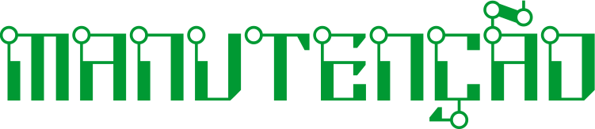

O curso de Auxiliar Administrativo, ministrado no [CNI - Unidade Centro](http://grupocni.com.br/index.php/centro-2/), busca apresentar aos alunos os conhecimentos necessários para atuar nos processos administrativos de empresas públicas e privadas, dos mais diversos portes e segmentos, executando atividades de apoio nas áreas de recursos humanos, finanças, logística, administrativa e de vendas, observando os procedimentos operacionais e a legislação vigente.

**Objetivo Geral:** Criar oportunidade de qualificação profissional, por meio do desenvolvimento de competências e habilidades para atuar na área administrativa de empresas públicas e privadas de todos os portes e segmentos

**Duração:** 12 meses | 96 horas

**Recursos do Curso:** [Acessar](./administracao.html)

---

A configuração e manutenção de computadores é fundamental para garantir a plena produtividade de empresas e usuários comuns. Com esta premissa em mente, o curso de MMC dedica-se a instruir aos alunos com as técnicas e ferramentas mais utilizadas neste ramo essencial da tecnologia moderna.

**Objetivo Geral:** Desenvolver e aprimorar as habilidades técnicas e manuais necessárias para a correta avaliação e resolução de problemas de *hardware* e *software* de micros.

**Recursos do Curso:** [Acessar](./manutencao.html)

---

O compartilhamento de recursos (como impressoras, arquivos e programas) é prática comum nas empresas e residências. Para garantir este objetivo e manter a integridade e segurança dos equipamentos, é necessária a correta instalação e configuração de redes de computador. Neste curso são apresentadas as técnicas e ferramentas básicas utilizadas para a montagem de redes funcionais.

**Objetivo Geral:** Desenvolver e aprimorar as habilidades técnicas e manuais necessárias para a correta montagem e configuração de redes cabeadas e *WiFi*.

**Recursos do Curso:** [Acessar](./redes.html)

---

A configuração e manutenção de computadores é fundamental para garantir a plena produtividade de empresas e usuários comuns. Com esta premissa em mente, o curso de MMC dedica-se a instruir aos alunos com as técnicas e ferramentas mais utilizadas neste ramo essencial da tecnologia moderna.

**Objetivo Geral:** Desenvolver e aprimorar as habilidades técnicas e manuais necessárias para a correta avaliação e resolução de problemas de *hardware* e *software* de micros.

**Recursos do Curso:** [Acessar](./manutencao.html)

---

Somente entre 2018 e 2019, o número de empresas que investiram na contratação de *hackers* para invadirem e testarem sua infrasetrutura de defesa cibernética aumentou em mais de [41% na América Latina](https://www.hackerone.com/sites/default/files/2019-08/hacker-powered-security-report-2019.pdf). Ao contrário do que se pensa e divulga, o *hacking* é uma atividade ética, legal e fundamental para a sobrevivência e a segurança de empresas e seus clientes.

**Objetivo Geral:** Apresentar os conceitos fundamentais da Segurança da Informação, bem como as técnicas e ferramentas utilizadas para o ataque e defesa de ameaças cibernéticas.

**Recursos do Curso:** [Acessar](./hacking.html)
