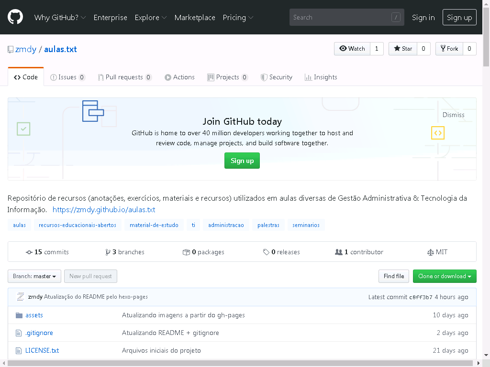
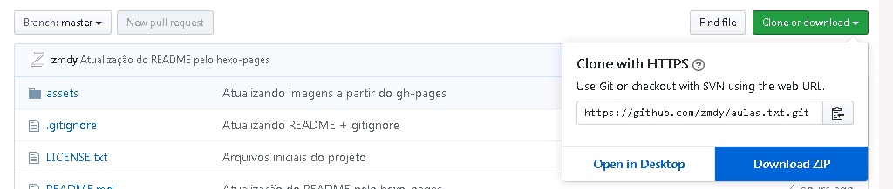
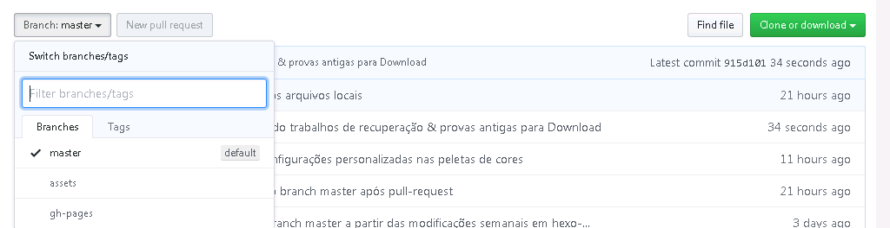

Todo o conteúdo disponibilizado é **livre** (free/libre), o que significa que você está **automaticamente autorizado** a baixar, estudar e modificar todo o conteúdo do projeto.

Para acessar os conteúdos finais já processados, em **.pdf ou outros formatos**, acesse a página [Materiais](../tag)

Os textos, imagens, fontes, ícones e eventuais bibliotecas, módulos ou softwares utilizados no site podem ser acessados pelo repositório do projeto no [GitHub](https://github.com/zmdy/aulas.txt).

Ao acessar o repositório de aulas.txt, você verá uma tela como a mostrada a seguir:



Nesta página estão todos os conteúdos de texto, imagens, fontes, scripts e bibliotecas utilizados para criar o site e os slides.

Caso deseje baixar ou clonar todo o conteúdo e adaptá-lo aos seus projetos pessoas, faça o download do branch `master`.

> Para baixar os arquivos de qualquer *branch* basta clicar no botão `Clone or Download` e em seguida clicar sobre `Download ZIP`



Ao baixar e extrair o conteúdo, você terá acesso à seguinte estrutura de pastas e arquivos:

```
ESTRUTURA DO BRANCH MASTER
  .
  ├── sources                 
  │  ├── _posts               # Posts do site em formato Markdown
  │  ├── pages                # Páginas do site em formato Markdown  
  │  ├── src                  # Scripts e arquivos personalizados
  │  └── assets                   
  │     ├── content             # Arquivos de texto usados para criar os slides
  │     └── media               # Arquivos de mídia
  │         ├── fonts         	# Fontes utilizadas nos slides
  │         ├── icons           # Ícones diversos
  │         ├── img           	# Todas as imagens utilizadas
  │         └── logo            # Logo do projeto aulas.txt
  |
  ├── _config.yml_            # Arquivo de configurações do Hexo
  ├── .gitignore
  ├── LICENSE.txt
  ├── package.json            # Arquivo de configurações do Node
  └── README.md
```

Caso queira utilizar alguma imagem, pdf, fonte, ou modificar algum conteúdo de texto **fique a vontade**! Só **não se esqueça** de manter o arquivo LICENSE.txt na pasta ;)

Para baixar o **conteúdo bruto** (todo este conteúdo é chamado de *assets*), contendo os arquivos de texto, PDFs, imagens e fontes utilizados no site, você deverá acessar o branch `assets`, conforme mostrado abaixo.

---

## Branches do projeto

Todos os slides utilizados no projeto (e o próprio site) são construídos utilizando os assets mostrados acima. No entanto, para **renderizar** este conteúdo em um [site](https://zmdy.github.io/aulas.txt/), é necessário utilizar alguns frameworks especiais.

O site deste projeto é hospedado via [GitHub Pages](https://pages.github.com/) utilizando temas disponibilizados pelo framework [Hexo](https://hexo.io/themes/).

Para acessar os arquivos (e frameworks) utilizados para criar o site e os slides, clique sobre `Branch: master` e em seguida clique na opção `assets`.



Cada um dos itens mostrados na imagem acima (master, assets e gh-pages) é chamado de *branch*.

Um *branch* nada mais é do que a ramificação de um projeto de software ou site. No caso do [aulas.txt](https://github.com/zmdy/aulas.txt), há 3 diferentes ramos:

- `master`: branch responsável pelo armazenamento dos arquivos brutos (assets), das dependências do framework [Hexo](https://hexo.io/themes/) e das bibliotecas usadas para produzir os [slides](https://github.com/zmdy/bonisa).
- `assets`: branch responsável pelo armazenamento de todos os conteúdos de texto, imagens e fontes;
- `gh-pages`: branch responsável pelo armazenamento deste [site](https://zmdy.github.io/aulas.txt/);

O branch `assets` contém todo o material bruto utilizado para produzir o site. Isto inclui imagens, fontes, PDFs, documentos e outros arquivos de texto.

Ao baixar este *branch*, você terá acesso à seguinte estrutura de pastas:

```
ESTRUTURA DO BRANCH ASSETS
  .
  ├── assets                   
  │   ├── content           # Arquivos de texto usados para criar os slides
  │   └── media             # Arquivos de mídia
  │      ├── fonts          # Fontes utilizadas nos slides
  │      ├── icons          # Ícones diversos
  │      ├── img            # Todas as imagens utilizadas
  │      └── logo           # Logo do projeto aulas.txt
  ├── sources                 
  │  ├── _posts             # Posts do site em formato de texto
  │  ├── pages              # Páginas do site em formato de texto  
  │  ├── src                # Scripts e arquivos personalizados
  |
  ├── .gitignore            
  ├── LICENSE.txt
  └── README.md
```

Caso queira utilizar alguma imagem, pdf, fonte, ou modificar algum conteúdo de texto **fique a vontade**! Só **não se esqueça** de manter o arquivo LICENSE.txt na pasta ;)

Por questões de praticidade, o branch `gh-pages` é automaticamente atualizado no processo de *deployment* do [Hexo](https://hexo.io/docs/github-pages). Por esta razão o mesmo **não é modificado manualmente**.

Se desejar, você poderá [baixar](https://github.com/zmdy/aulas.txt/tree/gh-pages) este branch e rodar em sua máquina. O site será corretamente mostrado, mas os slides não!

---

## Rodando o projeto localmente

Como vimos, o `master` é o branch responsável por armazenar e gerar todas as páginas do site e todos os slides.

Para converter os arquivos do branch `master` no site acessado no `gh-pages` é utilizado um *framework* chamado [Hexo](https://hexo.io/themes/). 

Caso você queira instalar o site, localmente, com **todas** as suas funcionalidades (incluindo os slides), siga o passo a passo a seguir:

Primeiramente, você precisará instalar o [Node.js](https://nodejs.org/en/) em seu computador para garantir que tudo funcione corretamente.

| #     | Software | O que é?  |
| :---: | :---:    | :---:            |
| 01    | [Java Script](https://developer.mozilla.org/pt-BR/docs/Aprender/JavaScript) | (NÃO É NECESSÁRIO INSTALAR) Linguagem de programação utilizada para implementar conteúdos dinâmicos- como mapas interativos, animações gráficas em 2D/3D e vídeos - em sites. |
| 02    | [Node.js](https://nodejs.org/en/) | Interpretador de JavaScript repleto de funcionalidades *server-side*. |
| 03    | [Hexo](https://hexo.io/) | Poderoso, simples e rápido framework escrito em [Node.js](https://nodejs.org/en/) para criação de blogs com arquivos de texto [Markdown](https://daringfireball.net/projects/markdown/). |
| 04    | [Markdown](https://daringfireball.net/projects/markdown/)| (NÃO É NECESSÁRIO INSTALAR)  Linguagem textual capaz de implementar estruturas HTML/XHTML em textos planos. |

Após instalar todos os programas necessários, você deverá baixar o site [aulas.txt](https://zmdy.github.io/aulas.txt) para o seu computador, por meio do  branch `master`.

1. [Download](https://github.com/zmdy/aulas.txt/archive/assets.zip) direto do site: `https://github.com/zmdy/aulas.txt/archive/assets.zip`

Quando o download finalizar, você deverá extrair os arquivos baixados. Em seguida, acesse a pasta com os arquivos extraídos. A partir desse momento você **deverá utilizar** um terminal (Prompt de Comando) para executar os passos.

2. Acessa a pasta extraída: `cd aulas.txt`

Agora basta instalar os módulos [Node.js](https://nodejs.org/en/) necessários para o funcionamento do [Hexo](https://hexo.io/).

3. Instalar as dependências Node.js: `npm install`

Com o download finalizado, basta iniciar o servidor [Hexo](https://hexo.io/).

4. Inicia o servidor: `hexo server`

Para acessar o site, vá até o navegador de sua preferência e abra o endereço a seguir:

5. Abrir o site com o navegador: `127.0.0.1:4000/aulas.txt`