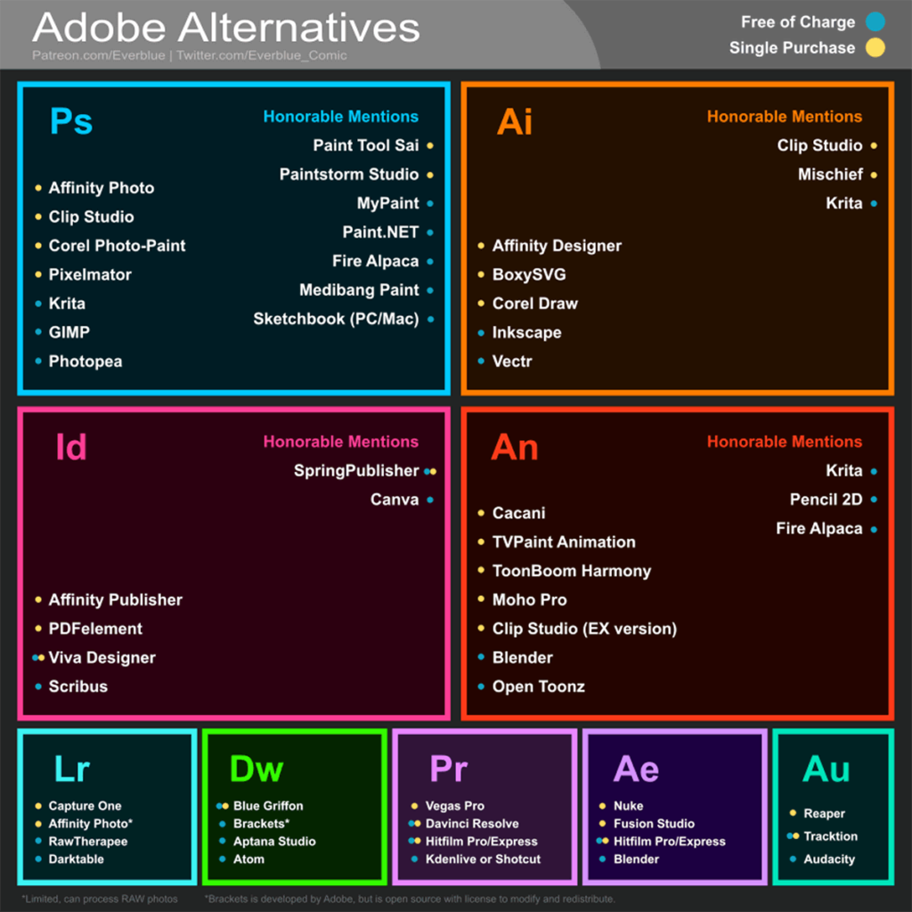

Em 1983, um jovem programador hippie chamado Richard Stallman deu os primeiros passos para garantir que os usuários dos computadores tivessem a *liberdade* para escolherem e controlarem os programas que eles utilizam.

A *liberdade* referida por Stallman, permite que os usuários "controlam o programa e o que ele faz por eles". Na prática, a filosofia do *software livre* fornece uma maneira de contrabalancear o monopólio que empresas de tecnologia (principalmente as produtoras de softwares) exercem sobre o mercado.

Hoje, a ideia de *software livre* se expandiu e inclui os mais diversos produtos digitais: desde músicas, imagens, vídeos e softwares, até os circuitos digitais usados por diversos dispositivos *IoT*.

Resumindo: o *software livre* e seus diversos filhos são maneiras de permitir que usuários desenvolvam, executem, copiem, distribuam, estudem, modifiquem, editem e compartilhem seus trabalhos com o mundo, de forma gratuita e colaborativa.

Abaixo estão alguns projetos e softwares *livres* sobre os mais diversos assuntos.

## Imagens Gratuitas

[Pexels](https://www.pexels.com/)
[Pixabay](https://pixabay.com/pt/)
[Unsplash](https://unsplash.com/)
[Wikimedia Commons](https://commons.wikimedia.org/wiki/Main_Page)

## Ícones e Vetores Gratuitos

[The Noun Project](https://thenounproject.com/)
[Flaticon](https://www.flaticon.com/)
[Freepik](https://br.freepik.com/)

## Fontes Gratuitas

[Google Fonts](https://fonts.google.com/)
[Open Foundry](https://open-foundry.com/)
[Font Library](https://fontlibrary.org/pt)
[Use & Modify](https://usemodify.com/)
[The League of Movable Type](https://www.theleagueofmoveabletype.com/)

## Cores e Paletas

[My Color Space](https://mycolor.space/)
[Palleton](https://paletton.com/)
[Palx](https://palx.jxnblk.com/)
[Open Color Tools](http://opencolor.tools/)
[Tint & Shade Generator](https://maketintsandshades.com/)

## Programas

Imagem produzida por [Michael Sexton](https://www.patreon.com/posts/adobe-software-26834357), 2019. Todos os direitos reservados.